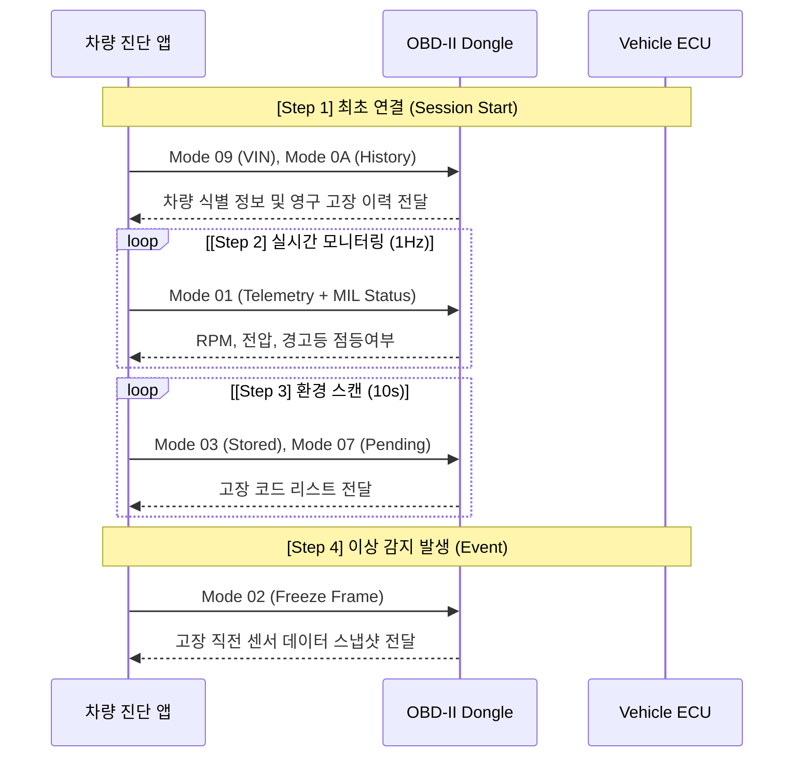
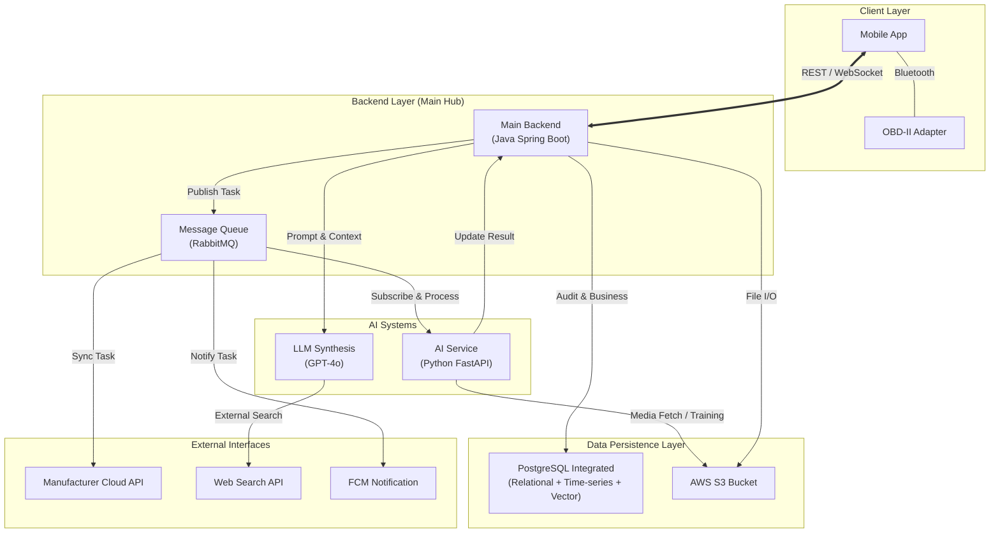
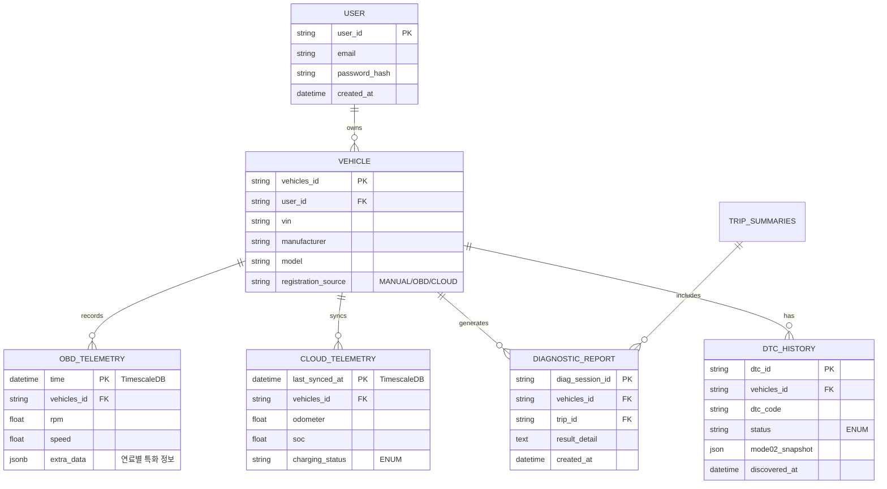
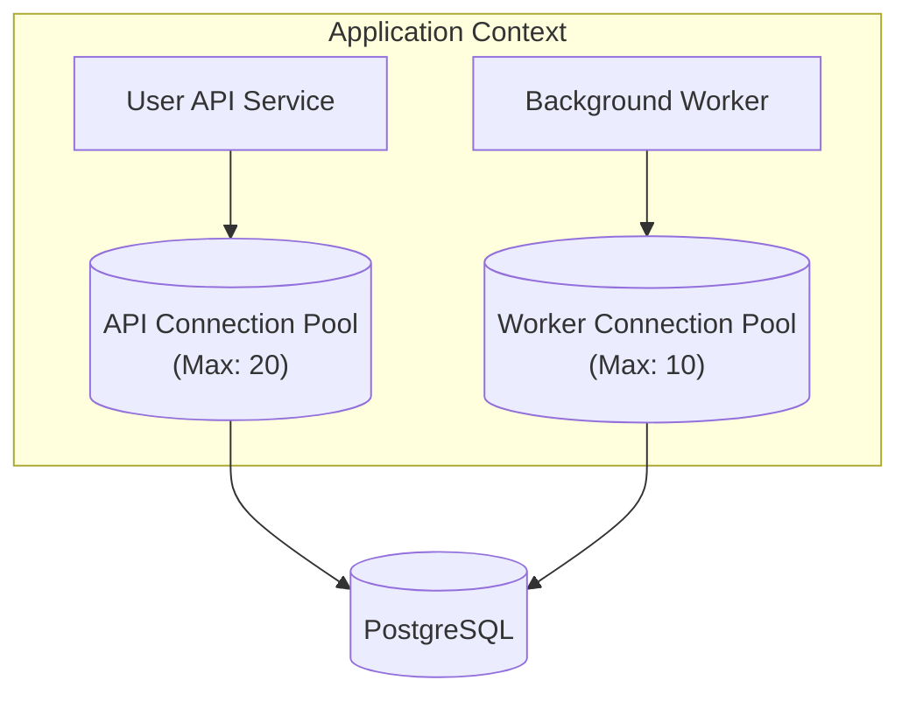

# 기술 구현 가이드라인

> **[전략적 가이드라인] + [상세 기술 명세] + [AI 파이프라인]**
> 이 문서는 프로젝트의 모든 상세 명세와 구현 기술을 하나하나 누락 없이 기술한 최종 마스터 문서입니다.

---

## 📑 목차

1. [핵심 기능 (MVP)](#1-핵심-기능-mvp)
   - [1.1 OBD-II 실시간 연결 및 모니터링](#11-obd-ii-실시간-연결-및-모니터링)
   - [1.2 AI 통합 진단 시스템 (DTC 포함)](#12-ai-통합-진단-시스템-dtc-포함)
   - [1.3 운전 습관 분석 (운전 점수)](#13-운전-습관-분석-운전-점수)
   - [1.4 소모품 교체 시점 예측](#14-소모품-교체-시점-예측)
   - [1.5 실시간 이상 감지 (Anomaly Detection)](#15-실시간-이상-감지-anomaly-detection)
   - [1.6 AI 고장 예측 (Predictive Maintenance)](#16-ai-고장-예측-predictive-maintenance)
   - [1.7 셀프 점검 (시동음/사진 분석)](#17-셀프-점검-시동음사진-분석)
   - [1.8 전기차(EV) 및 하이브리드 통합 지원 (Universal Strategy)](#18-전기차ev-및-하이브리드-통합-지원-universal-strategy)
   - [1.9 제조사 커넥티드 서비스 API 연동](#19-제조사-커넥티드-서비스-api-연동)
   - [1.10 디지털 차계부 (Basic)](#110-디지털-차계부-basic)
2. [부가 기능](#2-부가-기능)
   - [2.1 리콜 정보 알림](#21-리콜-정보-알림)
   - [2.2 지능형 개인화 서비스 (Personalized AI)](#22-지능형-개인화-서비스-personalized-ai)
   - [2.3 정기검사 만료일 알림](#23-정기검사-만료일-알림)
3. [확장 기능 (Roadmap)](#3-확장-기능-로드맵)
   - [3.1 사고 수리 견적 (VLM)](#31-사고-수리-견적-vlm)
   - [3.2 중고차 가치 산정 및 시세 조회](#32-중고차-가치-산정-및-시세-조회)
   - [3.3 정비 네트워크 및 실시간 예약 (Network & Booking)](#33-정비-네트워크-및-실시간-예약-network--booking)
   - [3.4 유지보수 자동화 및 자산 관리 (Automation)](#34-유지보수-자동화-및-자산-관리-automation)
4. [시스템 아키텍처](#4-시스템-아키텍처)
5. [기술 스택](#5-기술-스택)
6. [구현 상세 전략](#6-구현-상세-전략)
   - [6.1 기본 인프라 및 보안](#61-기본-인프라-및-보안)
   - [6.2 동시성 및 데이터 정책](#62-동시성-및-데이터-정책)
   - [6.3 멀티모달 복합 진단 로직 (AI Reasoning Path)](#63-멀티모달-복합-진단-로직-ai-reasoning-path)
   - [6.4 진단 유발 액션 (Diagnostic Triggers)](#64-진단-유발-액션-diagnostic-triggers)
   - [6.5 진단 신뢰성 및 Fail-Safe](#65-진단-신뢰성-및-fail-safe)
   - [6.6 하이브리드 데이터 수집 및 전천후 대응 설계](#66-하이브리드-데이터-수집-및-전천후-대응-설계)
   - [6.7 AI 프롬프트 엔지니어링 및 페르소나 전략](#67-ai-프롬프트-엔지니어링-및-페르소나-전략)
   - [6.8 모바일 최적화 및 오프라인 대응 (Optimization)](#68-모바일-최적화-및-오프라인-대응-optimization)
   - [6.9 시연 및 대응 시나리오 (AI Scenarios)](#69-시연-및-대응-시나리오-ai-scenarios)
7. [MVP 개발 범위](#7-mvp-개발-범위)
8. [공공 API 및 데이터 출처](#8-공공-api-및-데이터-출처)
9. [AI 모델 재학습 파이프라인](#9-ai-모델-재학습-파이프라인)
10. [데이터베이스 아키텍처 및 저장 전략](#10-데이터베이스-아키텍처-및-저장-전략)
11. [운영 및 데이터 보안 정책](#11-운영-및-데이터-보안-정책)

---

## 1. 핵심 기능 (MVP)

### 1.1 OBD-II 실시간 연결 및 모니터링

| 항목 | 내용 |
|:---|:---|
| **기능 설명** | OBD-II 블루투스 어댑터로 차량 데이터 실시간 수집 |
| **입력** | ELM327 블루투스 연결 (1초 간격 데이터 수집) |
| **출력** | RPM, 속도, 온도, 연료 트림 등 실시간 대시보드 표시 |

#### 📊 수집 데이터 목록
| 데이터 | PID 코드 | 단위 | 용도 |
|:---|:---|:---|:---|
| 엔진 RPM | `0x0C` | rpm | 운전 패턴 및 이상 부하 감지 |
| 차량 속도 | `0x0D` | km/h | 급가속/급제동 및 주행거리 계산 |
| 냉각수 온도 | `0x05` | °C | 엔진 과열 예측 및 냉각 시스템 진단 |
| 엔진 부하 | `0x04` | % | 출력 저하 및 엔진 건강 상태 분석 |
| 연료 트림 | `0x06`-`0x09` | % | 연료 공급 시스템 및 인젝터 이상 감지 |
| 스로틀 위치 | `0x11` | % | 운전 습관 및 스로틀 바디 오염 분석 |
| 배터리 전압 | `0x42` | V | 배터리 수명 및 알터네이터 성능 예측 |
| 주행거리 | `0xA6` | km | 소모품 교체 주기 관리 기준 데이터 |

- **주기**: 하드웨어 과부하 방지 및 AI 학습 최적화를 위해 **1초(1Hz)**를 글로벌 표준 주기로 확정. (TimescaleDB 7일 보관 정책과 연계)
- **실행 트리거**: 앱 실행 시 자동 블루투스 페어링 및 주행 중 상시 데이터 스트리밍(1Hz).

#### ⚠️ 구현 시 주의점
- **연결 안정성**: 블루투스 연결 해제 시 자동 재시도 로직 필수 적용.
- **부하 관리**: 과도한 데이터 요청은 어댑터 프리징 유발 → 1s 주기가 표준.
- **시뮬레이션**: 실제 차량 부재 시 `obdsim`을 이용한 개발 환경 구축.

---

### 1.2 AI 통합 진단 시스템 (DTC 포함)

| 항목 | 내용 |
|:---|:---|
| **기능 설명** | 고장 코드(DTC) 및 멀티모달 데이터 기반 정밀 진단 |
| **입력** | DTC 코드, 시동음(Audio), 부품 사진(Image), 실시간 OBD 데이터 |
| **출력** | 고장 원인, 위험도, 조치 방법 및 정비 가이드 제안 |

- **기능**: OBD를 통해 읽어온 DTC(Diagnostic Trouble Code)의 AI 해석 및 자연어 안내.
- **OBD 통신 수명주기 (Communication Lifecycle)**:


#### 1.2.1 OBD 명령 동시성 및 우선순위 정책 (Concurrency & Priority)
OBD-II 버스는 대역폭이 제한적이며 한 번에 하나의 호출만 처리 가능한 경우가 많습니다. 명령이 겹칠 경우의 충돌을 방지하기 위해 아래와 같은 **'우선순위 기반 큐(Priority Queue)'** 정책을 적용합니다.

| 우선순위 | 우선순위 그룹 | 해당 명령 (OBD Mode) | 처리 정책 |
|:---|:---|:---|:---|
| **P0 (Immediate)** | **안전 및 이벤트** | Mode 02 (Freeze Frame), Mode 04 (Clear) | 현재 수행 중인 모든 작업을 중단(Abort)하거나 즉시 다음에 실행 |
| **P1 (High)** | **상시 모니터링** | Mode 01 (1Hz 실시간 데이터) | 데이터의 연속성을 위해 정해진 주기를 최우선 준수 |
| **P2 (Normal)** | **상태 스캔** | Mode 03 (Stored), Mode 07 (Pending) | P0, P1 작업이 없는 유휴 시간에 실행 (10초 주기) |
| **P3 (Low)** | **심층 진단** | Mode 06, Mode 09 (차량 정보) | 시스템 부하가 적을 때 실행 (1분 주기 또는 초기 1회) |

- **충돌 해결 (Collision Handling)**:
    - 동일 우선순위 명령이 겹칠 경우: **먼저 요청된 명령(First-Come-First-Serve)** 순으로 큐에서 처리.
    - 하위 우선순위 실행 중 상위 명령 발생 시: 현재 명령 완료 즉시 상위 명령 수행 (Preemptive-like behavior).
    - **타임아웃 관리**: 응답이 2초 이상 지연될 경우 해당 명령을 '실패'로 간주하고 큐의 다음 명령으로 전환하여 시스템 Hang 현상을 방지합니다.

- **DTC 모니터링 로직**:
    1. **경고등 상태(MIL) 체크**: Mode 01을 통해 **1초(1Hz)** 간격 상시 감지.
    2. **상세 코드 및 프리즈 프레임 스캔**: MIL 점등 감지 시 즉시 **Mode 02 & Mode 03** 수집.
    3. **정밀 모니터링 (Deep)**: **Mode 06**을 1분 단위 또는 사용자 요청 시 수집하여 '잠재적 결함' 예측.
- **DTC 히스토리 관리**: 고장 코드 발생 시점과 복구 시점을 기록하여 차량의 전체 생애 주기 건강 이력을 관리. **데이터베이스 내의 이력은 절대 삭제하지 않으며**, 오직 'OBD 클리어 명령'을 통한 경고등 제어만 허용합니다.
- **실행 트리거**: MIL 상시 감시(1Hz), 경고등 점등 시 즉시 스캔(Event), 정밀 진단(1분/요청).

#### 🛡️ 입력 유형별 처리 상세 (DTC 중심)
| 입력 유형 | 분석 및 활용 방법 | 정보 부족 시 대응 (Fallback) | 구현 시 주의점 |
|:---|:---|:---|:---|
| **DTC 코드** | **SAE J2012 표준 DB** 조회 → LLM 자연어 해석 → 조치 안내 | "OBD 스캔 결과 고장 코드가 없습니다." | **'OBD Mode 04 (Clear)' 기능을 '경고등 끄기' 버튼으로 제공**하되, 실행 전 수리가 아님을 안내하는 **면책 공고(Disclaimer) 팝업**을 필수 노출합니다. DB상에서는 이력을 영구 보관합니다. |
| **시동음** | CNN (Mel-Spectrogram) 분류 → 이상 부위 특정 → LLM 해석 | "정확한 진단을 위해 OBD 연결을 권장합니다." | 주변 소음 필터링 및 오디오 정규화 필수 |
| **사진/이미지** | YOLOv8/OCR → 부위별 손상/마모 감지 → LLM 해석 | "추가 부위 촬영 또는 OBD 조회를 권장합니다." | 역광/저조도 환경에 대비한 이미지 전처리 |
| **실시간 OBD** | 시계열 이상 패턴 분석(연료 트림 등) → LLM 종합 판단 | "현재 차량 데이터는 정상 범주입니다." | 데이터 누락 시 이전 상태 기반 보간 로직 |

#### 🛠 통합 진단 파이프라인 (Progressive Synthesis)
```python
def diagnose(inputs: dict) -> str:
    results = []
    
    # [Fast Path 1] 치명적 안전 결함 (Safety Critical)
    if is_safety_critical(inputs.get("obd_data")):
        results.append(emergency_alert_logic(inputs["obd_data"]))
        return llm.generate_immediate_warning(results) # 0.5초 내 즉시 경고

    # [Fast Path 2] 확실한 DTC 고장 코드 또는 사용자의 명시적 특정 질문
    if inputs.get("dtc_codes") or inputs.get("user_specific_inquiry"):
        # 1차 분석 수행 (Confidence Check 포함)
        fast_result, needs_escalation = analyze_fast_priority(inputs)
        
        # 데이터가 충분하고 단발성 질문이면 즉시 리턴, 아니면 Normal Path로 전환
        if not needs_escalation and not inputs.get("full_scan_requested"):
            results.append(fast_result)
            return llm.generate_stream(results)
        else:
            # "추가 분석이 필요합니다"라는 중간 메시지를 먼저 띄워 가시성 확보
            results.append(fast_result + " (심층 분석 진행 중...)")
            # 진행 상황을 유지한 채 Normal Path로 하단 로직 수행
    
    # [Normal Path] 모든 분석 모델을 병렬로 가동 (Minimum Wait: 1.5s / Max Timeout: 2.5s)
    with ConcurrentExecutor() as executor:
        futures = {
            "sound": executor.submit(analyze_sound, inputs.get("sound_file")),
            "photo": executor.submit(analyze_photo, inputs.get("photo_files")),
            "obd": executor.submit(analyze_obd_anomaly, inputs.get("obd_data")),
            "cloud": executor.submit(analyze_cloud_telemetry, inputs.get("cloud_api_data")),
            "rag": executor.submit(retrieve_rag_context, inputs)
        }
    
    # 순차적으로 LLM Synthesis 시작 (멀티모달 융합 진단)
    gathered_results = wait_for_mandatory_or_timeout(futures, min_wait=1.5, max_timeout=2.5)
    
    return llm.generate_stream(f"종합 진단 (우선순위 기반): {gathered_results}")
```

#### 📝 복합 진단 엔진 응답 예시 (Composite Diagnosis)
- **사례 1 (DTC + 소리)**:
    - **입력**: `P0301 (1번 실린더 실화)` + `엔진 부조음(Audio)`
    - **결과**: "1번 실린더 소모품(점화플러그) 노화로 인한 실화가 감지되었습니다. 단순 DTC 코드보다 실제 엔진 소리에서 불규칙한 파형이 함께 확인되므로 즉각적인 교체를 권장합니다."
- **사례 2 (OBD 패턴 + 시각)**:
    - **입력**: `연료 트림 +15% (희박 연소)` + `엔진룸 사진(Image)`
    - **결과**: "연료 공급 부족이 의심됩니다. 전송하신 엔진룸 사진상 호스 균열은 보이지 않으나, OBD 수치상 공기 유입이 과다하므로 흡기 라인 정밀 점검이 필요합니다."
- **품질 제어**: Temperature 0.3 설정(환각 방지), 신뢰도 스코어링 도입, 면책 조항 필수 포함.

---

### 1.3 운전 습관 분석 (운전 점수)
- **기능**: 급가속, 급제동, 과속 빈도를 분석하여 100점 만점의 운전 점수 산출.

| 항목 | 내용 |
|:---|:---|
| **기능 설명** | 급가속, 급제동, 고RPM 빈도를 분석해 점수화 및 피드백 제공 |
| **분석 기준** | 가속도 > 3m/s²(급가속), 감속도 > -4m/s²(급제동), RPM > 4000 지속 등 |
| **결과 활용** | 보험료 할인 연동(확장), 연비 개선 가이드 제공 |

- **로직**: 단위 주행 거리당 비정상적인 G-Force 변화 및 RPM 급증 사례를 집계.
- **실행 트리거**: 주행 중 실시간 특징점 추출(1Hz) 및 주행 종료 시(Post-Drive) 최종 운전 점수 산출.

---

### 1.4 소모품 교체 시점 예측

| 항목 | 내용 |
|:---|:---|
| **기능 설명** | 주행 습관 및 거리를 반영한 미래 소모품 잔여 수명 예측 |
| **입력** | 누적 주행거리, 엔진 부하 데이터, 운전 점수(XGBoost 피처) |
| **출력** | 엔진 오일, 타이어 등 주요 소모품의 예상 교체 일자 및 % |

- **기능**: 엔진 오일, 브레이크 패드, 타이어 등 주요 소모품의 잔여 수명 예측.
- **모델**: **XGBoost Regression** (주행거리 + 운전 가혹 조건 가중치 반영).
- **실행 트리거**:
    1. **주행 종료 시 (Post-Drive Sync)**: 실시간 피처(`drive_score`, `load_avg`) 반영 → **잔여 수명(%)** 즉시 업데이트.
    2. **개인별 비운행 시간대 배치 (Personalized Batch)**: 최근 주행 기록 추세 분석 → **잔여 수명(%)** 및 **예상 교체 날짜(Date)** 정기 업데이트.
- **피처 엔지니어링**:
    - `mileage`: 최근 주행 누적 거리.
    - `drive_score`: 급가속/급제동 빈도가 반영된 성능 가산점.
    - `load_avg`: 엔진 부하(`0x04`)의 평균값 (가혹 주행 여부 판단).
- **데이터 활용**: 누적 주행거리와 운전 점수를 결합하여 초개인화된 수명 곡선 산출.

#### 🧊 Cold Start 및 데이터 확보
- **초기**: 차종별 표준 주기 + **성능점검정보 API(누유/사고 이력)** 및 공공 정비이력 API를 통해 **'차량 건강 기준점(Baseline)'** 자동 설정.
- **학습**: 100km 주행 이후 개인 운전 습관을 가중치로 반영한 맞춤형 예측 전환.
- **입력**: 수동 입력 버튼 + 공공 API 자동 동기화 + 영수증 OCR (확장 기능).

---

### 1.5 실시간 이상 감지 (Anomaly Detection)

| 항목 | 내용 |
|:---|:---|
| **기능 설명** | 주행 중 발생하는 수치적 급변 및 패턴 이상 실시간 경고 |
| **입력** | 배터리 전압, 냉각수 온도, 연료 트림 시계열 데이터 |
| **출력** | "배터리 전압 급락 감지" 등 즉각적인 푸시 알림 및 권고 |

- **작동 원리 (Hybrid Detection)**:
    1. **미니멀 세이프티 (App Context - if문)**: **"사고 직전의 치명적 결함"** (110도 초과, 전압 급락 등)을 **수집 주기(1s) 내 최우선 순위**로 판단하여 즉각 통보. 나머지는 AI로 위임.
    2. **서버 정밀 진단 (Server Context - LSTM)**: 각 사용자의 고유한 주행 패턴을 학습하여, 수치는 정상범위 내에 있더라도 미세한 노화 및 고장 전조 증상을 개인화하여 포착.
- **실행 트리거**: 주행 중 센서 데이터 상시 감시 및 임계치 초과 시 즉각 반응(Event-driven).
- **필터링**: 3회 연속 임계치 초과 시 알림 트리거 (센서 노이즈로 인한 오진 방지).

---

### 1.6 AI 고장 예측 (Predictive Maintenance)

| 항목 | 내용 |
|:---|:---|
| **기능 설명** | 시계열 데이터의 추세(Trend)를 분석하여 미래의 고장 시점을 선제적으로 예측 |
| **핵심 모델** | **LSTM (Long Short-Term Memory)** / **Prophet** (시계열 모델) |
| **입력 데이터** | **(Hybrid)** 최근 7일간의 **1Hz 원본 로그** + 최근 30일간의 **일일 요약 데이터** |
| **실행 트리거** | **개인별 비운행 시간대 배치 (Personalized Batch)** 및 **주행 종료 시 세션 분석** |

#### 🔮 데이터 기반 정밀 예측 시나리오
| 대상 부품 | 주 분석 데이터 | 예측 로직 (Prognostics) | 데이터 소스 |
|:---|:---|:---|:---|
| **배터리** | 시동 시 최저 전압 | 시동 순간의 고해상도(1Hz) 전압 강하 기울기 분석 | 7일 Raw 데이터 |
| **연료 시스템**| 장기 연료 보정값 | 주간/월간 보정값 평균의 우상향 추세(Drift) 분석 | 30일 요약본 |
| **점화 계통** | RPM 미세 변동 | 특정 부하 구간에서의 고주파 RPM 파형 불안정성 분석 | 7일 Raw 데이터 |
| **냉각 시스템**| 워밍업 소요 시간 | 일별 엔진 온도 도달 시간의 장기적 증가 추세 분석 | 30일 요약본 |

- **데이터 계층 활용**: 정밀한 파형 분석이 필요한 부품(배터리, 점화)은 **7일치 Raw 데이터**를, 장기적 수치 변화를 보는 부품(연료, 냉각)은 **30일치 요약본**을 우선 참조합니다.

- **알림 정책**: 단순 예보는 주간 리포트에 포함, 고위험군(방전 직전 등)은 즉시 푸시 알림.

#### 🎬 시연(Demo) 전략: Data Seeding
- **문제점**: 시연 당일에는 30일치 데이터가 없으므로 예측 모델이 작동하지 않음.
- **해결책 (Demo Mode)**: **"배터리 노화 시나리오"** 더미 데이터셋(CSV)을 강제 주입(Injection)하는 버튼 개발.
    - 버튼 클릭 시: 최근 30일간 배터리 전압이 12.6V → 10.2V로 서서히 떨어지는 **"가상 이력(Fake History)"**이 DB에 즉시 생성됨.
    - 결과: AI가 즉시 "경고: 3일 내 배터리 방전 위험 (확률 92%)" 리포트 출력.


---

### 1.7 셀프 점검 (시동음/사진 분석)

| 항목 | 내용 |
|:---|:---|
| **기능 설명** | 시청각(녹음/촬영) 데이터를 활용한 부품별 정밀 상태 점검 |
| **입력** | 시동음 녹음 데이터(WAV), 타이어/계기판 촬영 사진(JPG) |
| **출력** | "벨트 장력 불량 의심", "타이어 슬립 위험" 등 AI 판정 결과 |

- **소리 분석 (CNN) - 예시**: 시동/공회전음 분석 등. **Mel-Spectrogram** 변환 전처리를 통해 벨트 마찰음, 노킹 음 등 다양한 기계적 이상 징후를 탐지할 수 있으며, 실제 진단 대상은 학습 데이터 확보 상황에 따라 유연하게 결정함.
- **시각 분석 (YOLOv8/OCRI) - 예시**: 타이어 마모, 계기판 OCR, 누유, 부식 등. 육안 점검이 가능한 모든 영역에 대해 진단 범위를 확장할 수 있는 범용적인 시각 분석 아키텍처를 지향함.

---

### 1.8 전기차(EV) 및 하이브리드 통합 지원 (Universal Strategy)

| 항목 | 내용 |
|:---|:---|
| **기능 설명** | 내연기관 외 친환경 차종(EV/HEV)에 최적화된 데이터 수집 및 상태 진단 |
| **핵심 지표** | 배터리 잔존 수명(SOH), 셀 전압 편차, 모터/인버터 온도, 회생제동 효율 |
| **출력** | "배터리 노화 징후 감지", "저전압 배터리 점검 권고" 등 차종 맞춤형 리포트 |

- **글로벌 브랜드 지원 (API Aggregator)**: 
    - **Smartcar / High Mobility** 연동을 통해 Tesla, BMW, Ford, Volvo 등 40개 이상의 브랜드 지원.
    - **하이브리드 전략**: 전기차/하이브리드의 경우, OBD보다 제조사 정규 API가 **BMS(배터리 관리 시스템)와 냉각 계통 데이터**수집에 훨씬 더 정확하므로 이를 결합하여 "Universal Vehicle Care" 구현. (MVP 단계: **Sandbox 활용**)
- **동적 PID 스위칭**: 차종(ICE/EV/HEV) 감지 시, 해당 파워트레인에 맞는 전용 OBD PID 맵으로 자동 전환하여 수집 데이터 최적화.
- **범용성 확보**: 특정 브랜드나 유종에 고립되지 않고 전 세계 모든 표준 준수 차량을 아우르는 "Universal Vehicle Care" 구현.

---

### 1.9 제조사 커넥티드 서비스 API 연동
- **연동 전략**: **Smartcar / High Mobility** 애그리게이터 활용.
    - **시연용 프리티어 (Sandbox)**: 학원 시연 및 개발 단계에서는 **무료 샌드박스 계정**을 활용하여 가상 차량(Simulated Vehicles)으로 데이터 수집 및 진단 시나리오 구현 가능. (실차 연동 시에만 과금되는 구조를 활용)
- **접근성 및 UX**: 제조사 계정 로그인이 필요한 번거로움이 있으나, 이를 통해 **실제 정교한 전기차 배터리 상태 및 원격 제어** 등 OBD의 한계를 넘는 고부가가치 데이터를 확보 가능.
- **데이터 유사성**: 현대/기아 오피셜 API인 BlueLink/Connect와 거의 동일한 수준의 위치, 누적 주행거리, 배터리 상태(EV), 도어 잠금 상태 등을 제공받음.
- **법적 안정성 (Legal & Compliance)**:
    - **사용자 동의 기반 (OAuth 2.0)**: 차주가 직접 로그인하여 권한을 승인하므로 데이터 주권 및 개인정보 이슈에서 가장 안전한 방식.
    - **데이터 주권 (EU Data Act)**: 2025년 이후 제조사의 데이터 개방 의무화 추세에 따라 최상의 확장성 확보.
- **활용**: OBD 어댑터가 없는 사용자도 클라우드 계정 연동만으로 기본적인 AI 건강 진단 및 관리 서비스 이용 가능.
- **동기화 주기 전략**:
    - **MVP 단계**: 비용 최적화를 위해 **24시간 1회** (Daily Sync) 또는 사용자 수동 요청(Pull) 시에만 호출.
    - **상용화 단계**: 실시간성을 위해 **1시간 1회** (Hourly Sync) 자동 호출로 확장.
- **예외 대응**: 상세 내용은 [11.2 예외 상태 대응 정책](#112-예외-상태-대응-정책) 참조.

### 1.10 디지털 차계부 (Basic)
| 항목 | 내용 |
|:---|:---|
| **기능 설명** | 사용자가 정비 내역을 직접 기록하고 관리하는 기본 차계부 |
| **입력** | 정비 날짜, 항목(엔진오일, 타이어 등), 비용, 메모 (수동 입력) |
| **출력** | 월별 유지비 리포트, 소모품 교체 주기 연동(1.4) 가산점 반영 |

- **기능**: "언제, 얼마에 갈았는지"를 기록하는 가장 기초적인 데이터베이스 역할.
- **연동**: 여기서 입력된 데이터는 **1.4 소모품 예측의 '초기화(Reset) 트리거'**로 즉시 반영됨 (예: 타이어 교체 입력 시 타이어 수명 100%로 리셋).

---

## 2. 부가 기능

### 2.1 리콜 정보 알림

| 항목 | 내용 |
|:---|:---|
| **기능 설명** | 차량 정보를 기반으로 한 국토교통부 리콜 정보 알림 |
| **입력** | 차량 식별 번호 (VIN), 공공 데이터 포털 API 키 |
| **출력** | "리콜 대상 부품: 브레이크 호스" 등 상세 메시지 |

- **기능**: 차량 VIN 번호 기반 국토교통부 공공 API 연동 리콜 정보 자동 알림.
- **연동**: 자동차 대여/매매 공공 데이터셋 및 리콜 센터 API.
- **실행 트리거**: 앱 실행 시(On-Demand) VIN 기반 최초 동기화 및 주간(Weekly) 정기 리포트 생성 시 자동 갱신.

#### ⚠️ 구현 시 주의점
- **API 인증**: 공공 데이터 포털 API 키를 위한 JWT 인증 적용.

### 2.2 지능형 개인화 서비스 (Personalized AI)
- **추천 엔진**: 사용자의 주행 데이터를 바탕으로 정비 주기 외에도 연비 향상 팁, 보험 할인 조건 등 맞춤형 인사이트 제공.
- **예측형 선제 알림**: 단순 고장 진단을 넘어, 시계열 데이터(LSTM)가 예측한 "2주 내 배터리 수명 종료"와 같은 정보를 선제적으로 Push 알림 통보.

### 2.3 정기검사 만료일 알림
- **기능**: 한국교통안전공단 공공 API를 통해 정기검사 유효기간을 조회하고, 만료 D-30일/D-7일 시점에 Push 알림 발송.
- **가치**: "종합 차량 매니지먼트" 앱으로서 법적 검사 일정까지 원스톱 관리 제공.


---

## 3. 확장 기능 (Roadmap)

### 3.1 사고 수리 견적 (VLM)
- **기능**: VLM(Vision-Language Model)을 활용하여 차량 파손 사진 분석 후 예상 수리 견적 및 공임비 산출.
- **목적**: 사고 시 사용자에게 투명한 수리 가격 가이드라인 제공.


### 3.2 중고차 가치 산정 및 시세 조회
- **기능**: 차량의 관리 이력을 기반으로 한 중고 가치 평가 지수 산출.
- **Data Source**: **성능점검정보 API**를 통해 중고차 구매 시점의 초기 상태(누유, 사고 유무)를 **Baseline**으로 설정.
- **차별화 로직**: 본 서비스가 수집한 **실제 엔진 건강 상태(연료 트림, 센서 반응성) 및 소모품 잔여 수명**을 가중치로 반영하여 '상태 기반 정밀 가치' 산출.

### 3.3 정비 네트워크 및 실시간 예약 (Network & Booking)
- **정비소 매칭**: 현 위치(GPS) 및 진단된 고장 부위에 특화된 최적의 정비소(예: 수입차 전문, 타이어 전문 등) 추천.
- **실시간 예약 및 연동**: 앱 내에서 즉시 정비 예약 및 진단 결과(DTC, 소리 데이터 등)를 정비소에 사전 전송하여 방문 시 대기 및 설명 시간 단축.

### 3.4 유지보수 자동화 및 자산 관리 (Automation)
- **정비 이력 자동 아카이빙 (OCR)**: 정비소 방문 후 받은 **종이 영수증이나 정비 명세서를 촬영**하면 AI가 항목과 비용을 자동으로 추출하여 1.10 차계부에 자동 입력. (수동 입력의 귀찮음 해결)
- **중고차 인증 리포트 (NFT)**: 본 서비스가 보증하는 누적 데이터(무사고, 정기 정비 이력)를 기반으로 조작 불가능한 인증 리포트를 발행하여 중고차 거래 시 가치 극대화.


---

## 4. 시스템 아키텍처



- **Client**: 모바일 앱 (React Native 또는 Flutter)
- **Main Backend (Hub)**: Java (Spring Boot) - 비즈니스 로직 및 전체 워크플로우 제어.
- **Message Queue (MQ)**: RabbitMQ - Java와 AI 서비스 간의 비동기 작업 중계 (Docker 기반).
- **AI Service**: Python (FastAPI) - 큐를 구독하며 AI 모델(YOLO, AST 등) 추론 수행.
- **Data Pipeline**: PostgreSQL (통합) + AWS S3 (미디어/대용량 로그).

---

## 5. 기술 스택

- **가상화**: **Docker / Docker Compose (Local & Production 일관성 확보)**
- **메인 백엔드**: Java (Spring Boot)
- **AI 서비스**: Python (FastAPI)
- **메시지 큐**: RabbitMQ (Management Plugin 포함)
- **DB**: PostgreSQL (v15+) + pgvector + TimescaleDB
- **스토리지**: AWS S3

---

## 6. 구현 상세 전략

### 6.1 기본 인프라 및 보안
- **연결 안정성**: 블루투스 연결 해제 시 자동 재시도 로직 필수 적용.
- **부하 관리**: 과도한 데이터 요청은 어댑터 프리징 유발 → 1s 주기가 표준.
- **시연 및 개발 시뮬레이션**: 
    - **Docker 기반 인프라 (Local Environment)**: 
        - 집과 학원 등 상이한 개발 환경에서도 동일한 DB/MQ 환경을 명확히 보장하기 위해 Docker Desktop을 필수 사용함.
        - **명령어**: 프로젝트 루트에서 `docker-compose up -d` 실행 시 즉시 개발 준비 완료.
        - **RabbitMQ GUI**: RabbitMQ Management UI를 통해 메시지 흐름 실시간 모니터링.
    - **OBD**: 실제 차량 부재 시 `obdsim`을 이용해 가상 RPM/속도 데이터 생성.
    - **Cloud**: Smartcar/High Mobility의 **Simulator Studio**를 통해 가상 전기차 상태(SoC, 주행거리) 데이터를 연동하여 시연 환경 구축.

- **보안**: 
    - **비밀번호**: bcrypt 단방향 해시 알고리즘 적용.
    - **민감 데이터**: VIN, 사용자 이메일 등은 AES-256 알고리즘으로 양방향 암호화 저장.
    - **인증**: JWT 기반 토큰 인증 및 TLS 1.2+ HTTPS 필수 적용.
    - **BT 보안 및 바인딩 (Device Binding)**:
        - **PIN Pairing**: 첫 연결 시 물리적 PIN 입력을 통한 기기 인증.
        - **Device Pinning**: 등록된 스마트폰 MAC 주소와 OBD 어댑터 간의 1:1 매핑 연동.
        - **Account Lock**: 서버 DB에서 [사용자 계정 ↔ OBD 일련번호]를 바인딩하여 타인의 무단 접근 원천 차단.

- **제조사 클라우드 연동 보안 (OAuth Security)**:
    - **통신 보안**: 모든 OAuth 인증 과정은 TLS 1.3 암호화 구간에서만 수행하며, Redirect URI는 사전 등록된 도메인으로 제한함.
    - **토큰 암호화 (AES-256)**: 수집된 `access_token` 및 `refresh_token`은 DB 저장 전 애플리케이션 레벨에서 **AES-256 알고리즘**으로 암호화하여 저장함. (Secret Key는 외부 환경변수/KMS로 관리)
    - **토큰 갱신 정책**: `expires_at`을 상시 모니터링하여 만료 전 `refresh_token`을 통해 비동기 배치 작업으로 자동 갱신.
    - **스코프 최소화 (Least Privilege)**: 차량 상태 조회, 주행거리 등 서비스 구현에 꼭 필요한 읽기 전용 스코프(Scope)만 요청하여 권한 노출 최소화.

### 6.2 동시성 및 데이터 정책
- **점진적 스케일링 (Concurrency Strategy)**: 
    - **MVP/개발기**: 서버 내장 비동기 큐(예: FastAPI BackgroundTasks)를 사용하여 개발 속도와 단순성 유지.
    - **운영/확장기**: 동시 접속 1,000명 초과 시 **Redis/Celery**와 같은 별도 워커 그룹으로 비동기 로직 이관.
- **데이터 정책**: 상세 내용은 [11.1 데이터 생애주기 정책](#111-데이터-생애주기-정책) 참조.

### 6.3 멀티모달 복합 진단 로직 (AI Reasoning Path)
- **판단 프로세스**: 전문가 모델(CNN, YOLO, LSTM)이 추출한 피처를 기반으로 LLM이 다음의 3단계 우선순위를 통해 최종 결론 도출.
    1. **RAG (공식 데이터 검색)**: 사내 구축된 차종별 정비 매뉴얼, 고장 코드 DB, 공공 리콜 데이터를 최우선 참조.
    2. **내장 지식 (Parametric Knowledge)**: LLM이 학습한 보편적인 자동차 공학 지식을 바탕으로 연관성 분석 (예: 실화 고장코드와 부조음의 상관관계).
    3. **실시간 외부 검색 (Tavily)**: 특정 차종의 고유한 결함 사례(고질병), 가장 최근의 동종 차량 정비 트렌드 정보를 보완재로 활용.

- **데이터 수집 구조**:
    - **상시 수집**: OBD 데이터, 클라우드 API (상태 모니터링용).
    - **선택적 수집**: 사용자가 직접 촬영/녹음하거나, **LLM이 진단 도중 필요하다고 판단하여 사용자에게 추가 요청**하는 '대화형 수집'.

- **정보 부족 및 불확실성 대응 (Interactive Refinement)**:
    - **증거 요청 (Evidence Request)**: "현재 데이터만으로는 판독이 어렵습니다. **엔진룸 좌측 상단**을 사진 찍어 주시면 누유 여부를 더 정확히 알 수 있습니다"와 같이 구체적인 행동 가이드 제공.
    - **모르면 모른다 (Confident Ignorance)**: "죄송합니다. 해당 데이터 파형은 제가 학습하지 않은 드문 케이스입니다. 비전문적인 추측 대신 **'특수 정비 장비'**를 보유한 정비소 방문을 권장하며, 점검 시 **'LPG 레귤레이터 압력'** 확인을 요청해 보세요."
    - **단계적 예방 제안 (Step-wise Inquiry)**: "데이터상 두 가지 가능성이 열려 있습니다. 정비소 방문 전, 먼저 **주유구 캡이 완전히 닫혔는지** 확인해 보시겠어요? 간단한 체크만으로도 경고등이 꺼질 수 있습니다. 조치 후에도 증상이 같다면 다음 단계로 **'흡기 라인'** 점검을 제안해 드립니다."

### 6.4 진단 유발 액션 (Diagnostic Triggers)
AI 진단은 단순히 사용자가 버튼을 누를 때만 작동하는 것이 아니라, 다음의 3가지 '사건'에 의해 지능적으로 유발됨.

1. **사용자 요청 (Reactive)**: 
    - "차에서 이상한 소리가 나요"라고 말하거나, 직접 소리/사진을 촬영하여 진단을 요청하는 경우.
2. **이상 징후 감지 (Proactive)**: 
    - **DTC 발생**: 차량 ECU로부터 고장 코드가 생성되는 즉시 푸시 알림과 함께 진단 파이프라인 가동.
    - **Threshold 임계치 도달**: 냉각수 온도 급증, 배터리 전압 급락 등 센서 데이터가 위험 범위를 즉시 이탈한 경우.
    - **추세 이상 감지 (Predictive)**: **개인별 비운행 시간대 배치**를 통해 배터리 전압 강하량이나 연료 보정값의 악화 추세가 감지된 경우.
    - **정기 마일스톤**: 소모품 교체 주기가 도래하거나 정기 검사일이 다가온 경우.
3. **AI 상호작용 (Interactive)**: 
    - 1차 OBD 진단 결과 정보가 부족할 때, AI가 **"흡기 계통 이상이 의심되니 에어클리너 박스 사진을 찍어서 보여주시겠어요?"**라고 추가 액션을 요구하는 경우.

### 6.5 진단 신뢰성 및 Fail-Safe
- **Confidence Scoring (가중치 기반 신뢰도 산출)**:
    - **70% (공인 데이터군 - Hard Facts)**: **OBD 실시간 데이터**, **제조사 Cloud API**, **DTC(고장코드)**. 
        - 차량 내부 시스템이 직접 판단/측정한 값으로, 진단의 절대적 기준이 됨.
    - **30% (멀티모달 보조군 - Clues)**: **이미지(분석)**, **사운드(녹음)**.
        - 외부 환경 변수(소음, 조명)가 크므로 단독 진단은 금지하며, 70%군 데이터의 '정황 증거'로만 활용. (※ 단, 사운드 데이터는 AI 학습(Reinforcement Learning)이 축적될수록 고유한 기계적 패턴 식별 기여도가 높아질 수 있으므로, 데이터 아카이브를 통한 **'모델 정교화'**에 주력함)
    - **통제 항목**: 데이터 소스 간 충돌 발생 시(예: 센서 정상/소리 이상) 신뢰도 점수 강제 차감(-20점).
- **점수대별 Fail-Safe 전략**:
    - **85점 이상 (확신)**: 구체적인 원인 가설 제안 및 정비 가이드 제공.
    - **50점 ~ 84점 (주의)**: **대화형 증거 요청** (7.3절) 발동 → "사진을 한 장 더 찍어주세요".
    - **50점 미만 (미확인)**: "모르면 모른다" 전략 (6.7절) 발동 → 전문 정비소 방문 권장 및 점검 키워드만 전달.
- **점거 미션 (Gamification)**: "주유구 캡을 꽉 닫아보세요"와 같은 실시간 자가 점검 미션(Low-cost Action)을 최우선 제안하여 사용자 심리적 안정성 확보 및 불필요한 정비 비용 절감.

### 6.6 하이브리드 데이터 수집 및 전천후 대응 설계
- **하이브리드 Ingestion 전략**: 
    - **Physical (OBD-II)**: 엔진 부하, 연료 트림 등 실시간/고주파수 정밀 진단 데이터 수집.
    - **데이터 성격 (Living Stream)**: 제조사 API는 차량의 상태 변화를 실시간/주기적으로 갱신하는 '스트림 데이터'임. 이를 TimescaleDB에 누적하여 **'디지털 주행 일지'**를 생성.
    - **싱크 주기**: 사용자가 앱을 열 때 **'온디맨드 동기화'**를 우선 수행하며, 백그라운드에서는 **1시간 주기**로 동기화하여 API 호출 비용 및 차량 배터리 소모 최적화.

#### 🏎️ 유종별(Fuel Type) 데이터 수집 및 우선순위 정책
차종 및 연료 방식에 따라 가용한 데이터 소스가 상이하므로, 아래와 같은 **단일화된 통합 인터페이스(Unified Interface)**를 적용함.

| 항목 | 내연기관(ICE) | 전기차(EV) | 하이브리드(HEV) |
|:---|:---|:---|:---|
| **OBD 주력 데이터** | 엔진 부하, 연료 트림, 산소 센서 | (부족) 제조사 전용 PID 필요 | 엔진 부하 + 모터 작동 상태 |
| **Cloud 주력 데이터** | 소모품(엔진오일), 주행거리 | **배터리 잔량(SoC), SoH, 충전 상태** | **에너지 흐름도, 배터리 상태** |
| **분석 핵심 포인트** | 연소 효율 및 기계적 마모 | 배터리 열관리 및 셀 밸런싱 | 동력 전환 시점의 시스템 안정성 |

#### ⚖️ 데이터 충돌 및 우선순위 (Conflict Resolution)
동일한 항목의 데이터가 OBD와 클라우드 API 양쪽에서 수집될 경우 아래 기조를 따름.

| 데이터 유형 | 우선순위 (Primary) | 사유 |
|:---|:---|:---|
| **실시간 주행 데이터** | **OBD (1Hz)** | 높은 해상도 및 실시간성 (급가속/파형 분석 필수) |
| **누적 통계치 (Odometer)**| **Cloud API** | 제조사 서버의 공인된 누적 주행거리를 신뢰 |
| **배터리 잔량 (SoC)** | **Cloud API** | BMS가 직접 계산한 최종 보정값이 가장 정확함 |
| **차량 위치/제어 상태** | **Cloud API** | 시동 Off 시 최종 위치 및 문 열림 등 제어 정보 |
| **정비 이력 (History)** | **사용자 수동 입력** | API 반영 지연(2~3일) 및 누락 발생 시 최우선 증거로 활용 |
- **API 데이터 싱크 가이드라인 (Polling Strategy)**:
| 소스 | 데이터 종류 | 동기화 주기 | 트리거 |
|:---|:---|:---|:---|
| **OBD (Mode 01)** | 실시간 텔레메트리 및 MIL 상태 | **1초 (1Hz)** | 시동 On (BT 연결) |
| **OBD (Mode 03,07,02)**| 상세/대기 고장코드 및 프리즈프레임 | **이벤트/10초** | 경고등 감지 시 / 주기 스캔 |
| **OBD (Mode 09,0A)** | VIN 및 과거 영구 고장 이력 수집 | **최초 1회** | 블루투스 최초 연결 시 |
| **OBD (Mode 06)** | 잠재적 결함 모니터링 데이터 | **1분** | AI 심층 분석 필요 시 |
| **제조사 Cloud** | 차량 상태 (SoC, 주행거리 등) | **24시간 (MVP) / 1시간 (상용)** | 배경 싱크 / 앱 실행 |
| **기타 (공공 - 정적)** | 차량 기본 제원 (모델명, 배기량 등) | **최초 1회** | 서비스 가입 시 |
| **기타 (성능점검)** | 중고차 성능상태점검기록부 | **최초 1회** | OBD 최초 연동 및 차량 등록 시 (Baseline 설정) |
| **기타 (공공 - 동적)** | 정비 이력 및 리콜 정보 | **3일 ~ 7일 (가변)** | 앱 실행(3일 쿨다운) 및 서버 주간 싱크 |
| **기타 (수동 입력)** | 정비 항목, 비용, 메모 등 | **즉시 (Real-time)** | 사용자가 직접 앱에서 입력 시 |
- **자동 정보 보정**: 수동 등록 차량(`MANUAL`)이 처음 OBD 어댑터와 연결되는 시점에 차대번호(VIN)를 자동으로 수집하며, 이를 기반으로 제조사 및 모델 정보를 최신으로 갱신함.

> [!NOTE]
> **지능형 가변 싱크**: 정비소 전산망 반영 시차(2~3일)를 고려하여, 매일 운행 시에는 **3일 간격**, 장기 미운행 시에는 **최대 1주일 간격**으로 데이터를 자동 최신화하는 방식입니다. (수동 리프레시 불필요)

- **브랜드별 전용 전처리**: 각 제조사의 상이한 데이터 형식을 '표준 텔레메트리 포맷'으로 변환하는 추상화 계층(VAL) 운영.

### 6.7 AI 프롬프트 엔지니어링 및 페르소나 전략
AI 진단 리포트의 톤앤매너와 논리적 무결성을 유지하기 위해 다음의 프롬프트 설계를 적용함.

- **페르소나(Persona)**: "15년 경력의 베테랑 정비사와 긴밀히 협업하는 전문 CS 어드바이저".
    - **특징**: 전문적인 자동차 공학 지식을 보유하고 있으나, 사용자에게는 수평적이고 친절한 '조력자(Helper)'의 어투를 유지.
- **단계적 사고 (Chain-of-Thought)**:
    1. **데이터 분석**: 수집된 OBD, Cloud, 사운드, 이미지 데이터의 교차 검증 및 이상 수치 식별.
    2. **필터링**: 현재 상황이 '긴급 정비'가 필요한 안보/안전 상의 치명적 결함인지 판별.
    3. **제한 및 검토**: 사용자가 직접 해결 가능한 범위(DIY)와 전문가의 손길이 필요한 정비 영역을 구분.
    4. **가이드 생성**: "모르면 모른다"는 솔직함과 함께, 정비소 방문 시 유용한 '전문 키워드'를 포함한 제안서 작성.
- **가드라인 및 금지어 (Guardrails)**:
    - **금지 표현**: "확진입니다", "고장입니다", "A 부품을 교체하세요", "수리비는 00원입니다"와 같은 단정적/금전적 단정.
    - **권장 표현**: "~일 가능성이 열려 있습니다", "확인해 보시겠어요?", "점검을 권장합니다", "정비사에게 ~를 확인해 달라고 하세요".

### 6.8 모바일 최적화 및 오프라인 대응 (Optimization)
- **레이턴시 타겟 (3초 이내 응답)**:
    - **Parallel Processing**: 모든 전문가 모델(CNN/YOLO/LSTM)과 RAG 검색을 병렬로 동시 수행하여 전체 응답 시간을 가장 긴 단일 작업 시간으로 수렴시킴.
    - **Streaming UI**: LLM의 최종 합리화 과정을 스트리밍 방식으로 사용자에게 전달하여 체감 대기 시간을 1초 미만으로 단축.
    - **Asynchronous Search**: 시간이 소요되는 외부 웹 검색(Tavily) 결과는 1차 진단 리포트 출력 후 "심층 분석 결과"로 비동기 업데이트.
- **배터리 및 백그라운드 전략**:
    - **Trigger**: **블루투스 어댑터(OBD) 연결 감지 시**에만 고정밀(1Hz) 수집 활성화 (시동 On 상태 한정).
    - **Adaptive Sampling**: 배터리 잔량에 따라 수집 주기를 동적으로 조절 (1Hz → 0.1Hz).
- **로컬 경량 AI (LSTM) 활용 확대**:
    - **Safety Intercept**: 서버 통신 지연 없이 브레이크/엔진 과열 등 긴급 이상 징후 즉시 경고.
    - **S3 Cost Guardian (LSTM 활용)**: 모든 데이터를 S3에 업로드하지 않고, LSTM 모델이 '이상 징후'로 판정한 구간이나 'AI 재학습 가치'가 있는 데이터만 선별적으로 아카이빙하여 클라우드 유지 비용을 90% 이상 절감.
- **네트워크 한계 및 오프라인 대응**:
    - **물리적 오프라인 (지하/터널)**: 네트워크 타임아웃 발생 시 "로컬 AI 모델이 진단 중입니다" 안내.
    - **Data Queuing**: 미전송된 데이터는 로컬 DB에 큐잉했다가 복구 시 일괄 업로드.

### 6.9 시연 및 대응 시나리오 (AI Scenarios)
발표 시나리오의 완성도를 위해 다음의 '지능형 대응' 케이스를 구현함.

1.  **상호작용 시나리오 (Asking for Evidence)**:
    - **상황**: OBD상 연료 보정값 이상 감지.
    - **AI 메시지**: "연료 공급 시스템에 이상이 의심됩니다. 엔진룸의 연료 호스 부근을 사진 찍어 주시면 누유 여부를 더 정확히 판별해 드릴 수 있습니다." → 사용자가 사진 촬영 후 재진단 유도.
2.  **불확실성 시나리오 (I Don't Know / Fallback)**:
    - **상황**: 녹음된 소리가 너무 작거나 주변 소음이 심할 때.
    - **AI 메시지**: "주변 소음으로 인해 정확한 분석이 어렵습니다. 보다 안전한 판별을 위해 가까운 정비소 방문을 권장하며, 점검 시 **'벨트 미끄러짐'** 여부를 확인해 달라고 하시면 도움이 될 것입니다."
3.  **데이터 미보유 시나리오 (Cold Start)**:
    - **상황**: 신규 차종이라 데이터가 없는 경우.
4.  **예측 시연 시나리오 (Time-Travel Demo)**:
    - **상황**: 발표 현장에서 "AI가 고장을 미리 알 수 있나요?"라는 질문을 받았을 때.
    - **Action**: 개발자 모드에서 `[Demo: Inject Battery Failure Log]` 버튼 클릭.
    - **AI 반응**: (30일치 가상 데이터를 순식간에 분석 후) **"주의: 사용자의 최근 시동 전압 추세가 하향 곡선을 그리고 있습니다. 다음 주 화요일 한파 예보와 겹쳐 배터리 방전 확률이 매우 높습니다."** 라며 미래 시점 경고 출력.
### 6.10 LSTM-LLM 데이터 연동 및 지표 요약 (Metric Extraction)
LSTM은 단순히 이상을 감지하는 것에 그치지 않고, LLM이 논리적 추론을 수행할 수 있도록 방대한 시계열 데이터를 핵심 지표(Metric)로 요약하여 전달하는 **'전처리 전문가'** 역할을 수행합니다.

#### 6.10.1 데이터 가공 및 저장 흐름
1.  **이상 구간 식별**: LSTM이 시계열 데이터에서 예측 오차(Prediction Error)가 급증한 구간(Snapshot)을 포착.
2.  **지표 추출 (Metric Extraction)**: 해당 구간의 수치 데이터를 아래와 같은 정량적 통계치로 변환.
    - **통계적 특성**: 최댓값(Peak), 평균값(Mean), 변동 계수(CV).
    - **동적 특성**: 변화율(Slope/Grad), 상관관계(Correlation - 예: RPM 상승 시 전압 하락 여부).
3.  **Context 저장 및 구성**: 추출된 지표를 JSON 형태로 구조화하여 **`ai_evidences` 테이블의 `ai_analysis` 컬럼에 영구 저장**함과 동시에 LLM 프롬프트에 주입.

#### 6.10.2 시계열 요약 데이터 스키마 (Example)
```json
{
  "time_series_summary": {
    "detected_anomaly": "Voltage Drop during Cranking",
    "window_size": "5s",
    "metrics": {
      "baseline_avg": "12.6V",
      "lowest_peak": "9.2V (-27%)",
      "recovery_time": "1.2s (Slow)",
      "correlation": "RPM drop matched Voltage drop"
    },
    "interpretation_hint": "Typical of aging battery or starter motor resistance."
  }
}
```

#### 6.10.3 기대 효과
- **토큰 절약**: 수천 개의 로우 데이터를 텍스트로 보낼 때 발생하는 토큰 낭비 방지.
- **추론 정확도**: LLM이 가공된 '경향성'을 보고 원인을 분석하게 하여 오진율 감소.
- **사후 검증(Audit)**: 저장된 JSON 요약본을 통해 LLM이 어떤 근거로 결론을 내렸는지 개발자가 사후에 추적 가능.

---

---

## 7. MVP 개발 범위
> [!IMPORTANT]
> **MVP 개발 범위는 현재 확정되지 않았습니다.** 팀 내 기능 우선순위 논의 후 업데이트 예정입니다.

---

## 8. 공공 API 및 데이터 출처

본 서비스에서 활용하는 주요 공공 데이터 API는 다음과 같음. (VIN 또는 차량번호 기반 조회)

| API 명칭 | 데이터 소스 | 조회 키 | 제공 정보 |
|:---|:---|:---|:---|
| **자동차 리콜 정보** | 국토교통부 / 자동차리콜센터 | VIN | 리콜 대상 여부, 리콜 기간, 조치 내용 |
| **정기검사 유효기간** *(Additional)* | 한국교통안전공단 | 차량번호 | 정기검사 만료일, 검사 이력 |
| **자동차 정비이력** | 국토교통부 / 자동차민원대국민포털 | VIN / 차량번호 | 공식 정비소 수리 이력, 부품 교체 기록 |
| **자동차 제원정보** | 한국자동차환경협회 / 공공데이터포털 | VIN / 모델명 | 배기량, 연료 종류, 최초 등록일, 차종 분류 |
| **성능점검정보 API** | 한국교통안전공단 | 차량번호 | 중고차 성능점검 결과 |

> [!NOTE]
> 모든 공공 API 호출 시 **공공데이터포털 발급 API 키**를 사용하며, 출처 표시 의무를 준수합니다.

---

## 9. AI 모델 학습 및 데이터 파이프라인 전략

### 9.1 모델 비교 및 선정 전략 (Model Strategy)
> **멘토님 피드백 반영**: "최신 SOTA 모델도 적극적으로 도입해보고, 가성비 모델과 성능 차이를 직접 비교해서 우리 서비스에 딱 맞는 걸 찾아보자."

#### 1. 모델 비교: SOTA(고성능) vs Efficiency(효율성) (Mentor 논의 필요)
> **핵심**: 두 모델 모두 **오픈소스(Open Source)**이므로 모델 자체 비용은 **무료(0원)**입니다.
> 차이는 **"돌리는 컴퓨터(GPU)가 비싼 거냐 싼 거냐"**에 있습니다.

| 구분 | A안: SOTA 모델 (High-Performance) | B안: 효율성 모델 (Efficiency) | 비고 |
| :--- | :--- | :--- | :--- |
| **시각 (손상)** | **YOLOv8-Large / X** | YOLOv8-Nano / Small | A안: 무거움 / B안: 가벼움 |
| **청각 (이음)** | **AST (Audio Spectrogram Transformer)** | YAMNet / EfficientNet-B0 | A안: 정확함 / B안: 빠름 |
| **시계열 (OBD)** | **LSTM-AutoEncoder / Transformer** | Isolation Forest / SVM | A안: 정교함 / B안: 단순함 |
| **정형 (수명)** | **XGBoost / LightGBM** | Random Forest / Logistic Reg | A안: 과적합 방지 / B안: 빠름 |
| **특징** | 정확도 최상, 무거움 (GPU 권장) | 정확도 다소 낮음, 가벼움 (CPU 가능) | Performance vs Cost |
| **비용** | 모델 무료 / **서버비 발생 (RunPod)** | 모델 무료 / **서버비 0원 (On-device)** | **(미팅 후 결정)** |

#### 2. 학습 환경 비교: 클라우드 서버 vs 로컬 서버 (Mentor 논의 필요)
> **상황**: 예산과 개발 속도 사이에서 고민 중입니다. 미팅 시 조언을 구합니다.

| 항목 | A안: 로컬 서버 (내 PC) | B안: 클라우드 서버 (RunPod) | 비고 |
| :--- | :--- | :--- | :--- |
| **장비 스펙** | RTX 3060 / 4060 (VRAM 한계) | **RTX 3090 / 4090 (고성능)** | 클라우드가 압도적 |
| **학습 시간** | 느림 (며칠 소요 예상) | **빠름 (수 십분 ~ 수 시간)** | 속도는 돈으로 해결 가능 |
| **비용** | **0원** (전기세 제외) | 시간당 500~1000원 | 예산(20만원) 충분함 |
| **장단점** | 돈은 아끼지만 **시간을 버림** | 돈은 들지만 **시간을 아낌** | 개발 기간이 촉박함 |
| **결론** | 비용 절감이 최우선일 때 선택 | **성능/속도가 최우선일 때 선택** | **(미팅 후 결정)** |

> **💡추천 (Recommendation)**:
> 복잡한 **Serverless(Cold Start 문제)** 대신, **"RunPod On-Demand(시간제)"** 방식을 권장합니다.
> - **이유 1**: RTX 3090 기준 시간당 **$0.44 (약 600원)**으로 매우 저렴합니다.
> - **이유 2**: 발표 당일 하루 종일 켜놔도 1만 원 미만이며, **반응 속도(Latency)**가 가장 빠릅니다.

#### 3. 성능 비교 및 평가 기준 (예시)
> **평가 요소**: **①비용(Cost), ②속도(Speed), ③정확도(Accuracy)**
> 아래 표는 그중 **'정확도와 속도'**를 구체적으로 어떻게 측정할지에 대한 기준입니다.

| 모델 | 평가 지표 (Metric) | 설명 및 목표치 (예시) | 현실적 의미 |
| :--- | :--- | :--- | :--- |
| **시각 (YOLO)** | **mAP@50** (Accuracy) | **목표: 0.85 이상**<br>탐지 박스가 실제 고장 부위와 50% 이상 겹치는 정확도 | "미세한 스크래치도 놓치지 않고 정확하게 박스 칠 수 있는가?" |
| **청각 (AST)** | **F1-Score** (Accuracy) | **목표: 0.90 이상**<br>고장(Positive)을 놓치지 않는 재현율(Recall) 중심 평가 | "시끄러운 엔진 소리 속에서도 '노킹' 소리를 놓치지 않는가?" |
| **강건성** | **Robustness** (Stability) | **목표: 성능 저하 10% 이내**<br>야간/우천(영상), 주행풍/음악(오디오) 노이즈 추가 테스트 | "비 오거나 음악 틀어놓은 실제 주행 환경에서도 잘 되는가?" |
| **속도** | **Latency** (Speed) | **목표: 500ms 이내** (서버 기준) | "사진 찍고 결과 나올 때까지 한국인이 참을 수 있는 시간인가?" |
| **비용** | **Cost** (Bill) | **목표: 월 5만 원 이내** (초과 시 On-Device 전환 고려) | "학생 지갑으로 감당 가능한 수준인가?" |

### 9.2 학습 데이터 출처 및 검증 상태

#### 1️⃣ 공개 데이터셋 (Verified & Ready)

| 데이터 | 데이터셋 명칭 (링크) | 라이선스/주의점 | 활용 용도 |
|:---|:---|:---|:---|
| **소리** | [Kaggle Car Diagnostics Dataset](https://www.kaggle.com/datasets/brsdincer/vehicle-engine-sounds-dataset) | Unknown (PoC용 권장) | 시동음 이상 탐지 (Misfire, Knocking) |
| **시각** | [Car Damage Detection (CarDD)](https://github.com/StartCodeEz/CarDD) | **Research Only** (상용화 시 허가 필요) | 외관 손상(Dent, Scratch) 정밀 감지 |
| **OBD** | [KITopen Automotive OBD-II](https://publikationen.bibliothek.kit.edu/1000086780) | **CC BY 4.0** (상용 가능, 출처표시) | 정상 주행 패턴 학습 및 이상치 테스트 |
| **정비** | [공공데이터포털 자동차 정비이력](https://www.data.go.kr/) | CC BY (공공누리) | 소모품 수명 예측을 위한 정답지(Label) |

> [!WARNING]
> **CarDD**와 일부 Kaggle 데이터셋은 **'연구용/비상업적 용도'**로 제한될 수 있습니다. 본 프로젝트(포트폴리오/학습) 단계에서는 사용 가능하나, 실제 배포 시에는 라이선스 재확인 또는 자체 데이터 구축이 필요함을 명시해야 합니다.

### 9.3 재학습(Retraining) 주기 및 파이프라인
1.  **Phase 0: SOTA 순정 테스트 (Zero-shot Verification)**
    - **핵심**: "학습 없이 바로 써본다."
    - SOTA 모델(YOLOv8, YAMNet)을 있는 그대로 돌려보고, 우리가 원하는 고장(스크래치, 이음)을 잡아낸다면 **재학습 과정 생략**. (가장 이상적인 시나리오)
2.  **Phase 1: Cold Start (초기 배포)**
    - 순정 모델로 부족할 경우에만, 위 **공개 데이터셋**으로 소량 Fine-tuning 하여 탑재.
3.  **Phase 2: On-Device Learning (개인화)**
    - **OBD (LSTM-AE)**: 사용자가 주행할 때마다 쌓이는 데이터로 **매주 금요일 밤** 사용자 폰(또는 서버)에서 미세 튜닝.
4.  **Phase 3: Server Feedback Loop**
    - 사용자가 "진단이 정확해요/틀려요" 피드백을 주면, 해당 데이터를 **S3 'Golden Set'**에 저장하여 3개월(분기) 단위로 업데이트.
- **유연한 데이터 수집 구조**: 진단 항목 확장에 맞춰 다양한 형태의 데이터를 수용할 수 있는 범용 파이프라인 구축.
- **수집 데이터 (예시)**: 
    - 성능 개선이 필요한 소리/이미지/OBD 로그 등 멀티모달 데이터 일체.
    - **Global API Telemetry**: Smartcar/High Mobility를 통해 수집된 외제차 주행 및 상태 데이터.
    - 데이터 확보 상황에 따라 수집 범주를 동적으로 조정.
- **Feedback Loop (Ground Truth 확보)**:
    - **수집**: 실제 정비소 영수증 OCR 또는 사용자의 "진단 일치" 체크 결과를 **S3**에 정밀 데이터(소리/이미지/OBD)와 함께 페어링하여 저장.
    - **검증 (Validation)**: 공공 정비이력 및 수동 입력된 정비 기록과 AI 예측값을 자동 대조하여 모델 정확도를 지속적으로 모니터링.
    - **주기**: **3개월 단위(Quarterly)**로 S3에 쌓인 고품질 데이터를 선별하여 AI 모델 재학습 및 배포 진행.
- **학습 전략**: 정기적인 성능 모니터링을 통해 데이터셋 보강 및 모델 재학습 추진.

---

## 10. 데이터베이스 아키텍처 및 저장 전략

데이터의 발생 주기와 분석 용도에 따라 다음과 같은 **계층형 저장소 매핑(Data-to-Storage Mapping)**을 적용함.

| 데이터 범주 | 관련 소스(Mode) | 저장소 | 보관 주기 | 저장 사유 |
|:---|:---|:---|:---|:---|
| **실시간 스트림** | Mode 01, 06 | **TimescaleDB** | **7일** | 초단위 원본. 공통(RPM/속도) 외 유종별 특화 데이터는 **JSONB**로 확장 |
| **주행 요약(Trip)**| 통계 가공 데이터 | **PostgreSQL** | **영구** | 주행거리, 평균연비 등 관리용 통계 지표 |
| **이벤트/스냅샷** | Mode 02 | **PostgreSQL** | **영구** | 고장 직전 센서 스냅샷 (DTC 히스토리와 연동) |
| **진단/히스토리** | 03, 07, 09, 0A | **PostgreSQL** | **영구** | 차량 정보 및 고장 이력의 관계형 무결성 유지 |
| **미디어 데이터** | 사진, 녹음 파일 | **AWS S3** | **영구** | 대용량 바이너리 파일 보관 및 서비스 연동 |
| **학습용 빅데이터** | 비식별 전체 로그 | **S3 / Glue** | **영구** | AI 재학습을 위한 데이터 레이크 (Cold Storage) |

> [!NOTE] 
> **데이터 티어링(Data Tiering) 전략**: 모든 실시간 데이터는 1Hz로 수집되어 TimescaleDB에 저장됩니다. **주행 종료 직후(Immediately)** PostgreSQL에 통계 요약본(Trip Summary)을 생성하며, DB 부하 및 비용 최적화를 위해 **7일이 지난 Raw 데이터만 삭제**하고 요약 데이터는 영구 보관합니다. 특이 데이터는 S3로 즉시 아카이빙됩니다.

### 10.1 개략적 ERD (Entity Relationship Diagram)



- **Hot Store**: **TimescaleDB** (실시간 OBD 및 **제조사 API 텔레메트리** / **7일 보관**).
- **Warm Store**: **PostgreSQL** (분석 결과, 사용자 정비 이력, 통계 데이터 / **2년 보관**).
- **Cold Store**: **AWS S3/Glacier** (비식별화된 **Critical/Learning 전용 로그**, AI 모델 재학습용 / **영구 보관**). 
    - **Selective Archiving**: 일반 주행 데이터는 7일 후 통계적 요약값만 PostgreSQL에 남기고 삭제하며, LSTM이 선별한 '이상 징후' 및 '사용자 피드백' 세트만 S3에 영구 저장하여 보관 비용 최적화.
- **Data Movement**: Celery 워커를 통한 정기적 데이터 마이그레이션(Hot → Warm → Cold).

---

## 11. 운영 및 데이터 보안 정책

### 11.1 데이터 생애주기 및 리텐션 정책
- **Soft Delete**: 사용자 계정 및 차량 삭제 시 물리적 삭제 대신 `deleted_at` 컬럼을 통한 논리 삭제를 수행합니다.
- **익명화 보존**: 삭제된 데이터 중 주행 로그, 고장 진단 이력은 개인식별정보(PII)를 제거한 후 AI 모델 재학습 및 통계 분석을 위해 영구 보존합니다.
- **Hot-to-Cold 이관**: 실시간 `obd_logs`는 7일간 TimescaleDB에 보관 후 삭제되며, 중요한 이상 징후 구간만 선별하여 AWS S3로 영구 아카이빙합니다.

### 11.2 예외 상태 대응 정책
- **긴급 충전 에러**: 제조사 클라우드 동기화 중 `charging_status`가 `ERROR`로 감지될 경우, 시스템은 1분 이내에 관리자 알림을 생성하고 사용자에게 FCM 긴급 푸시를 발송해야 합니다.
- **방전 위험 감지**: 주차 중 배터리 전압(`voltage`)이 일정 임계치(예: 11.5V) 이하로 3회 연속 감지될 경우 긴급 방전 경고를 발송합니다.

### 11.3 데이터 정합성 보정 정책
- **자동 정보 업데이트**: 수동(`MANUAL`) 등록 차량이 최초로 OBD 어댑터와 페어링되어 `Mode 09`를 통해 VIN을 획득하면, 해당 VIN을 기반으로 차량의 제조사, 모델, 유종 정보를 자동으로 보정하고 `registration_source`를 업데이트합니다.
- **동기화 우선순위**: 동일 항목에 대해 OBD 데이터(실시간성)와 클라우드 API(공인성)가 충돌할 경우, 주행 데이터는 **OBD**를, 누적 통계치(주행거리 등)는 **Cloud API**를 우선 신뢰합니다.
- **정비 이력 중복 제거 (Deduplication)**: 
    - 사용자의 **수동 입력**과 **공공 API(국토교통부)** 데이터가 중복될 경우(날짜 ±3일 & 항목 일치), 이를 별개 레코드가 아닌 하나의 **'인증된 이력'**으로 자동 병합합니다.
    - 이 때, 가격과 공식 기록은 공공 데이터를 따르되 사용자의 메모와 사진은 보존하여 데이터 풍부성을 유지합니다.

### 11.4 소모품 수동 입력 및 데이터 정합성 보정 정책
사용자 수동 입력(`maintenance_logs`)과 시스템 예측(`consumables_state`) 데이터 간의 불일치를 방지하고 AI 모델의 신뢰도를 높이기 위한 정책입니다.

1.  **입력 방식 (UI/UX Policy)**:
    - **드롭다운 선택 (Standardizado)**: AI가 수명을 예측 관리하는 핵심 소모품 8종은 드롭다운 리스트에서 선택하도록 유도하여 데이터 오염을 방지합니다.
    - **직접 입력 (Other)**: 리스트에 없는 항목(예: 와이퍼, 워셔액 등)은 '기타'를 선택한 후 자유롭게 텍스트 입력이 가능하도록 설계합니다.
2.  **수동 입력 시 예측 데이터 즉시 보정 (Zero-Reset Sync)**:
    - 사용자가 **드롭다운을 통해 표준 항목**을 교체했다고 입력하면, 해당 차량의 `consumables_state` 내 해당 부품의 **잔여 수명(`current_life`)을 즉시 100%로 업데이트**합니다.
    - **기타(Other) 항목**: AI 수명 예측 시스템에는 영향을 주지 않되, 정비 이력(`maintenance_logs`)에는 고스란히 저장하여 사용자 차계부로서의 기능을 수행합니다.
3.  **AI 모델 재학습 트리거**:
    - 표준 항목으로 입증된 '실제 교체 데이터'는 AI의 잔여 수명 예측 모델을 위한 **최우선 학습 데이터(Ground Truth)**로 활용됩니다.

### 11.5 리소스 최적화 및 트랜잭션 정책

#### 11.5.1 트랜잭션 및 상태 관리
- **트랜잭션-외부 API 완전 분리**: LLM, AI 서버, 제조사 클라우드 등 외부 네트워크 호출(I/O Bound)이 포함된 로직에서는 절대 DB 트랜잭션을 잡고 기다리지 않습니다. 이를 통해 커넥션 풀 고갈을 원천 차단합니다.
- **Fine-grained Transaction**: `@Transactional` 어노테이션 범위를 최소화합니다. 실제 DB `INSERT/UPDATE`가 일어나는 시점에만 짧게 트랜잭션을 실행합니다.
- **상태 머신 기반 무결성**: 단일 전역 트랜잭션 대신 `status` 필드를 활용하여 단계별 상태를 관리하며, 실패 시 재시도 또는 보정 로직을 적용합니다.

#### 11.5.2 커넥션 풀 격리 (Pool Isolation)
커넥션 풀 격리란 특정 작업이 DB 연결을 모두 점유하여 시스템 전체가 마비되는 것을 방지하기 위해, 용도별로 DB 연결 통로(Pool)를 분리하는 전략입니다.

1. **개념 이해 (은행 창구 비유)**:
    - **통합 풀 (위험)**: 모든 고객이 하나의 줄에서 대기. 한 대출 상담(무거운 AI 작업)이 창구를 모두 점유하면 입출금 고객(실시간 API)이 무한 대기함.
    - **격리 풀 (안전)**: '실시간 전용 창구'와 '비동기/대량 작업 창구'를 별도로 운영. 대량 작업이 몰려도 실시간 서비스는 영향을 받지 않음.

2. **구현 전략 (Spring Boot/HikariCP)**:
    - **Primary Pool (Main API)**: 사용자 로그인, 대시보드 조회 등 실시간성이 중요한 작업에 할당.
    - **Secondary Pool (Worker)**: AI 분석 결과 저장, RabbitMQ 메시지 처리, 대기 중인 텔레메트리 데이터 처리 등 무거운 작업에 할당.
    - **설정 방식**: `application.yml`에 다중 DataSource를 정의하거나, 단일 DB에 대해 서로 다른 풀 설정을 가진 DataSource Bean을 생성하여 서비스별로 주입합니다.



- **효과**: AI 서버 연동이 지연되거나 대량의 텔레메트리 데이터를 처리하는 중에도 사용자의 앱 접속 및 기본 기능 이용은 보장됩니다.

- **격리 이유**: 배치가 DB 커넥션을 100% 점유하더라도, 사용자용 API 통로(Pool)는 살아있어 서비스가 중단되지(Hang) 않습니다.
    - **Final Synthesis**: 모든 필수 증거물(`ai_evidences`)의 분석이 완료된 것을 확인한 후, 최종적으로 LLM이 `diag_results`를 생성하고 세션 상태를 `DONE`으로 변경합니다.
- **Retry 및 Timeout**: `PROCESSING` 상태가 5분 이상 지속될 경우 '타이메아웃'으로 간주하고 `FAILED` 처리 및 사용자 재시도 알림을 발송합니다.

### 11.6 진단 위험도(risk_level) 판정 로직
시스템은 수집된 실시간 데이터와 AI 분석 결과를 바탕으로 아래의 매트릭스에 따라 위험도를 자동으로 산정합니다.

| 위험도 (ENUM) | 판정 데이터 소스 (Criteria) | 세부 로직 및 임계치 (Thresholds) |
|:---|:---|:---|
| **CRITICAL** | **OBD (Sensor)** | 냉각수 온도 > 110℃, 배터리 전압 < 10.5V (주행 중) |
| | **DTC** | P0117(냉각수 센서 저전압), P0300(다중 실화) 등 주행 불능 관련 고장 코드 |
| | **AI (Image)** | 브레이크 패드 마모도 > 95%, 엔진룸 화재/연기 감지 |
| **HIGH** | **DTC** | MIL(경고등) 점등을 동반한 모든 엔진/변속기 관련 코드 |
| | **AI (Sound)** | 엔진 노킹음(Knocking) 또는 벨트 끊어짐 전조음(Squeal) 감지 |
| | **Predictive** | 배터리 SoH < 10% 또는 1주일 내 방전 예측 확률 > 90% |
| **MID** | **OBD (Sensor)** | 연료 트림(Fuel Trim) > ±15% (희박/농후 연소 징후) |
| | **DTC** | P0442(증발가스 미세 누설) 등 안전과 직접 관련 없는 환경 규제 코드 |
| | **Parts** | 소모품(엔진오일 등) 잔여 수명 < 10% 도래 |
| **LOW** | **OBD (Sensor)** | 배터리 전압 11.5V ~ 12.0V (주의 단계) |
| | **DTC** | 과거 발생 후 현재는 비활성화된(Pending/Stored) 코드 |
| | **Parts** | 정기 점검 주기(마일스톤) 도래 |

- **종합 판정 (LLM Synthesis)**: 
    1. 개별 전문가 모델이 산출한 위험도 중 **가장 높은 등급**을 기본값으로 채택합니다.
    2. 데이터 간 충돌이 발생할 경우(예: 센서는 정상이나 소리는 위험), **신뢰도 가중치**를 적용하여 최종 등급을 보정합니다. (공인 데이터 7 : 멀티모달 3)

### 11.7 위험도별 커뮤니케이션 및 조치 가이드라인
시스템은 `risk_level`에 따라 사용자에게 전달하는 언어적 톤과 권장 조치 사항을 차별화합니다. 이는 법적 책임 보호와 사용자 안전을 동시에 고려한 설계입니다.

#### 11.7.1 위험도별 기본 톤 및 UI 전략
| 위험도 | 서비스 커뮤니케이션 톤 (Tone of Voice) | 권장 조치 가이드 (Recommended Action) | UI/UX 표현 전략 |
|:---|:---|:---|:---|
| **CRITICAL** | **단정적, 명령조 (Commanding)**<br/>"즉시 운행을 중단하십시오." | 주행 즉시 정차 및 견인 서비스 호출 권고 | 전체 화면 Red 점멸, 경고 로고, 햅틱 피드백 |
| **HIGH** | **긴급, 직설적 (Urgent)**<br/>"24시간 이내에 정비가 필요합니다." | 정비소 예약 강제 제안 또는 긴급 정비 모드로 연결 | Orange 계열 강조, 알림바 상단 고정, 리마인드 3회 |
| **MID** | **제안적, 상세 설명형 (Suggestive)**<br/>"가까운 시일 내 점검을 권장합니다." | 1주일 내 정비소 방문 권장, 자가 조치 영상 제공 | Yellow 계열, '상세 보기' 버튼 활성화, 부품별 수명 그래프 표시 |
| **LOW** | **관찰형, 일상 정보형 (Informative)**<br/>"현재 상태는 양호하나 모니터링이 좋습니다." | 정기 점검 시 확인 목록에 추가, 소모품 구매 링크 제공 | Blue/Green 계열, 대시보드 내 리스트 형태로 표시 |

#### 11.7.2 신뢰성 보호 정책 (Reliability & False-Positive Mitigation)
오진으로 인한 앱 신뢰도 하락을 방지하기 위해 아래 정책을 추가로 적용합니다.

1. **신뢰도(Confidence Score) 기반 톤 조정**:
    - **Confirmed (Conf. > 90%)**: OBD/DTC 등 확정적 데이터 기반일 경우에만 위 표의 '단정적 톤'을 유지합니다.
    - **Inferred (Conf. < 70%)**: AI 이미지/사운드 분석 등 추론 데이터 기반일 경우, 위험도가 **CRITICAL**이라 하더라도 "강력한 점검 권고" 수준의 **완곡한 확신 어조**를 사용합니다. (예: "~일 가능성이 매우 높으니 즉시 확인이 필요합니다.")
2. **증거 기반 설명 (Evidence-Based Disclosure)**:
    - 단순히 "위험합니다"라고 말하지 않고, 반드시 **판단 근거**를 함께 제시합니다. (예: "냉각수 온도가 115℃에 도달하여 엔진 과열이 우려됩니다.")
3. **데이터 소스 명시**:
    - 진단 결과 하단에 '차량 데이터 기반(확정)', 'AI 추론 기반(예측)' 등의 라벨을 표기하여 정보의 성격을 명확히 공지합니다.

- **LLM Persona 설정**: 
    - 최종 진단 결과를 요약하는 LLM은 위험도와 신뢰도를 동시에 입력받아 페르소나를 조정합니다.
    - 특히 **CRITICAL** 등급에서 오진 가능성이 있을 경우, "안전을 위해 보수적으로 판정한 결과임"을 안내하는 보조 문구를 포함합니다.

### 11.8 구조화된 프롬프트 엔지니어링 전략 (Structured Prompting)
복잡한 커뮤니케이션 정책(위험도, 신뢰도, 톤 조절)을 단일 프롬프트로 관리할 때의 복잡도를 해결하기 위해 **'데이터 구조화 기반 렌더링'** 전략을 채택합니다.

#### 11.8.1 입력 데이터의 구조화 (JSON Schema)
LLM에게 자연어만 주는 것이 아니라, 판단 로직이 완료된 **구조화된 데이터**를 함께 전달하여 LLM의 판단 부담을 줄입니다.

```json
{
  "diagnosis_context": {
    "risk_level": "CRITICAL",
    "confidence_score": 0.95,
    "is_confirmed_data": true,
    "primary_source": "OBD_DTC",
    "evidence": ["Coolant Temp: 118C", "P0117 active"],
    "persona_guidELINE": {
      "tone": "COMMANDING",
      "style": "CONCISE",
      "focus": "IMMEDIATE_STOP"
    }
  },
  "raw_analysis_results": "..."
}
```

#### 11.8.2 프롬프트 컴포넌트화 (Component-based Prompt)
프롬프트를 하나의 긴 텍스트가 아닌, 목적에 맞는 블록으로 조립하여 사용합니다.

1.  **System Base Block**: 진단 전문가로서의 기본 정체성 정의.
2.  **Policy Routing Block**: `diagnosis_context`의 값을 바탕으로 특정 정책(11.7.1)을 적용하라는 명령 블록.
3.  **Output Schema Block**: 응답의 구조(요약, 근거, 조치) 정의.

#### 11.8.3 기대 효과
- **일관성**: 동일한 위험도와 신뢰도 상황에서 항상 일관된 톤의 응답을 보장합니다.
- **유지보수**: 어조를 바꾸고 싶을 때 프롬프트 전체를 고치는 대신, 정책 매트릭스나 특정 컴포넌트 블록만 수정하면 됩니다.
- **성능**: LLM이 상황을 '판단'하는 데 에너지를 쓰지 않고, 주어진 상황을 '설명'하는 데 집중하게 하여 응답 속도와 정확도를 높입니다.

### 11.9 영어 프롬프트 및 결과물 번역 정책 (English Prompting & Translation)
프롬프트가 길어질 경우의 토큰 효율성과 LLM의 성능 극대화를 위해 **'영어 프롬프트 사용 + 최종 결과물 번역'** 프로세스를 권장합니다.

1. **영어 프롬프트 (English-Centric Prompting)**:
    - 시스템 프롬프트(Identity), 페르소나 지침, 구조화된 데이터 설명 등 코어 지시는 **영문**으로 작성합니다.
    - 장점: 영어 기반 데이터로 학습된 대다수의 LLM(GPT-4, Claude 3 등)에서 보다 정확한 지시 이행(Instruction Following)과 논리적 추론 성능을 보입나다.
    - 효율성: 동일한 의미를 전달할 때 한글 대비 토큰 소모량이 적어, 긴 프롬프트 처리 시 비용과 지연 시간(Latency)을 단축할 수 있습니다.

2. **최종 결과 도출 및 번역 (Translation Pipeline)**:
    - LLM에게 최종 답변을 생성할 때, 내부 추론은 영문으로 하되 결과물만 한글로 출력하도록 지시하거나, 별도의 **Translation API(DeepL, Google Translate 등)** 또는 **Translation 전용 LLM**을 통해 한글로 변환합니다.
    - **Self-Translation 지시**: "Think in English but generate the final user output in Korean based on the prescribed persona (Informative/Urgent, etc.)." 와 같은 지시를 포함합니다.

3. **기대 효과**:
    - **성능**: 복잡한 위험도 판단 및 근거 요약 로직의 정확도 극대화.
    - **비용**: 프롬프트 토큰 절감을 통한 API 비용 최적화.


### 11.10 RAG 지식베이스 데이터 출처 및 수집 가이드라인 (RAG Data Sources)
AI 진단의 신뢰성을 뒷받침할 벡터 데이터베이스(`knowledge_vectors`)의 주요 출처와 수집 방식을 정의합니다.

#### 11.10.1 카테고리별 주요 데이터 소스
| 카테고리 | 정보 유형 | 권장 데이터 소스 (Links/Sources) | 수집 방식 |
|:---|:---|:---|:---|
| **MANUAL** | 차량 사용자 매뉴얼 | [현대차 매뉴얼](https://www.hyundai.com/kr/ko/download-center), [기아 매뉴얼](https://members.kia.com/kr/view/qcm/qcm_manual.do) 등 | PDF 파싱 → 텍스트 추출 |
| **DTC_GUIDE** | 고장 코드 정의 및 정비 지침 | [SAE J2012 표준](https://www.sae.org/standards/content/j2012_201612/), [OBD-Codes.com](https://www.obd-codes.com/) | Web Scraping / API |
| **RECALL** | 리콜 및 기술 서비스 공문 | [자동차리콜센터(국토부)](https://www.car.go.kr/), [NHTSA(미국)](https://www.nhtsa.gov/recalls) | 공공 데이터 포털 API |

| **CASE_STUDY** | 과거 진단 및 수리 성공 사례 | 내부 진단 히스토리(비식별화), [iFixit](https://www.ifixit.com/Device/Car) | 내부 로직 자동 임베딩 |
| **PART_INFO** | 부품 호환성 및 교체 정보 | 현대 모비스 WPC, 에프터마켓 부품 카탈로그 | 파트너사 DB 연동 / 정기 크롤링 |

#### 11.10.2 지식 데이터 관리 정책
1. **최신성 유지**: 리콜 정보 및 DTC 지침서는 최소 **주 1회** 업데이트를 수행합니다.
2. **출처 명시**: AI가 RAG를 통해 생성한 답변 하단에는 반드시 `[출처: 현대자동차 2024 그랜저 매뉴얼]`과 같은 근거 문구를 포함합니다.
3. **Chunking 전략**: 매뉴얼과 같이 긴 문서는 의미 단위(Section)로 쪼개어(Chunking) 검색 정확도를 높입니다.

---
> **모든 상세 기술 명세와 구현 가이드라인이 통합된 최종 마스터 문서입니다.**
