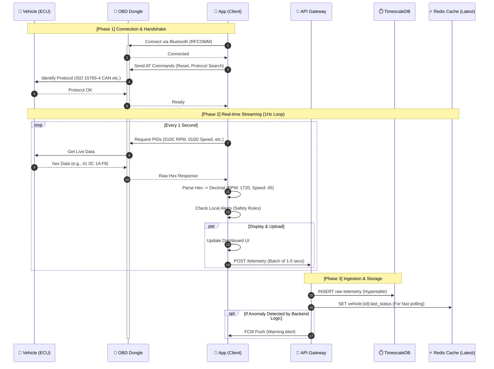
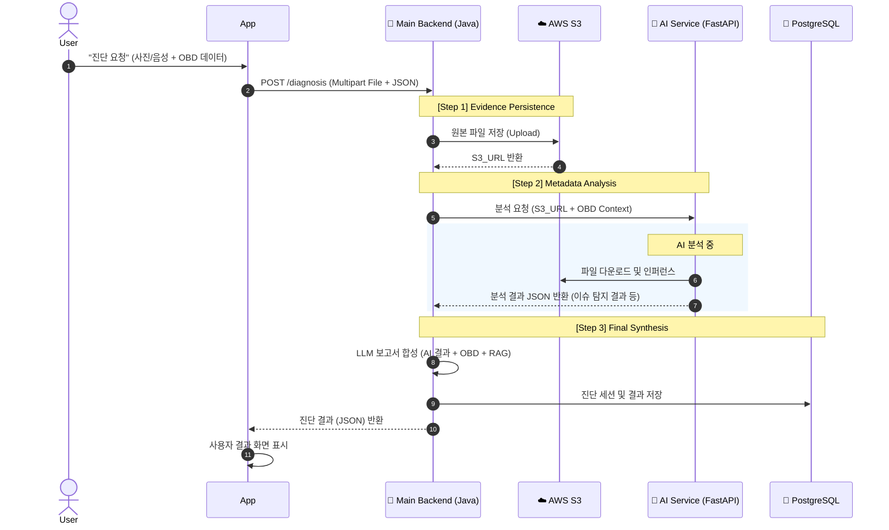
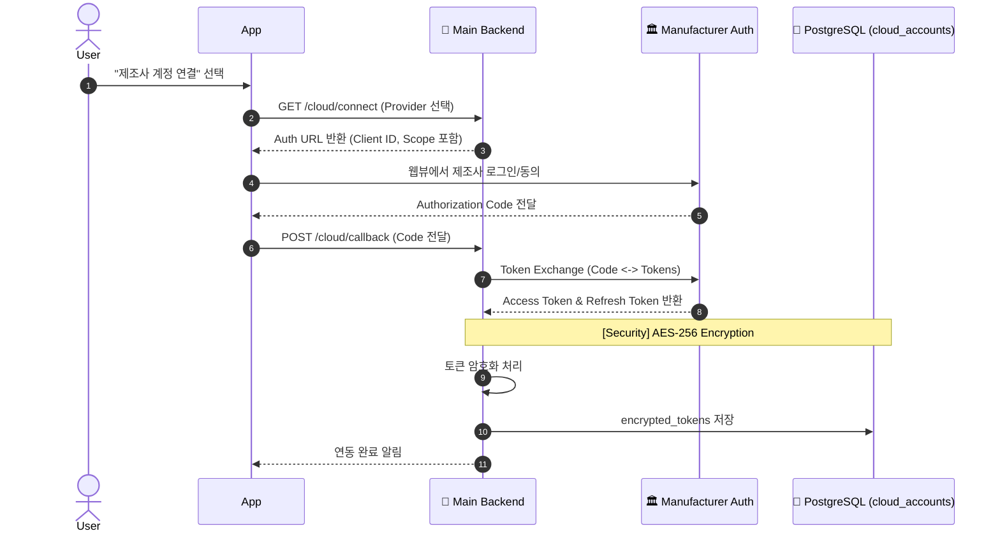

# 시스템 아키텍처 및 데이터 흐름 상세 설계서

> **문서 버전**: v1.0
> **기반 문서**: 기술 구현 가이드라인
> **작성일**: 2026-01-10

---

## 1. 시스템 아키텍처 오버뷰 (System Overview)

본 시스템은 **실시간성(Real-time)**이 요구되는 OBD-II 차량 데이터 처리와 **고연산(High-Compute)**이 필요한 AI/LLM 진단을 동시에 수행하는 하이브리드 아키텍처를 채택합니다.

### 1.1 High-Level Architecture Diagram

```mermaid
graph TD
    %% Client Layer (Top)
    subgraph Client_Layer["Client Layer"]
        direction TB
        OBD_Adapter[("OBD-II Adapter")]
        MobileApp[("Mobile App")]
        OBD_Adapter <== "Bluetooth" ==> MobileApp
    end

    %% Backend Layer (Center Hub)
    subgraph Backend_Layer["Backend Layer"]
        direction TB
        Gateway["Main Backend<br/>(Java Spring Boot)"]
        MQ["Message Queue<br/>(RabbitMQ)"]
        Gateway -- "Publish Task" --> MQ
    end

    %% Layer Connections (서브그ë˜í”„ 밖으로 ì´ë™)
    MobileApp -- "REST/WebSocket" --> Gateway

    %% Data Layer
    subgraph Data_Layer["Data Persistence Layer"]
        direction TB
        subgraph Postgres_Integrated["PostgreSQL Integrated"]
            direction TB
            RDB[("Relational DB")]
            TSDB[("Time-series DB")]
            VDB[("Vector DB")]
        end
        S3_Bucket[("AWS S3 Bucket")]
    end
    Gateway -- "Business CRUD" --> RDB
    Gateway -- "Telemetry Write" --> TSDB
    Gateway -- "Similarity Search" --> VDB
    Gateway -- "File I/O" --> S3_Bucket

    %% External & AI (Narrow Layout)
    subgraph External_Services["External Interfaces"]
        direction TB
        CloudAPI["Manufacturer API"]
        SearchAPI["Web Search API"]
        PushSvc["FCM (Push Notification)"]
    end
    
    MQ -- "Sync Task" --> CloudAPI
    MQ -- "Notify Task" --> PushSvc

    subgraph AI_Systems["AI Systems"]
        direction TB
        Orchestrator["AI Service<br/>(FastAPI)"]
        LLM_Agent["LLM Synthesis"]
    end

    MQ -- "Subscribe & Process" --> Orchestrator
    Orchestrator -- "Media Fetch / Training" --> S3_Bucket
    Orchestrator -- "Update Result" --> Gateway
    Gateway -- "Prompt & Context" --> LLM_Agent
    LLM_Agent -- "External Search" --> SearchAPI
```



---

## 2. 상세 컴포넌트 명세 (Detailed Component Specification)

### 2.1 Client Layer (Mobile/Web)
- **Role**: 데이터 수집의 최전선이자 사용자 인터페이스.
- **Key Modules**:
    - **OBD Connector**: ELM327과의 블루투스 소켓 통신 관리. `AT Command` 전송 및 응답 파싱. (Connection Keep-alive 필수)
    - **Buffer Manager**: 1Hz 주기의 고빈도 데이터를 로컬 버퍼에 임시 저장 후, 네트워크 상태에 따라 배치(Batch) 전송 또는 실시간 스트리밍.
    - **Local Lite-AI**: 네트워크 단절 시(Tunnel 등) 기본적인 안전 경고(급발진, 과열)를 수행하는 경량화된 Rule-based 로직 내장.

### 2.2 Backend Layer (Java Spring Boot)
- **Role**: 비즈니스 로직 처리, 사용자 인증, 데이터 영속화, AI/외부 서비스 연동의 중추.
- **Function**: 모든 요청의 진입점(API Gateway)이며, 실시간 Telemetry 데이터를 파싱하여 DB에 적재합니다. 
- **Message Broker (RabbitMQ) 활용 범위**:
    - **AI Task**: 시간이 소요되는 AI 진단 및 추론 작업 분산 처리.
    - **Push Notification**: FCM을 통한 대량 알림 발송 시 응답 지연 방지 및 재시도 관리.
    - **Cloud Sync**: 외부 제조사 API(Smartcar 등)와의 데이터 동기화 작업 비동기화.
    - **Heavy Reports**: 대용량 시계열 데이터를 가공하는 리포트 생성 작업 백그라운드 처리.

### 2.3 AI Systems (Integrated AI Services)
- **Role**: 멀티모달 데이터(이미지, 음성, 시계열) 분석 및 지능형 가이드 생성.
- **Components**:
    - **AI Hub (Cloud GPU Service)**:
        - **Tech**: Python, FastAPI.
        - **Models**: YOLOv8-L (외관), AST (엔진음), LSTM-AE (OBD 패턴) 실시간 추론 수행.
    - **openAI (Large Language Model)**:
        - **Model**: **GPT-4o**.
        - **Role**: AI Hub의 분석 결과와 OBD 데이터를 합성하여 사용자 친화적인 진단 리포트(`LLM Synthesis`) 생성.

### 2.4 PostgreSQL Integrated Instance (Data Persistence)
본 시스템은 **단일 PostgreSQL 인스턴스**에서 Extension 기능을 활용하여 세 가지 데이터 모델을 통합 관리합니다.
- **관계형 테이블 (Standard PostgreSQL)**:
    - 사용자 정보, 차량 프로파일, 진단 세션 및 최종 리포트 등 정형 데이터 저장.
- **시계열 테이블 (TimescaleDB Extension)**:
    - 1초 단위로 수집되는 대량의 OBD 텔레메트리 데이터를 하이퍼테이블(Hypertables)로 관리. 7일 보관 후 자동 삭제(Drop Chunk) 정책 적용.
- **벡터 테이블 (pgvector Extension)**:
    - 차량 정비 지식 및 매뉴얼의 임베딩 값을 저장하여 LLM의 RAG(검색 증강 생성) 소스로 활용.

### 2.5 Storage (Media Assets)
- **AWS S3 Bucket**:
    - **목적**: 사용자가 업로드한 사고/고장 사진, 녹화된 엔진 소리 파일, AI 재학습용 원본 로그 저장.

### 2.6 External Interfaces
- **Manufacturer API**: 제조사 클라우드(BlueLink/KiaConnect 등)를 통한 차량 상태 데이터 동기화.
- **Search API (Tavily)**: 수리 방법 및 부품 가격 정보를 위한 실시간 웹 검색 엔진 연동.
- **Public Data Portal**: 엔진 오일 권장 주기, 리콜 정보 등 공공 정보 연동.

---

## 3. 핵심 데이터 흐름 상세 (Detailed Data Flow)

### 3.1 OBD-II 실시간 데이터 수집 및 처리 파이프라인
차량 시동 ON 시점부터 앱이 데이터를 수집하여 서버에 저장하고, 실시간 모니터링 뷰를 갱신하는 흐름입니다.



### 3.2 AI 멀티모달 복합 진단 프로세스 (Link-based Diagnosis)
사용자가 진단을 요청했을 때, 대용량 파일은 S3를 거쳐 주소 기반으로 처리됩니다.



### 3.3 제조사 클라우드 연동 (OAuth 2.0 Flow)
사용자가 제조사 계정을 연결하고 데이터를 동기화하는 보안 흐름입니다.



### 3.4 소모품 예지 정비 및 배치 분석 (Predictive Maintenance Batch)
매일 밤 수행되는 대규모 데이터 분석 및 예측 파이프라인입니다.

```mermaid
flowchart TD
    trigger((⏰ Daily Trigger<br/>03:00 AM)) --> BatchJob[batch-prediction-job]
    
    subgraph Data_Preparation
        BatchJob --> FetchData[Fetch Last 30 Days Summary from Postgres]
        BatchJob --> FetchRaw[Fetch Last 7 Days Raw Waveform from TimescaleDB]
        FetchData & FetchRaw --> Preprocess[Feature Engineering<br/>(Trend, Drift, Volatility)]
    end
    
    subgraph AI_Inference
        Preprocess --> XGBoost[XGBoost Regressor<br/>(Consumables Life %)]
        Preprocess --> LSTM[LSTM Anomaly Detector<br/>(Battery/Start-up Voltage)]
    end
    
    subgraph Evaluation_Action
        XGBoost --> CheckLife{Life < 10%?}
        LSTM --> CheckDanger{Failure Prob > 80%?}
        
        CheckLife -- Yes --> CreateNoti1[Create Notification<br/>'Engine Oil Change Due']
        CheckLife -- No --> UpdateStatus1[Update Current Status DB]
        
        CheckDanger -- Yes --> CreateNoti2[Create **CRITICAL** Alert<br/>'Battery Dying Soon']
        CheckDanger -- No --> UpdateStatus2[Log Prediction Score]
    end
    
    CreateNoti1 & CreateNoti2 --> PushServer[FCM Push Server]
    UpdateStatus1 & UpdateStatus2 --> DB[(PostgreSQL)]

```

---

## 4. 데이터베이스 스키마 설계 (Extended ERD)

기본적인 사용자/차량 정보 외에, **시계열 데이터 최적화**와 **AI 진단 이력** 관리에 초점을 맞춘 확장 설계입니다.

### 4.1 간략 ERD (Simplified ERD)

> [!NOTE]
> 본 다이어그램은 시스템의 전체적인 관계를 파악하기 위한 **간략 버전**입니다. 각 컬럼의 데이터 타입, 제약 조건, Enum 값 등 상세한 데이터베이스 설계 정보는 [데이터베이스 상세 설계서 (DB_설계서.md)](file:///c:/dev/AI/AI-5-main/Docs/DB_설계서.md)를 참조하십시오.


---

## 5. 보안 및 네트워크 설계 (Security & Network)

### 5.1 네트워크 아키텍처
- **Private Subnet 원칙**: DB(PostgreSQL, TimescaleDB, Redis)와 AI Inference Server는 외부에서 직접 접근할 수 없는 Private Subnet에 배치.
- **Bastion Host / VPN**: 관리자 전용 접근 통로.
- **TLS 1.3**: 모든 구간(App-Server, Server-DB)에 암호화 통신 적용.

### 5.2 데이터 보안
- **VIN & PII 암호화**: `AES-256-GCM` 알고리즘을 사용하여 DB 저장 시 암호화. (Key Management System 활용 권장).
- **데이터 비식별화**: AI 학습용으로 S3로 이관되는 데이터는 `user_id`, `vin` 등을 제거하거나 Hashing 처리하여 저장.

---
**[문서 끝]**
