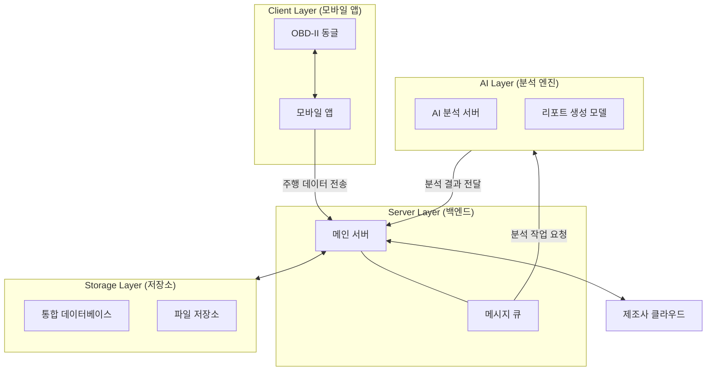
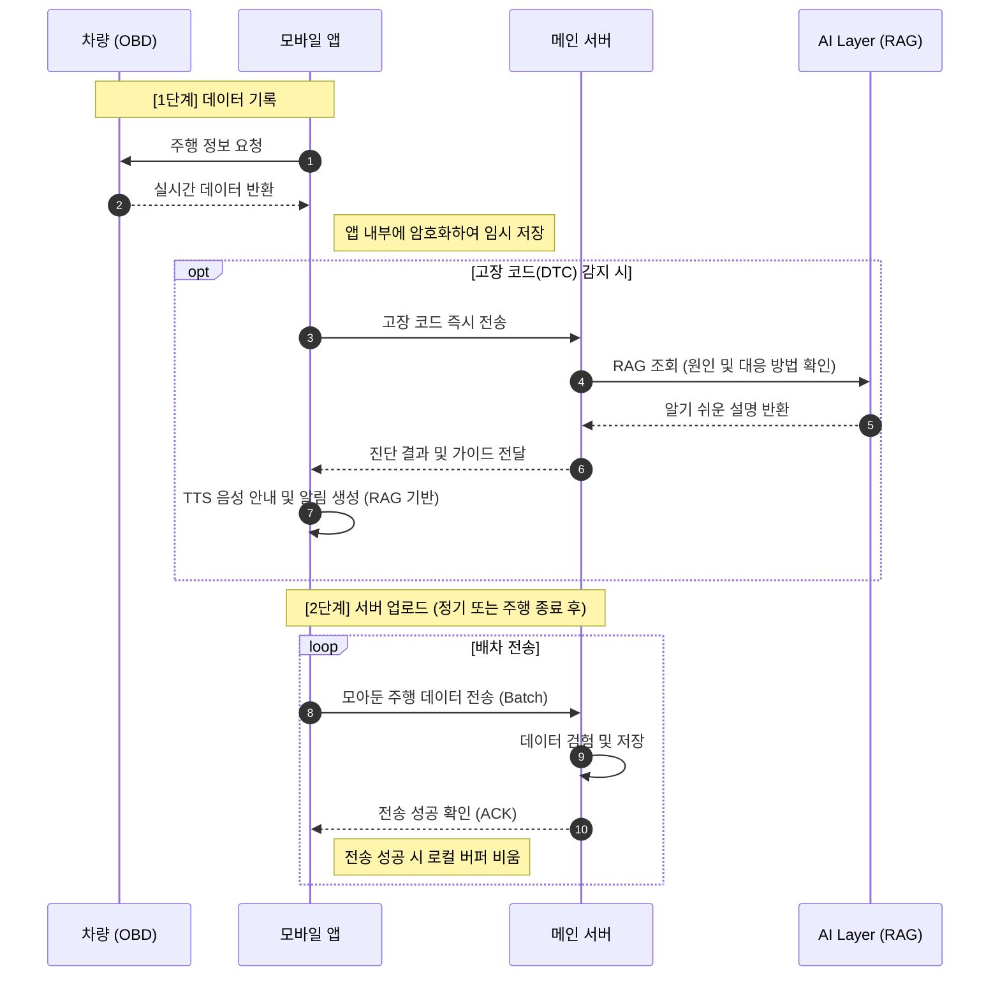
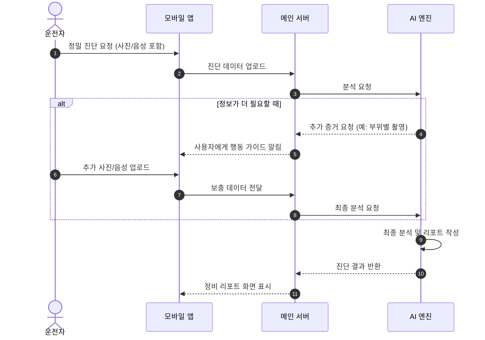

# 시스템 구조 및 데이터 흐름 설계

본 문서는 차량에서 발생하는 데이터를 수집하고 AI가 분석하여 정비 리포트를 제공하는 전체 흐름을 정의합니다.

---

## 1. 기술 스택 (Tech Stack)

| 영역 (Domain) | 핵심 기술 (Core Technologies) | 설명 |
|:---:|:---|:---|
| **Mobile App** | **React Native** | Android/iOS 크로스 플랫폼 애플리케이션 |
| **Backend** | **Spring Boot (Java), FastAPI (Python)** | 비즈니스 로직 및 AI 모델 서빙 |
| **Infra & DB** | **PostgreSQL (+TimescaleDB, pgvector), RabbitMQ, Docker** | 데이터 저장, 비동기 메시징, 컨테이너 환경 |
| **AI / ML** | **PyTorch, YOLOv8, LSTM, XGBoost** | 시계열 분석(고장 예측) 및 이미지 진단 |
| **Device** | **OBD-II (ELM327)** | 차량 데이터 실시간 통신 인터페이스 |

---

## 2. 시스템 구조 개요 (Architecture Overview)

전체 시스템은 **Client Layer, Server Layer, AI Layer**의 3가지 핵심 계층으로 구성됩니다.

---

## 3. 계층별 역할 (Component Specification)

### 3.1 Client Layer (모바일 앱)
- **데이터 수집**: 주행 중 발생하는 차량 데이터를 실시간으로 기록합니다.
- **음성 안내 (TTS)**: 차량 고장 코드(DTC)가 나타나면 즉시 음성으로 알려줍니다.
- **연결 복구 전송**: 인터넷이 끊기면 데이터를 앱에 임시 저장했다가, 다시 연결될 때 서버로 보냅니다.

### 3.2 Server Layer (메인 백엔드)
- **정보 관리**: 사용자 계정, 차량 등록 정보, 주행 기록을 통합 관리합니다.
- **작업 조율**: AI 분석이나 외부 데이터 동기화처럼 시간이 걸리는 일을 조율하고 관리합니다.

### 3.3 AI Layer (분석 엔진)
- **이상 탐지**: 평소와 다른 미세한 고장 징후를 찾아냅니다.
- **DTC 즉시 분석**: 감지된 고장 코드를 **RAG(검색 증강 생성)**를 통해 실시간으로 해석하여 안내합니다.
- **복합 진단**: 숫자 데이터뿐만 아니라 사진이나 엔진 소리를 함께 분석하여 더 정확한 결과를 냅니다.
- **리포트 작성**: 분석 결과를 일반 운전자가 이해하기 쉬운 보고서로 정리합니다.

### 3.4 Storage Layer (데이터 저장)
- **통합 DB**: 차량과 관련된 모든 정보 및 주행 기록을 한곳에 저장합니다.
- **중요 데이터 보관**: 일반적인 기록은 주기에 맞춰 정리하고, 사고나 고장 의심 구간의 상세 데이터는 별도 보관소(S3)에 영구 저장합니다.

---

## 4. 주요 데이터 흐름 (System Data Flow)

### 4.1 주행 데이터 수집 및 전송

### 4.2 AI 정밀 진단 프로세스 (Guided Diagnosis)

---

## 5. 보안 및 시스템 안정성 (Security & Reliability)

- **데이터 보안**: 차량 번호 등 중요한 정보는 암호화하여 저장하며, 모든 데이터 전송은 보안 통로를 통과합니다.
- **네트워크 불안정 시 데이터 보호**: 인터넷 연결이 원활하지 않은 환경에서도 주행 데이터가 기록되고, 복구 시 안전하게 전송되도록 설계되었습니다.
- **분리 처리**: 시간이 오래 걸리는 무거운 분석 작업은 서비스 속도에 영향을 주지 않도록 분리하여 처리합니다.

---
**[설계 문서 종료]**
