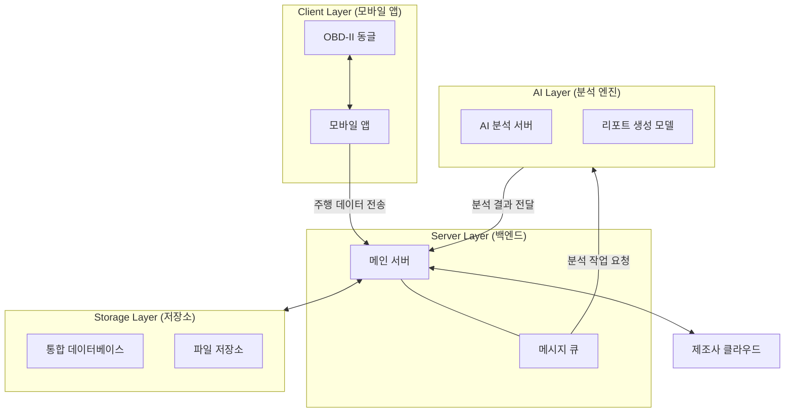
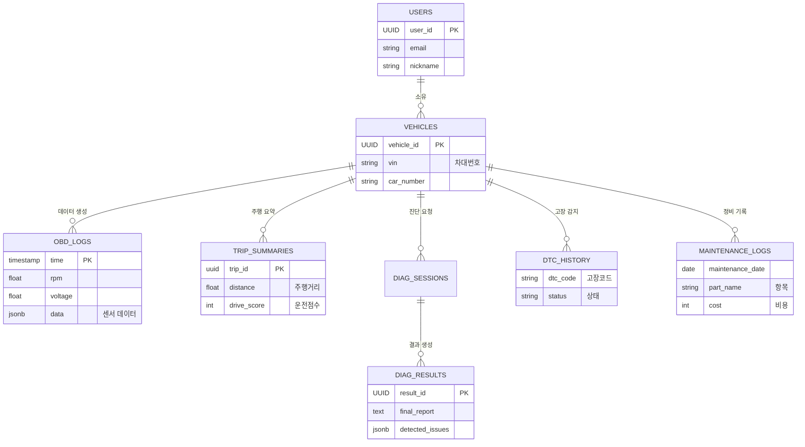

# 멘토링 공유 페이지

> **Notion 작성 팁**
> - 이 페이지는 멘토링 시 프로젝트 현황을 한눈에 공유하기 위한 대시보드입니다.
> - **상단 2단 구성**: 1.1~1.2를 왼쪽, 1.3~1.4를 오른쪽에 배치하려면 Notion에서 `/2col` 명령어를 사용하세요.
> - **토글 사용**: 중단/하단 내용은 `/toggle` (토글 목록)을 사용하여 내용을 접어두면 깔끔합니다.
> - **체크리스트**: 마일스톤의 `[ ]` 부분은 Notion에서 체크박스로 변환될 수 있습니다.

---

## 1. 프로젝트 현황 요약 (Top Section)

### [Left Column] 개요 및 핵심 기능

#### 1.1 프로젝트 개요
- **프로젝트명**: 차량 예지 정비 시스템 (AI-Car-Care)
- **소개**: OBD-II 데이터와 멀티모달 AI를 결합한 **초개인화 차량 예지 정비 솔루션**
- **목표**: OBD-II 및 멀티모달 데이터를 융합한 **AI 기반 종합 차량 컨디션 진단 솔루션**

#### 1.2 핵심 기능
1. **AI 종합 정비 진단**
   - 주행 종료 후 OBD 데이터와 엔진 소리/사진을 복합 분석하여, 정비사 수준의 정밀 진단 리포트 제공
2. **운전습관 기반 소모품 관리**
   - 단순 주행거리가 아닌, 급가속/급제동 등 **실제 운전 습관**을 분석하여 개인화된 교체 시기 추천
3. **고장 전조 자동 탐지**
   - 평소 주행 패턴을 학습한 AI가 고장 코드가 뜨기 전의 **미세한 이상 징후**(전압 불안정, 출력 저하)를 사전에 포착

---

### [Right Column] 기술 및 일정

#### 1.3 기술 스택
- **Frontend**: React Native (Android/iOS)
- **Backend**: Spring Boot 3 (Core), FastAPI (AI Serving)
- **Database**: PostgreSQL 15, TimescaleDB (Time-series), pgvector (Vector Search)
- **Infra**: Docker, RabbitMQ

#### 1.4 주간 마일스톤 (Progress)
- **기간**: 1/12 ~ 2/27 (총 7주)
- **현재 단계**: 2주차 (진행중)

<b>1주차: 개발 환경 설정</b>

- [x] **Backend**: 프로젝트 초기 설정, db 설계, api 신청
- [x] **Frontend**: 앱 프로젝트 초기화, UI/UX 디자인 수립, 퍼블리싱
- [x] **AI**: 개발환경구축, 학습용 데이터셋 확보 및 정제, AI 클라우드 서버 구축

<b>2~3주차: MVP 핵심 파이프라인 개발</b>

- [x] **Backend**: 주행 데이터 수집 API 및 AI 진단 시스템 구축
- [x] **Frontend**: OBD 기기 연결 및 백그라운드 데이터 전송 파이프라인 구축
- [/] **AI**: 핵심 진단 모델 학습 및 성능 수치화

<b>4주차: MVP고도화 및 멀티모달 통합 진단 체계 구축</b>

- [ ] **Backend**: 멀티모달 및 제조사(Connected Car) 데이터 연동을 통한 통합 진단 로직 구현
- [ ] **Frontend**: AI 진단 결과 리포트 및 사용자 경험 개선
- [ ] **AI**: 멀티모달 진단 모델링 완성 및 서버 연동/추론 최적화

<b>5~6주차: 통합 테스트 및 배포</b>

- [ ] **Backend**: 운영 서버 환경 구축 및 서비스 안정화 (부하 테스트 및 배포 자동화)
- [ ] **Frontend**: 앱 최종 빌드 및 APK 생성
- [ ] **AI**: 시스템 통합 테스트 지원 및 진단 결과물 최종 검사

<b>7주차: 발표 및 시연 준비(목요일 발표)</b>

- [ ] **Common**: 최종 시나리오 구성, 발표 자료 및 시연 영상 제작

---

## 2. 상세 정의 및 설계 ({Middle Section} - Toggle)

> *아래 각 항목은 Notion의 토글(Toggle) 기능을 활용하여 접어주세요.*

<b>[ 시스템 아키텍처 ]</b>

<b>[ ERD 핵심 테이블 ]</b>

<b>[ 전체 테이블 상세 명세 ]</b>

### 2.1 사용자 및 차량 (Core)
차량 소유 관계와 기본적인 차량 정보를 관리합니다.

| 테이블명 | 컬럼명 | 타입 | 제약조건 | 설명 |
|:---|:---|:---|:---|:---|
| **users** | user_id | UUID | PK | 사용자 고유 식별자 |
| | email | VARCHAR(255) | UK, NOT NULL | 로그인 계정 (직접/소셜) |
| | password_hash | VARCHAR(255) | | 암호화된 비밀번호 (bcrypt) |
| | nickname | VARCHAR(50) | | 서비스 내 활동 닉네임 |
| | fcm_token | VARCHAR(255) | | 푸시 알림 발송용 토큰 |
| | user_level | ENUM | DEFAULT 'FREE' | FREE / PREMIUM / ADMIN |
| | membership_expiry | TIMESTAMP | | 멤버십 만료 일시 |
| | last_login_at | TIMESTAMP | | 최종 로그인 일시 |
| | created_at | TIMESTAMP | DEFAULT NOW(), NOT NULL | 가입 일시 (BaseEntity) |
| | updated_at | TIMESTAMP | NOT NULL | 수정 일시 (BaseEntity) |
| | profile_image | OID | | 프로필 이미지 바이너리 |
| | deleted_at | TIMESTAMP | | 탈퇴 일시 (Soft Delete) |

#### 2.1.2 사용자 알림 및 서비스 설정 (user_settings - FR-NOTI-001)
| 테이블명 | 컬럼명 | 타입 | 제약조건 | 설명 |
|:---|:---|:---|:---|:---|
| **user_settings** | user_id | UUID | PK, FK | 사용자 식별자 (users.user_id) |
| | noti_maintenance | BOOLEAN | DEFAULT TRUE | 정비/소모품 알림 수신 여부 |
| | noti_anomaly | BOOLEAN | DEFAULT TRUE | 이상 징후 리포트(Post-Trip) 수신 여부 |
| | noti_marketing | BOOLEAN | DEFAULT FALSE | 마케팅 알림 수신 여부 |
| | noti_dtc_tts | BOOLEAN | DEFAULT TRUE | DTC 발생 시 TTS 음성 안내 수신 여부 (Safety Exception) |
| | night_push_allowed| BOOLEAN | DEFAULT FALSE | 야간 리포트 발송 허용 여부 |

#### 2.1.3 제조사 클라우드 연동 계정 (cloud_accounts - FR-CLOUD-001)
*OAuth 연동 정보를 보관하며, 토큰은 반드시 AES-256으로 암호화하여 저장합니다.*

| 테이블명 | 컬럼명 | 타입 | 제약조건 | 설명 |
|:---|:---|:---|:---|:---|
| **cloud_accounts** | account_id | UUID | PK | 식별자 |
| | user_id | UUID | FK | 사용자 식별자 |
| | provider | VARCHAR(50) | | 제조사 (HYUNDAI, KIA, TESLA 등) - Via High Mobility |
| | provider_user_id | VARCHAR(255) | | High Mobility 사용자 식별 ID |
| | access_token | TEXT | | 암호화된 Access Token |
| | refresh_token | TEXT | | 암호화된 Refresh Token |
| | expires_at | TIMESTAMP | | 토큰 만료 일시 |
| | last_synced_at | TIMESTAMP | | 최종 데이터 동기화 성공 시각 |

#### 2.1.4 리프레시 토큰 (refresh_tokens - BE-AU-006)
*사용자의 로그인 유지를 위한 JWT Refresh Token을 관리합니다.*

| 테이블명 | 컬럼명 | 타입 | 제약조건 | 설명 |
|:---|:---|:---|:---|:---|
| **refresh_tokens** | id | BIGINT | PK, AUTO_INC | 식별자 |
| | user_id | UUID | FK, UK, NOT NULL | 사용자 식별자 (users.user_id) |
| | token | VARCHAR(255) | UK, NOT NULL | Refresh Token 문자열 |
| | expiry_date | TIMESTAMP | NOT NULL | 토큰 만료 일시 |

#### 2.1.5 차량 (vehicles - FR-CAR-001)
| 테이블명 | 컬럼명 | 타입 | 제약조건 | 설명 |
|:---|:---|:---|:---|:---|
| **vehicles** | vehicles_id | UUID | PK | 차량 고유 식별자 |

| | user_id | UUID | FK | 소유주 (users.user_id) |
| | vin | VARCHAR(255) | UK | 차대번호 (암호화, 어댑터 미연동 시 NULL 가능) |
| | car_number | VARCHAR(20) | | 차량 번호 (예: 123가 4567) |
| | manufacturer | VARCHAR(50) | | 제조사 (예: Hyundai) |
| | model_name | VARCHAR(100) | | 모델명 (예: Sonata) |
| | model_year | INT | | 차량 연식 (예: 2023) |
| | fuel_type | ENUM | | GASOLINE / DIESEL / EV / HEV / LPG / ELECTRIC / HYBRID |
| | total_mileage | FLOAT | DEFAULT 0 | 누적 주행거리 (km) |
| | is_primary | BOOLEAN | DEFAULT FALSE | 대표 차량 여부 |
| | registration_source | ENUM | | MANUAL / OBD / CLOUD |
| | cloud_linked | BOOLEAN | DEFAULT FALSE | 클라우드 계정 연동 여부 |
| | nickname | VARCHAR(50) | | 차량 별칭 (사용자 설정) |
| | memo | TEXT | | 차량 관련 메모 |
| | obd_device_id | VARCHAR(100) | | OBD 어댑터 하드웨어 식별자 |
| | created_at | TIMESTAMP | DEFAULT NOW() | 등록 일시 |
| | deleted_at | TIMESTAMP | | 삭제 일시 (Soft Delete) |

### 2.2 텔레메트리 (Telemetry)
차량 주행 중 발생하는 데이터와 제조사 클라우드 동기화 데이터를 관리합니다.

#### 2.2.1 OBD 실시간 로그 (obd_logs - TimescaleDB)
*하이퍼테이블(Hypertable)로 설정하며, 3일 보관 후 자동 삭제(Drop Chunk) 정책을 적용함.*

| 테이블명 | 컬럼명 | 타입 | 제약조건 | 설명 |
|:---|:---|:---|:---|:---|
| **obd_logs** | time | TIMESTAMPTZ | PK | 수집 시각 |
| | vehicles_id | UUID | PK, FK | 차량 식별자 |
| | rpm | FLOAT | | 엔진 회전수 |
| | speed | FLOAT | | 차량 속도 |
| | voltage | FLOAT | | 배터리 전압 |
| | coolant_temp | FLOAT | | 냉각수 온도 |
| | engine_load | FLOAT | | 엔진 부하 |
| | fuel_trim_short | FLOAT | | 단기 연료 보정값 |
| | fuel_trim_long | FLOAT | | 장기 연료 보정값 |
| | json_extra | JSONB | | 연료량/제조사별 특화 데이터 (EV SoC 등) |

#### 2.2.2 클라우드 동기화 데이터 (cloud_telemetry)
*제조사 API(High Mobility)를 통해 정기적으로 가져오는 공식 상태 정보.*

| 테이블명 | 컬럼명 | 타입 | 제약조건 | 설명 |
|:---|:---|:---|:---|:---|
| **cloud_telemetry** | last_synced_at | TIMESTAMPTZ | PK | 동기화 시각 |
| | vehicles_id | UUID | PK, FK | 차량 식별자 |
| | odometer | FLOAT | | 공식 누적 주행거리 |
| | fuel_level | FLOAT | | 잔여 연료량 (%) |
| | battery_soc | FLOAT | | EV 배터리 잔량 (%) |
| | charging_status | ENUM | | EV 충전 상태 (DISCONNECTED/CHARGING/FULL/ERROR) |

#### 2.2.3 주행 요약 (trip_summaries)
*주행 종료 시 OBD 데이터를 가공하여 생성하는 통계 리포트.*

| 테이블명 | 컬럼명 | 타입 | 제약조건 | 설명 |
|:---|:---|:---|:---|:---|
| **trip_summaries** | start_time | TIMESTAMP | PK | 주행 시작 시각 |
| | vehicles_id | UUID | PK, FK | 차량 식별자 |
| | trip_id | UUID | UK, NOT NULL | 주행 세션 식별자 (로직용) |
| | end_time | TIMESTAMP | | 주행 종료 시각 |
| | distance | FLOAT | | 해당 주행 거리 (km) |
| | drive_score | INT | | 해당 주행 운전 점수 (0~100) |
| | average_speed | FLOAT | | 평균 속도 |
| | top_speed | FLOAT | | 최고 속도 |
| | fuel_consumed | FLOAT | | 소모 연료량 추정치 |
| | min_battery_voltage | FLOAT | | 시동 시 최저 전압 (배터리 수명 예측용) |
| | max_coolant_temp | FLOAT | | 주행 중 최고 냉각수 온도 (과열 이력) |
| | avg_fuel_trim | FLOAT | | 평균 연료 보정값 (흡기/누유 추적) |
| | max_engine_load | FLOAT | | 최대 엔진 부하 (엔진 피로도 관리) |
| | idle_time | INT | | 공회전 시간 (초) - 정차 비율 계산용 |
| | hard_accel_count | INT | | 급가속 횟수 (운전 습관) |
| | hard_brake_count | INT | | 급감속 횟수 (브레이크 수명 예측) |

### 2.3 AI 진단 및 증거 (Diagnosis & AI)
AI 모델의 분석 과정과 최종 리포트를 관리합니다.

| 테이블명 | 컬럼명 | 타입 | 제약조건 | 설명 |
|:---|:---|:---|:---|:---|
| **diag_sessions** | diag_session_id | UUID | PK | 진단 세션 식별자 |
| | vehicles_id | UUID | FK | 차량 식별자 |
| | trip_id | UUID | FK | 주행 세션 ID (nullable, trip_summaries.trip_id) |
| | trigger_type | ENUM | | MANUAL/DTC/ANOMALY/ROUTINE |
| | status | ENUM | | PENDING/PROCESSING/DONE/FAILED |
| | created_at | TIMESTAMP | | 요청 시각 |

> **소모품 리셋 연동**: 정비 이력이 등록되면 해당 부품의 `vehicle_consumables` 레코드가 자동으로 갱신(수명 100% 리셋)됩니다.

#### 2.3.2 AI 진단 결과 (diag_results)
| 테이블명 | 컬럼명 | 타입 | 제약조건 | 설명 |
|:---|:---|:---|:---|:---|
| **diag_results** | diag_result_id | UUID | PK | 결과 식별자 |
| | diag_session_id | UUID | FK | 진단 세션 ID (diag_sessions.diag_session_id) |
| | final_report | TEXT | | LLM 생성 최종 분석 리포트 (Markdown) |
| | contributing_factors| JSONB | | [SRS REQ-AI-01] 이상 발생 기여 요인 (예: ["RPM", "Voltage"]) |
| | detected_issues | JSONB | | 감지된 고장/이상 항목 리스트 |
| | actions_json | JSONB | | 추천 정비 또는 자가 조치 액션 |
| | risk_level | ENUM | | LOW/MID/HIGH/CRITICAL |

#### 2.3.3 AI 진단 증거 및 미션 (ai_evidences - FR-DIAG-004)
*AI가 직접 수집하거나 사용자에게 요청한 사진/녹음 등의 멀티모달 증거를 관리합니다.*

| 테이블명 | 컬럼명 | 타입 | 제약조건 | 설명 |
|:---|:---|:---|:---|:---|
| **ai_evidences** | evidence_id | UUID | PK | 분석 증거 식별자 |
| | diag_session_id | UUID | FK | 진단 세션 ID (diag_sessions.diag_session_id) |
| | media_type | ENUM | | AUDIO/IMAGE/SNAPSHOT |
| | s3_key | TEXT | | AWS S3 저장 경로 (UPLOADED 상태에서 필수) |
| | ai_analysis | JSONB | | AI 분석 결과(YOLO/AST 결과 등) |
| | status | ENUM | DEFAULT 'UPLOADED' | REQUESTED / UPLOADED / FAILED |
| | request_text | TEXT | | AI가 사용자에게 사진/녹음 등을 요청한 안내 문구 |

### 2.4 상태 관리 및 히스토리 (Status & History)
차량의 건강 상태와 정비 이력을 관리합니다.

#### 2.4.1 DTC 고장 코드 이력 (dtc_history)
| 테이블명 | 컬럼명 | 타입 | 제약조건 | 설명 |
|:---|:---|:---|:---|:---|
| **dtc_history** | dtc_id | UUID | PK | 이력 식별자 |
| | vehicles_id | UUID | FK | 차량 식별자 |
| | dtc_code | VARCHAR(10) | | 고장 코드 (예: P0301) |
| | description | TEXT | | 코드 설명 (기본) |
| | rag_guide | TEXT | | [SRS REQ-AI-03] RAG를 통해 조회된 알기 쉬운 원인/대응 가이드 |
| | dtc_type | ENUM | | STORED(03) / PENDING(07) / PERMANENT(0A) |
| | status | ENUM | | ACTIVE/RESOLVED/CLEARED |
| | resolution_type| ENUM | | AUTO / MANUAL / OBD_CLEAR |
| | discovered_at | TIMESTAMP | | 최초 감지 시각 |
| | resolved_at | TIMESTAMP | | 해결/삭제 시각 |

#### 2.4.2 DTC 고장 시점 스냅샷 (dtc_freeze_frames - 정규화)
*Mode 02 데이터를 JSONB 대신 컬럼 기반으로 저장하여 분석 및 통계 속도를 최적화합니다.*

| 테이블명 | 컬럼명 | 타입 | 제약조건 | 설명 |
|:---|:---|:---|:---|:---|
| **dtc_freeze_frames** | frame_id | UUID | PK | 식별자 |
| | dtc_id | UUID | FK, UK | 관련 고장 이력 식별자 |
| | rpm | FLOAT | | 엔진 회전수 |
| | speed | FLOAT | | 차량 속도 |
| | coolant_temp | FLOAT | | 냉각수 온도 |
| | engine_load | FLOAT | | 엔진 부하 |
| | ambient_temp | FLOAT | | 외기 온도 |
| | fuel_pressure | FLOAT | | 연료 압력 |
| | pids_snapshot | JSONB | | 기타 비표준/특이 PID 데이터 |

#### 2.4.3 소모품 항목 관리 (consumable_items) - Reference
| 테이블명 | 컬럼명 | 타입 | 제약조건 | 설명 |
|:---|:---|:---|:---|:---|
| **consumable_items** | id | BIGINT | PK | 식별자 |
| | code | VARCHAR(255) | UK | 코드명 (ENGINE_OIL, TIRES 등) |
| | name | VARCHAR(255) | | 표시명 (엔진오일, 타이어 등) |
| | default_interval_mileage | INT | | 기본 교체 주기 (km) |
| | default_interval_months | INT | | 기본 교체 주기 (개월) |
| | description | TEXT | | 설명 |

#### 2.4.4 차량별 소모품 상태 (vehicle_consumables)
| 테이블명 | 컬럼명 | 타입 | 제약조건 | 설명 |
|:---|:---|:---|:---|:---|
| **vehicle_consumables** | vehicle_consumable_id | UUID | PK | 식별자 |
| | vehicle_id | UUID | FK | 차량 식별자 |
| | consumable_item_id | BIGINT | FK | 소모품 항목 식별자 |
| | wear_factor | FLOAT | DEFAULT 1.0 | AI 산출 마모도 가중치 |
| | remaining_life | FLOAT | | 잔존 수명 (%) |
| | last_replaced_mileage | FLOAT | | 마지막 교체 시점 누적 주행거리 (km) |
| | wear_factor_updated_at | TIMESTAMP | | 마모도 갱신 시각 |
| | created_at | TIMESTAMP | | 생성 일시 |
| | updated_at | TIMESTAMP | | 수정 일시 |

#### 2.4.4 정비 차계부 (maintenance_logs)
| 테이블명 | 컬럼명 | 타입 | 제약조건 | 설명 |
|:---|:---|:---|:---|:---|
| **maintenance_logs** | maintenance_id | UUID | PK | 기록 식별자 |
| | vehicles_id | UUID | FK | 차량 식별자 |
| | maintenance_date | DATE | | 정비 수행 날짜 |
| | part_name | VARCHAR(50) | | 정비/교체 항목 (표준 Key 또는 사용자 입력) |
| | is_standardized | BOOLEAN | | 표준 항목 여부 (True: 리스트 선택, False: 직접 입력) |
| | cost | INT | | 정비 비용 |
| | shop_name | VARCHAR(100) | | 정비소 이름 |
| | mileage_at_work | FLOAT | | 정비 시점 주행거리 |
| | ocr_data | JSONB | | [SRS REQ-EXT-02] 영수증에서 추출된 원본 데이터 |
| | memo | TEXT | | 추가 특이사항 |

#### 2.4.4 소모품 및 정비 항목 표준 명칭 (Standard Naming)
AI 예측 데이터(`consumables_state`)와 연동되는 핵심 항목들은 드롭다운 선택 형식을 제공하며, 그 외 항목은 '기타'를 통해 자유 입력이 가능합니다.

| 표준 명칭 (Key) | 한글 표시명 | 분류 | AI 수명 연동 여부 |
|:---|:---|:---|:---|
| `ENGINE_OIL` | 엔진 오일 | 필터/윤활유 | Yes |
| `TIRE_FRONT` | 앞 타이어 | 구동/제동 | Yes |
| `TIRE_REAR` | 뒤 타이어 | 구동/제동 | Yes |
| `BRAKE_PAD_FRONT`| 앞 브레이크 패드 | 구동/제동 | Yes |
| `BRAKE_PAD_REAR` | 뒤 브레이크 패드 | 구동/제동 | Yes |
| `BATTERY_12V` | 12V 배터리 | 전기 장치 | Yes |
| `CABIN_FILTER` | 에어컨 필터 | 필터/윤활유 | Yes |
| `COOLANT` | 냉각수 | 필터/윤활유 | Yes |
| `OTHER` | 기타 (직접 입력) | - | No (이력만 보존) |

### 2.5 알림 및 기타 (Notification & Extra)
| 테이블명 | 컬럼명 | 타입 | 제약조건 | 설명 |
|:---|:---|:---|:---|:---|
| **notification** | id | BIGINT | PK, AUTO_INC | 알림 식별자 |
| | user_id | UUID | FK | 수신 대상 사용자 |
| | type | ENUM | | MAINTENANCE_ALERT / COMMUNITY_ALERT / SYSTEM_ALERT |
| | title | VARCHAR(255) | | 알림 제목 |
| | body | TEXT | | 알림 본문 |
| | is_read | BOOLEAN | DEFAULT FALSE | 읽음 여부 |
| | created_at | TIMESTAMP | | 발송 시각 |

| 테이블명 | 컬럼명 | 타입 | 제약조건 | 설명 |
|:---|:---|:---|:---|:---|
| **knowledge_vectors** | knowledge_id | UUID | PK | 식별자 |
| | category | VARCHAR(20) | | MANUAL / DTC_GUIDE / CASE_STUDY / PART_INFO |
| | content | TEXT | | 원문 텍스트 |
| | metadata | JSONB | | { manufacturer, model, year, source, page, dtc_code } |
| | embedding | VECTOR(1024) | | 로컬 AI (mxbai-embed-large) 임베딩 벡터 |

#### 2.6 차량 상세 제원 (vehicle_specs - FR-CAR-003)
| 테이블명 | 컬럼명 | 타입 | 제약조건 | 설명 |
|:---|:---|:---|:---|:---|
| **vehicle_specs** | spec_id | UUID | PK | 식별자 |
| | vehicles_id | UUID | FK | 차량 식별자 |
| | length | FLOAT | | 전장 (mm) |
| | width | FLOAT | | 전폭 (mm) |
| | height | FLOAT | | 전고 (mm) |
| | displacement | INT | | 배기량 (cc) |
| | engine_type | VARCHAR(50) | | 엔진 형식 |
| | max_power | FLOAT | | 최대 출력 (hp) |
| | max_torque | FLOAT | | 최대 토크 (kg.m) |
| | tire_size_front | VARCHAR(50) | | 앞 타이어 규격 |
| | tire_size_rear | VARCHAR(50) | | 뒤 타이어 규격 |
| | official_fuel_economy| FLOAT | | 공인 연비 (km/L) |
| | last_updated | TIMESTAMP | | 동기화 시각 |

---

### 2.7 차량 마스터 데이터 (Reference Data)
사용자에게 수동 등록(Track B) 시 제공할 제조사 및 차량 모델 표준 정보입니다. 프론트엔드 캐싱을 위해 단순한 구조로 설계합니다.

| 테이블명 | 컬럼명 | 타입 | 제약조건 | 설명 |
|:---|:---|:---|:---|:---|
| **car_model_master** | model_id | BIGINT | PK | 식별자 (Auto Increment) |
| | manufacturer | VARCHAR(50) | | 제조사 (예: Hyundai, Kia) |
| | model_name | VARCHAR(100) | | 모델명 (예: Grandeur IG) |
| | model_year | INT | | 연식 (예: 2020) |
| | fuel_type | VARCHAR(20) | | 유종 (Gasoline/Diesel/LPG/HEV/EV/Electric/Hybrid) |
| | displacement | INT | | 배기량 (cc) - 자동차세/연비 기준 |
| | spec_json | JSONB | | 기타 제원 (탱크용량, 타이어규격 등) |

---

### 2.8 이상 감지 이력 (anomaly_records - FR-ANOMALY)
AI가 주행 종료 후 정밀 진단하여 찾아낸 핵심 이상 징후를 기록합니다. '스마트 EDR(사고기록장치)' 기능을 위해 사용합니다.

| 테이블명 | 컬럼명 | 타입 | 제약조건 | 설명 |
|:---|:---|:---|:---|:---|
| **anomaly_records** | anomaly_id | UUID | PK | 이상 징후 식별자 |
| | vehicles_id | UUID | FK | 차량 식별자 |
| | recorded_at | TIMESTAMP | | 감지 시각 |
| | anomaly_type | VARCHAR(50) | | 전압 급락 / RPM 이상 / 냉각수 과열 등 |
| | severity | ENUM | | LOW / MID / HIGH / CRITICAL |
| | snapshot_data | JSONB | | 감지 당시의 주요 센서값 요약 |

### 2.8 개인화 인사이트 및 리포트 (user_insights - FR-PERS-001)
AI가 분석한 주행/정비 리포트(미니 보고서) 전문을 관리합니다. 사용자 맞춤형 조언을 보관합니다.

| 테이블명 | 컬럼명 | 타입 | 제약조건 | 설명 |
|:---|:---|:---|:---|:---|
| **user_insights** | insight_id | UUID | PK | 리포트 식별자 |
| | user_id | UUID | FK | 수신 대상 사용자 |
| | trip_id | UUID | FK, NULLABLE| 관련 주행 세션 (주행별 피드백인 경우 필수) |
| | category | ENUM | | ECO_DRIVING / SAFETY / MAINTENANCE |
| | title | VARCHAR(255) | | 리포트 제목 (예: 오늘 출근길 분석) |
| | content_markdown| TEXT | | 상세 분석 내용 (LLM 생성 Markdown) |
| | created_at | TIMESTAMP | | 생성 일시 |
| | is_read | BOOLEAN | DEFAULT FALSE | 사용자 확인 여부 |

---

---

## 3. 요구사항 정의서 (Requirements)

<b>요구사항 요약표 (Summary List)</b>

| ID | 요구사항 명칭 | 핵심 기술 및 정책 | 우선순위 |
|:---|:---|:---|:---:|
| **REQ-DATA-01** | OBD 데이터 수집 | 백그라운드 수집 | 🔴 필수 |
| **REQ-DATA-02** | 안정적 데이터 전송 | 끊김 시 자동 재전송 | 🔴 필수 |
| **REQ-DATA-03** | 선택적 EDR 보관 | 이상 징후 영구 보관 | 🔴 필수 |
| **REQ-DATA-04** | 외부 데이터 연동 | 제조사 클라우드 연동 | 🟡 보통 |
| **REQ-AI-01** | 정밀 진단 | 주행 종료 후 분석 | 🔴 필수 |
| **REQ-AI-02** | 고장 전조 탐지 | 시계열 이상 패턴 감지 | 🔴 필수 |
| **REQ-AI-03** | 고장 코드 음성 알림 | TTS 즉시 안내 | 🔴 필수 |
| **REQ-AI-04** | 수동 정밀 진단 | 멀티모달(소리/사진) | 🟡 보통 |
| **REQ-AI-06** | 추가 증거 요청 | AI가 추가 촬영 지시 | 🔴 필수 |
| **REQ-AI-07** | 쉬운 정비 리포트 | 일반인 눈높이 설명 | 🔴 필수 |
| **REQ-USER-01** | 차량 등록 | OBD 자동/수동 등록 | 🔴 필수 |
| **REQ-USER-02** | 소모품 수명 예측 | 운전 습관 반영 | 🔴 필수 |
| **REQ-USER-03** | 디지털 차계부 | 정비 내역 관리 | 🟡 보통 |
| **REQ-USER-04** | 주행 리포트 | 주행 요약 및 점수 | 🔴 필수 |
| **REQ-SYS-01** | OBD 기기 바인딩 | 1:1 기기 잠금 | 🔴 필수 |
| **REQ-EV-01** | EV/HEV 지원 | 배터리 진단 | 🟢 낮음 |
| **REQ-EXT-02** | 영수증 OCR 입력 | 영수증 차계부 입력 | 🟢 낮음 |

<b>상세 요구사항 목록</b>

<b>[REQ-DATA-01] OBD 데이터 수집</b>: 백그라운드 수집, 배터리 최적화

### 1. 기본 정보 (Metadata)
- **ID**: REQ-DATA-01
- **분류**: 기능(Functional)
- **우선순위**: 필수(High)

### 2. 상세 내용 (Description)
- **요구사항 명칭**: OBD 데이터 수집
- **상세 설명**: 차량 시동이 켜지고 블루투스(OBD)가 연결되면, 사용자 개입이나 화면 켜짐 없이 백그라운드에서 주행 데이터를 수집합니다.
- **입력 데이터**: OBD-II Stream (RPM, Speed, Load, Battery Voltage, Fuel Trim 등)
- **출력 데이터**: 시간순으로 정렬된 주행 로그 파일

### 3. 검증 기준 (Acceptance Criteria)
- 앱이 **Background** 상태로 전환되어도 로컬 로그 파일에 데이터가 1초 간격으로 계속 기록되는지 확인.
- 화면이 꺼진(Off) 상태에서 장시간 주행 시에도 OS에 의해 종료되지 않고 안정적으로 수집되어야 함.

<b>[REQ-DATA-02] 안정적 데이터 전송</b>: 끊김 시 자동 재전송 (속도보다 안전성)

### 1. 기본 정보 (Metadata)
- **ID**: REQ-DATA-02
- **분류**: 기능(Functional)
- **우선순위**: 필수(High)

### 2. 상세 내용 (Description)
- **요구사항 명칭**: 안정적 데이터 전송
- **상세 설명**: 주행 중 인터넷이 끊겨도(터널, 지하 등) 기록이 사라지지 않도록 임시 저장했다가, 연결이 복구되면 자동으로 서버에 보냅니다.
- **입력 데이터**: 전송 대기 중인 주행 로그
- **출력 데이터**: 서버 전송 완료 상태

### 3. 검증 기준 (Acceptance Criteria)
- **네트워크 단절 테스트**: WiFi/LTE를 끄고 5분 주행 후 재연결 시, 임시 저장된 주행 데이터가 순차적으로 서버에 전송되어야 함.
- **중복 방지**: 동일한 데이터가 재전송되어도 서버에는 중복 없이 한 번만 저장되는지 확인.

<b>[REQ-DATA-03] 선택적 EDR 보관</b>: 이상 징후 구간만 영구 보관 (비용 절감)

### 1. 기본 정보 (Metadata)
- **ID**: REQ-DATA-03
- **분류**: 기능/정책
- **우선순위**: 필수(High)

### 2. 상세 내용 (Description)
- **요구사항 명칭**: 선택적 EDR 보관
- **상세 설명**: 저장 비용 효율화를 위해 모든 데이터를 무조건 저장하지 않고 선별적으로 보관합니다. 사고나 고장 같은 '특이 이벤트'는 필수로 저장하며, **평범한 주행 데이터도 추후 정할 기준(예: 학습용 샘플링)에 따라 선별하여 저장**합니다.
- **입력 데이터**: 주행 로그 스트림
- **출력 데이터**: 선별된 저장 파일

### 3. 검증 기준 (Acceptance Criteria)
- **보관 정책 검증**: '급격한 전압 강하(Voltage Drop)' 같은 고장 전조가 기록된 구간은 별도로 영구 보관되는지 확인.
- **선별 저장 검증**: 정상 주행일지라도 설정된 기준(미정)에 부합하는 데이터는 삭제되지 않고 보관되는지 확인.

<b>[REQ-DATA-04] 외부 데이터 연동</b>: 제조사 클라우드 데이터 동기화

### 1. 기본 정보 (Metadata)
- **ID**: REQ-DATA-04
- **분류**: 기능(Functional)
- **우선순위**: 보통(Normal)

### 2. 상세 내용 (Description)
- **요구사항 명칭**: 외부 데이터 연동 (Manufacturer Cloud)
- **상세 설명**: OBD만으로는 알기 힘든 정보(총 주행거리, 외부 온도 등)를 제조사 서버에서 가져와 데이터의 정확도를 높입니다.
- **입력 데이터**: 사용자 차량 계정 연동
- **출력 데이터**: 보정된 차량 정보

### 3. 검증 기준 (Acceptance Criteria)
- OBD 미연결 상태에서 **제조사(High Mobility) 연동 시**, 콘솔(시뮬레이터)의 차량 주행거리와 우리 앱의 주행거리가 일치하게 갱신되는지 확인.

<b>[REQ-AI-01] 정밀 진단</b>: 주행 종료 후 정밀 분석

### 1. 기본 정보 (Metadata)
- **ID**: REQ-AI-01
- **분류**: 기능(Functional)
- **우선순위**: 필수(High)

### 2. 상세 내용 (Description)
- **요구사항 명칭**: 정밀 진단 (Post-Trip Analysis)
- **상세 설명**: 주행이 끝나면 전체 데이터를 AI가 꼼꼼히 분석하여, 운전 중에 미처 발견하지 못한 문제가 있었는지 확인합니다.
- **입력 데이터**: 주행 종료된 세션 데이터
- **출력 데이터**: 정밀 분석 리포트

### 3. 검증 기준 (Acceptance Criteria)
- 주행 종료 이벤트 발생 후 **5분 이내**에 '분석 완료' 푸시 알림이 발송되어야 함.
- 고장 시뮬레이터(임의 데이터 조작)로 이상 데이터를 넣었을 때, 분석 결과가 **'이상(Anomaly)'**으로 명확히 판정되어야 함.

<b>[REQ-AI-02] 고장 전조 탐지</b>: 시계열 AI 기반 평소 패턴 학습 및 이상 징후 감지

### 1. 기본 정보 (Metadata)
- **ID**: REQ-AI-02
- **분류**: 기능(Functional)
- **우선순위**: 필수(High)

### 2. 상세 내용 (Description)
- **상세 설명**: 평소 주행 패턴을 학습한 AI가, 배터리 전압이 서서히 약해지거나 갑자기 튀는 것과 같은 이상 징후를 알아냅니다. 단순히 '수치가 낮다'는 기준이 아니라, 여러 데이터를 종합적으로 보고 **비정상 원인(Contributing Factors)**까지 찾아냅니다.
- **입력 데이터**: 시계열 센서 데이터 (전압, 온도가 포함된 벡터)
- **출력 데이터**: 이상 징후 여부(Anomaly), 원인 요소 - 예: "전압 불안정"

### 3. 검증 기준 (Acceptance Criteria)
- 단순 전압 저하가 아닌, 배터리 부하와 전압의 상관관계가 깨지는 'Battery Sag' 현상을 탐지해내는지 확인.
- 이상 감지 시, 단순히 "이상함"이 아니라 **"전압(Voltage) 패턴 이상"**과 같이 구체적인 원인이 함께 출력되는지 확인.

<b>[REQ-AI-03] 고장 코드 음성 알림</b>: 중요 고장 발생 시 즉시 음성 안내

### 1. 기본 정보 (Metadata)
- **ID**: REQ-AI-03
- **분류**: 기능(Functional)
- **우선순위**: 필수(High)

### 2. 상세 내용 (Description)
- **요구사항 명칭**: 고장 코드 음성 알림 (TTS Alert)
- **상세 설명**: 운전 중 **고장 코드(DTC) 경고**가 발생하면, 화면을 안 봐도 알 수 있게 음성으로 경고합니다. 발생한 모든 알림은 사라지지 않고 **'진단 이력' 메뉴에서 나중에 다시 확인**할 수 있어야 합니다.
- **입력 데이터**: 실시간 고장 코드
- **출력 데이터**: 음성 경고 메시지 및 저장된 알림 이력

### 3. 검증 기준 (Acceptance Criteria)
- **Latency**: 긴급 DTC 코드 주입 시, **3초 이내**에 TTS 음성 출력이 시작되어야 함.
- **이력 저장**: 경고 발생 후 '진단 이력' 메뉴에 해당 고장 내용과 발생 시각이 정확히 기록되는지 확인.
- **Audio Focus**: 음악 재생 중일 경우, 음악 볼륨이 줄어들고 경고 음성이 명확히 들려야 함.

<b>[REQ-AI-04] 수동 정밀 진단</b>: 소리/사진 + 과거 이력 교차 검증

### 1. 기본 정보 (Metadata)
- **ID**: REQ-AI-04
- **분류**: 기능(Functional)
- **우선순위**: 보통(Normal)

### 2. 상세 내용 (Description)
- **요구사항 명칭**: 수동 정밀 진단 (Manual Diagnosis)
- **상세 설명**: 사용자가 찍은 소리나 사진을 과거 주행 기록과 함께 분석하여, 더 정확한 원인을 찾아냅니다. "소리만으로는 알 수 없는 문제"를 과거 데이터를 통해 보완합니다.
- **입력 데이터**: 사진, 소리 파일, 최근 주행 이력
- **출력 데이터**: AI 종합 진단 리포트

### 3. 검증 기준 (Acceptance Criteria)
- 소리 데이터만 입력되어도 과거 OBD 전압 불안정 이력을 찾아내어 "배터리 노화" 관련 결론을 도출하는지 확인.
- 최종 리포트에 진단 근거(Evidence)와 정비 가이드가 포함되어야 함.

<b>[REQ-AI-06] 추가 증거 요청</b>: 정보 부족 시 AI가 추가 질문/사진 요청

### 1. 기본 정보 (Metadata)
- **ID**: REQ-AI-06
- **분류**: 기능(Functional)
- **우선순위**: 보통(Normal)

### 2. 상세 내용 (Description)
- **요구사항 명칭**: 정밀 진단 가이드
- **상세 설명**: AI가 판단하기에 데이터가 부족할 경우, 단순 추측을 하는 대신 정확한 진단을 위해 필요한 **추가 행동(사진 촬영, 특정 부위 소리 녹음, 육안 점검 등)을 가이드**로 제시합니다.
- **입력 데이터**: 정보 부족이 확인된 1차 분석 결과
- **출력 데이터**: 사용자 행동 지침 (버튼, 체크리스트 등)

### 3. 검증 기준 (Acceptance Criteria)
- AI 판단 근거가 부족할 경우 "정확한 확인을 위해 엔진룸 우측의 배선을 촬영해주세요"와 같은 **구체적인 행동 지시**가 생성되어야 함.
- 사용자에게 사진/음성 파일 업로드를 즉시 유도할 수 있는 **입력 UI(버튼 등)**가 함께 제공되어야 함.

<b>[REQ-AI-07] 쉬운 정비 리포트</b>: 초보자도 이해하기 쉬운 친절한 설명

### 1. 기본 정보 (Metadata)
- **ID**: REQ-AI-07
- **분류**: 기능(Functional)
- **우선순위**: 필수(High)

### 2. 상세 내용 (Description)
- **요구사항 명칭**: 쉬운 정비 리포트
- **상세 설명**: 어려운 정비 용어(P0300 등) 대신, 일반 운전자가 이해하기 쉬운 말로 바꿔줍니다. 마치 친절한 정비사가 설명해주는 것처럼 "무엇이 문제이고, 당장 무엇을 해야 하는지" 알려줍니다.
- **입력 데이터**: 기술적 진단 결과
- **출력 데이터**: 사용자 친화적 리포트

### 3. 검증 기준 (Acceptance Criteria)
- 생성된 리포트 텍스트 내에 알파벳 코드로 된 에러 코드(P0xxx)나 전문 용어가 그대로 노출되지 않아야 함. (예외: 상세 보기 클릭 시 노출 허용)
- "정비소에 가서 ~라고 말하세요"와 같은 구체적인 행동 가이드(Action Item)가 포함되어 있는지 확인.

<b>[REQ-USER-01] 차량 등록</b>: 자동(OBD 연결) / 수동(직접 선택) 등록

### 1. 기본 정보 (Metadata)
- **ID**: REQ-USER-01
- **분류**: 기능(Functional)
- **우선순위**: 필수(High)

### 2. 상세 내용 (Description)
- **요구사항 명칭**: 차량 등록
- **상세 설명**: OBD 기기를 꽂으면 자동으로 내 차 정보를 불러오고, 기기가 없어도 직접 모델을 선택해서 등록할 수 있습니다.
- **입력 데이터**: OBD 자동 인식 정보 또는 사용자 선택
- **출력 데이터**: 등록된 차량 정보

### 3. 검증 기준 (Acceptance Criteria)
- OBD 연결 시 별도 입력 없이 차종 정보가 자동 기입되어야 함.
- OBD 미연결 시 수동 선택 목록에서 차량을 선택하여 등록할 수 있어야 함.

<b>[REQ-USER-02] 소모품 수명 예측</b>: 운전 습관에 따른 개인화 수명 예측

### 1. 기본 정보 (Metadata)
- **ID**: REQ-USER-02
- **분류**: 기능(Functional)
- **우선순위**: 필수(High)

### 2. 상세 내용 (Description)
- **요구사항 명칭**: 소모품 수명 예측
- **상세 설명**: 주행 거리가 같아도 운전 습관에 따라 소모품 상태는 다릅니다. 급가속/급제동이 잦은지 등을 분석해서 "내 운전 습관에 맞는" 교체 시기를 알려줍니다.
- **입력 데이터**: 누적 주행 거리, 운전 습관 점수
- **출력 데이터**: 잔여 수명 및 교체 추천일

### 3. 검증 기준 (Acceptance Criteria)
- 동일 차종, 동일 주행거리라도 과격하게 운전한 시뮬레이션 계정의 소모품 잔여 수명이 더 짧게 표시되어야 함.

<b>[REQ-USER-03] 디지털 차계부</b>: 정비 내역 수동 기록 및 AI 연동

### 1. 기본 정보 (Metadata)
- **ID**: REQ-USER-03
- **분류**: 기능(Functional)
- **우선순위**: 낮음(Low)

### 2. 상세 내용 (Description)
- **요구사항 명칭**: 디지털 차계부
- **상세 설명**: 정비 내역을 기록하면 AI가 이를 인식해서 소모품 수명을 자동으로 초기화해줍니다.
- **입력 데이터**: 정비 기록 (날짜, 항목, 주행거리)
- **출력 데이터**: 업데이트된 정비 내역

### 3. 검증 기준 (Acceptance Criteria)
- 정비 내역 입력 후, 해당 소모품의 관리 상태가 '양호'로 즉시 변경되어야 함.

<b>[REQ-USER-04] 주행 리포트</b>: 주행 종료 즉시 안전/정비 종합 리포트 생성

### 1. 기본 정보 (Metadata)
- **ID**: REQ-USER-04
- **분류**: 기능(Functional)
- **우선순위**: 필수(High)

### 2. 상세 내용 (Description)
- **요구사항 명칭**: 주행 리포트 (Trip Report)
- **상세 설명**: 시동을 끄면 방금 운전은 어땠는지, 차에 문제는 없는지 요약해서 보여줍니다.
- **입력 데이터**: 주행 요약 정보, AI 진단 결과
- **출력 데이터**: 주행 완료 리포트 화면

### 3. 검증 기준 (Acceptance Criteria)
- 시동을 끄고 1분 이내에 "OO님의 주행 리포트가 도착했습니다" 알림이 와야 함.
- 리포트에서 이번 주행의 최고 속도, 급정거 횟수, 그리고 차량 이상 유무를 확인할 수 있어야 함.

<b>[REQ-SYS-01] OBD 기기 바인딩</b>: 타인 연결 방지 (기기 1:1 잠금)

### 1. 기본 정보 (Metadata)
- **ID**: REQ-SYS-01
- **분류**: 보안(Security)
- **우선순위**: 필수(High)

### 2. 상세 내용 (Description)
- **요구사항 명칭**: OBD 기기 바인딩
- **상세 설명**: 다른 사람이 내 차 데이터를 함부로 보거나 조작하지 못하도록, 내 계정에 등록된 OBD 기기는 나만 연결할 수 있게 잠급니다.
- **입력 데이터**: 기기 고유 ID, 사용자 ID
- **출력 데이터**: 연결 허용 여부

### 3. 검증 기준 (Acceptance Criteria)
- **Locking Test**: A 계정에 등록된 OBD를 B 계정 앱에서 연결 시도 시, "이미 등록된 기기입니다" 에러 메시지와 함께 차단되어야 함.
- **Unlocking**: A 계정에서 '기기 삭제' 수행 후에는 B 계정에서 정상 등록되어야 함.

<b>[REQ-EV-01] EV/HEV 지원</b>: 전기차 배터리(SOH, BMS) 진단

### 1. 기본 정보 (Metadata)
- **ID**: REQ-EV-01
- **분류**: 기능/확장(Future)
- **우선순위**: 낮음(Extension)

### 2. 상세 내용 (Description)
- **요구사항 명칭**: 전기차(EV) 및 하이브리드(HEV) 통합 지원
- **상세 설명**: 전기차의 생명인 배터리 상태(전압, 온도, 수명)를 엔진차와 똑같이 진단하고 관리해줍니다.
- **입력 데이터**: 배터리 데이터 (BMS), 제조사 연동 정보
- **출력 데이터**: 배터리 건강 리포트

### 3. 검증 기준 (Acceptance Criteria)
- EV 차종 선택 시 대시보드 UI가 RPM 게이지 대신 **Power/Charge 게이지** 및 **SoC(%)** UI로 변경되어야 함.
- 가상 시뮬레이터에서 배터리 온도 데이터를 60도 이상으로 보냈을 때 "냉각 시스템 점검" 경고가 뜨는지 확인.

<b>[REQ-EXT-02] 영수증 OCR 입력</b>: 영수증 촬영으로 정비 내역 자동 등록

### 1. 기본 정보 (Metadata)
- **ID**: REQ-EXT-02
- **분류**: 확장(Expansion)
- **우선순위**: 낮음(Low)

### 2. 상세 내용 (Description)
- **요구사항 명칭**: 영수증 OCR 입력
- **상세 설명**: 정비소 영수증을 촬영하면 AI가 날짜, 항목(예: 엔진오일), 비용을 자동으로 인식하여 '디지털 차계부'에 입력해줍니다.
- **입력 데이터**: 영수증 사진
- **출력 데이터**: 추출된 정비 데이터 (항목, 금액, 날짜)

### 3. 검증 기준 (Acceptance Criteria)
- 영수증 사진 업로드 시, 텍스트 내에서 **'엔진오일'** 또는 **'필터'**와 같은 정비 항목이 정확히 분류되는지 확인.
- 추출된 금액이 영수증상의 결제 금액과 일치하는지 확인.
- 인식이 완료되면 사용자 확인 후 '디지털 차계부'에 자동으로 내역이 추가되어야 함.

---

## 4. WBS

<b>1주차 상세 작업</b>

#### [ Backend ]
| 상세 작업 내용 (Development Tasks) | 상태 (Status) |
| :--- | :---: |
| Spring Boot 기반 웹 서비스 구조 설계 | [x] |
| 공통 예외 처리 모듈 구축 | [x] |
| 대용량 데이터 처리를 위한 데이터베이스 및 벡터 검색 환경 구축 | [x] |
| 사용자 및 차량 데이터 관리를 위한 데이터베이스 테이블 구조 설계 | [x] |
| 자동차 제조사 데이터 연동 테스트 및 인증 절차 설계 | [x] |
| 차량별 정비 지침서 데이터 수집 및 정제 | [-] |
| DTC 고장 코드 데이터베이스 확보 및 구축 | [-] |

#### [ Frontend ]
| 상세 작업 내용 (Development Tasks) | 상태 (Status) |
| :--- | :---: |
| React Native 모바일 앱 프로젝트 초기화 | [x] |
| 공통 UI 컴포넌트 구축 | [x] |
| 앱 화면 이동 구조 설계 | [x] |
| 데이터 상태 관리 체계 수립 | [x] |
| 차량 등록 안내 및 기본 화면(스플래시, 로그인, 홈) 레이아웃 개발 | [-] |
| 서버 통신 모듈 구성 및 네트워크 에러 처리 기능 구현 | [x] |

#### [ AI ]
| 상세 작업 내용 (Development Tasks) | 상태 (Status) |
| :--- | :---: |
| FastAPI 기반 AI 추론 서버 설계 | [x] |
| AI 개발 환경 구축 | [x] |
| AI 모델 실행을 위한 하드웨어 가속 환경 설정 | [x] |
| 데이터 벡터화 환경 설정 | [ ] |
| 진단용 데이터(차량 신호, 소리, 이미지) 수집 및 관리 시스템 구축 | [x] |
| AI 분석 결과 제공을 위한 인터페이스 정의 및 문서화 | [x] |
| AI 클라우드 서버(인프라) 구축 | [-] |

<b>2~3주차 상세 작업</b>

#### [ Backend ]
| 상세 작업 내용 (Development Tasks) | 상태 (Status) |
| :--- | :---: |
| JWT 기반 사용자 인증 및 보안 로그인 시스템 구축 | [x] |
| 회원가입 및 JWT 토큰 갱신(Refresh Token) 등 인증 로직 구현 | [x] |
| 차량 등록(수동/OBD) 기능 구현 | [x] |
| 주행 세션 관리 기능 구현 | [x] |
| 대량의 차량 운행 데이터 수집 API 개발 | [x] |
| 실시간 주행 데이터 전처리 및 대규모 데이터베이스 적재 로직 최적화 | [x] |
| 주행 종료 후 주행 데이터 요약 로직 구축 | [x] |
| 운전 점수 산출 로직 구축 | [x] |
| 정비 차계부 관리 기능 개발 (OCR 연동 미포함) | [x] |
| 스마트폰 알림(Push) 발송 시스템 개발 | [x] |

#### [ Frontend ]
| 상세 작업 내용 (Development Tasks) | 상태 (Status) |
| :--- | :---: |
| 차량 OBD 기기 연동 및 기기 검색/연결 시스템 구현 | [x] |
| 백그라운드 무중단 주행 데이터 수집 및 전송 시스템 구축 | [x] |
| 통신 장애 대비 데이터 임시 저장 및 복구 시 재전송 엔진 구현 | [ ] |
| 실시간 주행 대시보드 및 차량 데이터 시각화 화면 개발 | [x] |
| 스마트폰 알림(Push) 수신 및 알림 센터 화면 개발 | [x] |

#### [ AI ]
| 상세 작업 내용 (Development Tasks) | 상태 (Status) |
| :--- | :---: |
| 핵심 AI 모델(LSTM-AE) 기반 차량 이상 징후 탐지 알고리즘 구축 | [x] |
| 차량 고장 코드(DTC) 해석 및 데이터 매핑 로직 구축 | [x] |
| 이미지(YOLOv8) 및 소리(AST) 분석 모델 연동 및 추론 환경 통합 | [x] |
| AI 모델 성능 평가 및 1차 분석 결과 보고서 작성 | [x] |

<b>4주차 상세 작업</b>

#### [ Backend ]
| 상세 작업 내용 (Development Tasks) | 상태 (Status) |
| :--- | :---: |
| AI 진단 정보 관리 시스템 구축 | [x] |
| 이미지/소리 데이터 클라우드 저장 시스템 구축 | [x] |
| 메시지 큐(RabbitMQ) 기반 비동기 AI 분석 요청 처리 시스템 구현 | [x] |
| 벡터 데이터베이스 기반 정비 지침 검색 엔진 구축 | [x] |
| AI 답변 생성(RAG) 엔진 구축 | [x] |
| 이미지/소리/주행 데이터를 종합한 통합 진단 로직 구현 | [x] |
| AI 분석 서버 연동 | [x] |
| 자동차 제조사 데이터 정기 동기화 구현 | [ ] |
| 보안 토큰 관리 구현 | [x] |

#### [ Frontend ]
| 상세 작업 내용 (Development Tasks) | 상태 (Status) |
| :--- | :---: |
| 진단용 사진 촬영 및 엔진 소리 녹음을 위한 사용자 인터페이스 개발 | [ ] |
| 미디어 파일 전송 및 업로드 진행 상태 표시 기능 구현 | [ ] |
| 마크다운 형식의 통합 진단 결과 보고서 및 데이터 시각화 처리 | [ ] |
| 지식 데이터 기반 자동차 Q&A 챗봇 화면 및 대화 관리 모듈 구현 | [ ] |
| 긴급 고장 발생 시 즉각적인 음성 안내(TTS) 및 경고 알림 연동 | [ ] |

#### [ AI ]
| 상세 작업 내용 (Development Tasks) | 상태 (Status) |
| :--- | :---: |
| 주행 로그와 시청각 데이터를 결합한 가중치 기반 통합 분석 알고리즘 고도화 | [ ] |
| 더 정확한 AI 응답을 위한 프롬프트 최적화 및 결과 형식 검증 로직 반영 | [ ] |
| 검색 정확도 향상을 위한 자동차 전문 지식 데이터 전처리 및 최적화 | [-] |
| 분석 속도 향상을 위한 AI 모델 경량화 및 서버 성능 최적화 | [ ] |
| 진단 결과 기반 위험도 판정(Risk Level) 및 심각도 스코어링 로직 구현 | [ ] |

<b>5~6주차 상세 작업</b>

#### [ Backend ]
| 상세 작업 내용 (Development Tasks) | 상태 (Status) |
| :--- | :---: |
| 클라우드 운영 환경 구축 | [ ] |
| 자동 배포 시스템 설정 | [ ] |
| 서버 부하 테스트 수행 | [ ] |
| 데이터베이스 성능 최적화 | [ ] |
| 데이터 보관 정책에 따른 주행 데이터 정리 자동화 프로세스 구현 | [x] |
| 시스템 장애 대응을 위한 자동 복구 로직 적용 | [ ] |
| 예외 처리 로직 적용 | [x] |
| 실시간 차량 통신 데이터 우선순위(P0~P3) 큐 및 충돌 방지 로직 고도화 | [ ] |

#### [ Frontend ]
| 상세 작업 내용 (Development Tasks) | 상태 (Status) |
| :--- | :---: |
| 전 기기 대상 통합 테스트 및 발생하는 주요 오류 수정 | [ ] |
| 앱 성능 측정 및 로딩 속도 최적화 | [ ] |
| 시연 시나리오에 맞춘 최종 설치 파일(APK) 생성 | [ ] |
| 사용자 피드백 반영을 위한 화면 애니메이션 및 조작 환경 최종 폴리싱 | [ ] |

#### [ AI ]
| 상세 작업 내용 (Development Tasks) | 상태 (Status) |
| :--- | :---: |
| 대용량 데이터를 활용한 AI 분석 파이프라인 안정성 및 정확도 검증 | [ ] |
| AI의 잘못된 정보 전달 방지를 위한 필터링 레이어 및 안전 조치 적용 | [ ] |
| 최종 AI 성능 지표 측정 및 성과 분석 데이터 정리 | [ ] |
| 다양한 외부 환경(소음, 밝기 등)에서의 모델 안정성 최종 테스트 | [ ] |

<b>7주차 상세 작업</b>

#### [ Common / Event ]
| 상세 작업 내용 (Development Tasks) | 상태 (Status) |
| :--- | :---: |
| 시나리오 시연을 위한 가상 데이터 생성 및 연동 스크립트 도구 구축 | [ ] |
| 프로젝트 핵심 성과 및 기술적 문제 해결 과정을 담은 최종 발표 자료 및 영상 제작 | [ ] |
| 최종 결과물(설계서, API 문서, 기술 문서) 마감 및 최신화 | [ ] |
| **2/26(목) 개발 결과물 최종 시연 및 성과 발표** | [ ] |

---

## 5. 금주 멘토링 논의 안건 (Add-on)

> *멘토님과 상의하고 싶은 내용을 이곳에 정리합니다.*

- **Q1. 아키텍처**: 대용량 OBD 로그 수집 시 RabbitMQ 큐 관리 및 메시지 유실 방지 전략
- **Q2. 데이터 모델**: 시계열 데이터(TimescaleDB)와 일반 RDB의 조인 전략 및 성능 이슈 가능성
- **Q3. AI 서빙**: 모바일 앱에서 전처리(리사이징 등) 후 전송 vs 서버에서 원본 수신 후 처리, 어느 방식이 효율적인지
