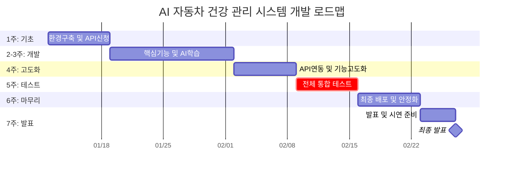

# 프로젝트 WBS (v2.0 - 최종 발표 일정 반영)

**프로젝트 명**: 인공지능 차량 건강 관리 시스템 (AI 차계부 및 진단 서비스)
**기간**: 7주 (1월 12일 ~ 2월 27일)
**목표**: **MVP(핵심 기능)와 주요 부가기능**을 2월 27일까지 완성하여 기획 발표 완료
> [!NOTE]
> 정비소 예약, 사고 견적 등 '확장 기능'은 이번 일정에서 제외하고 핵심 진단과 관리 기능에만 집중합니다.

---

## 📅 주차별 주요 목표 (7주 완공 플랜)

| 주차 | 단계 | 핵심 목표 (MVP + 부가기능) |
|:---:|:---:|:---|
| **1주차** | **준비하기** | **각종 API 권한 신청**, **외부 데이터 확보**, 프로젝트 기초 환경 구축 |
| **2주차** | **기능 시작 (1)** | 차량 데이터 수집 엔진(OBD), 앱 기본 화면, AI 핵심 모델 학습 시작 |
| **3주차** | **기능 시작 (2)** | 실시간 이상 감지 알림, 기초 차량 진단 기능 개발, AI 모델 1차 완성 |
| **4주차** | **기능 합치기** | **제조사 API 연동**, 사진/소리 진단 연동(부가기능), 전체 데이터 통합 |
| **5주차** | **마무리 및 보완** | 개인 정보 보안 강화, **맞춤형 차량 건강 리포트** 완성, 최종 기능 점검 |
| **6주차** | **테스트 및 검증** | **전체 기능 통합 테스트**, 버그 수정 및 안정성 확보 |
| **7주차** | **마무리 및 발표** | **최종 배포 및 시연 준비**, 2/27(금) 최종 발표 및 결과물 제출 |

---

## 👥 팀별 하는 일 (집중 개발 기간)

### 1. 백엔드 (Backend)
- **1주차**: 각종 API 권한 신청, 프로젝트 초기 설정, 외부 데이터(리콜/제원) 연동, DB 구축.
- **2~3주차**: OBD 데이터 실시간 수집 및 저장, 사용자/차량 관리, 알림 엔진 개발.
- **4주차**: **제조사 데이터 연동 완성**, AI 분석 결과 처리, 전체 기능 통합 API 지원.
- **5~6주차**: 보안 강화, 통합 테스트 버그 수정, **서버 최종 배포 및 안정화**.
- **7주차**: 데이터 백업 및 최종 점검, 발표용 데이터 세팅.

### 2. 앱 개발 (Frontend)
- **1주차**: 앱 뼈대 구성, 디자인 가이드 확정, 로그인/회원가입 기초 작업.
- **2~3주차**: 블루투스 연결, 실시간 차량 모니터링 화면, 위험 알림 UI 개발.
- **4주차**: AI 진단 요청 및 결과 화면, 제조사 계정 연동 UI, 멀티모달 입력 UI.
- **5~6주차**: **맞춤형 리포트 화면**, UI/UX 최종 보완, 통합 앱 패키지 빌드.
- **7주차**: 시연 시나리오 확정 및 발표 자료 준비.

### 3. AI 팀 (AI)
- **1주차**: AI 서버 환경 구축, 학습 데이터 정리, 핵심 진단 모델 선정.
- **2~3주차**: 고장 징후 감지 및 부품 수명 예측 모델 학습/검증 (MVP 핵심).
- **4주차**: 사진/소속(부가기능) 분석 연동, AI 리포트 자동 생성 로직 개발.
- **5~6주차**: 모델 성능 최적화, 통합 테스트 피드백 반영, 최종 모델 배포.
- **7주차**: AI 리포트 정확도 최종 검증 및 발표 준비.

---

## 📊 기획 발표용 로드맵 (간트 차트)

---

## 📢 [기획 발표 핵심 포인트]

### 1. "7주 안에 되나요?"에 대한 답변
- **선택과 집중**: 불필요한 확장 기능(예약, 견적 등)을 과감히 걷어내고, **'고장 예측'이라는 본질**에만 집중하여 실현 가능성을 100%로 높였습니다.
- **검증된 워크플로우**: 마지막 1주를 통으로 '전체 테스트'에 할당하여, 대충 만드는 것이 아니라 제대로 작동하는 서비스를 지향합니다.

### 2. 우리 팀만의 강점 (리스크 관리)
- **지연 방지 전략**: 승인이 오래 걸리는 **제조사/공공 API 신청을 1주차 최우선 순위**로 두어, 개발 중 병목 현상이 생기지 않도록 설계했습니다.
- **병렬 개발**: 백엔드(인프라), 프론트(화면), AI(학습)가 동시에 움직여 7주를 꽉 채워 효율적으로 사용합니다.
