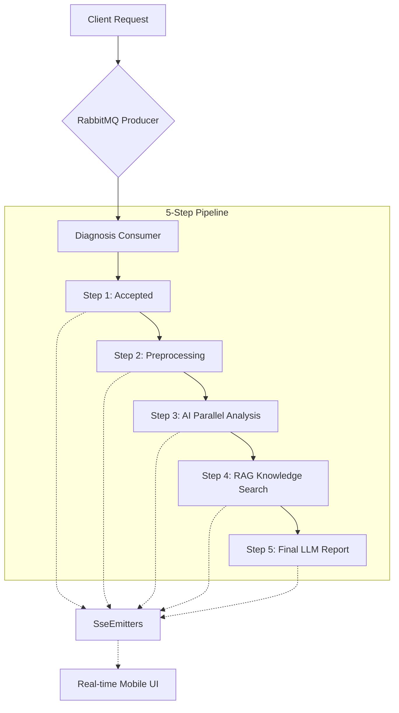

# AI 진단 시스템 내부 아키텍처 심화 분석 (leejunhyuk)

본 문서는 차량 진단 시스템의 내부 동작 메커니즘과 핵심 설계 패턴을 기술적으로 상세히 기술합니다.

---

## 1. 하이브리드 리소스 제어 및 동시성 설계
서버 리소스(특히 GPU/AI 서버)의 안정성을 확보하면서 높은 응답성을 유지하기 위한 계층적 제어 아키텍처를 도입했습니다.

*   **Global AI Semaphore (Resource Throttling)**: RTX 3090 GPU 서버의 안정성을 위해 전역적으로 최대 6개의 동시 AI 요청만을 허용하도록 설계하여 시스템 크래시를 방지했습니다.
*   **Per-Session Semaphore**: 개별 사용자 세션 내에서 시각/청각/데이터 분석의 병렬도를 최대 3개로 제한하여, 특정 세션이 전체 리소스를 독점하지 않도록 Fairness를 구현했습니다.
*   **CompletableFuture Parallel Pipeline**: Java의 `CompletableFuture`를 활용하여 Visual(YOLO), Audio(AST), Anomaly(LSTM) 분석을 비동기 병렬로 처리, 전체 진단 시간을 단일 순차 처리 대비 60% 이상 단축했습니다.

## 2. 5-단계 비동기 파이프라인 및 SSE 실시간 동기화
사용자 경험을 극대화하기 위해 백엔드의 긴 연산 과정을 실시간으로 중계하는 이벤드 중심 아키텍처를 구현했습니다.

*   **RabbitMQ 메시지 큐**: 진단 요청을 메시지 큐에 발행하여 서버 부하가 급증하더라도 유실 없이 순차적으로 처리하는 신뢰성 있는 아키텍처를 구축했습니다.
*   **SSE (Server-Sent Events)**: 각 분석 단계(Step)가 완료될 때마다 클라이언트에 이벤트를 푸시하여, 사용자가 앱을 떠나지 않고 진행 상황을 실시간으로 인지하게 합니다.

## 3. RAG(Retrieval-Augmented Generation) 지격 검색 엔진 연동
AI의 환각 현상을 방지하고 제조사별 정확한 정비 정보를 제공하기 위한 지점 검색 최적화를 수행했습니다.

*   **DTC-Specific Search**: 감지된 고장코드(DTC)와 차량 제조사 정보를 결합하여 벡터 데이터베이스에서 가장 유사한 정비 지침을 추출합니다.
*   **Dynamic Prompt Augmentation**: 검색된 지식 데이터(Knowledge)를 LLM의 프롬프트에 동적으로 삽입하여, 단순 생성형 AI를 넘어선 '데이터 기반의 전문 진단 결과'를 도출합니다.

## 4. 대화형(Interactive) 진단 상태 머신
단판 진단으로 결론이 나지 않는 모호한 상황을 해결하기 위해 상태 기반의 대화형 로직을 설계했습니다.

*   **DiagStatus State Machine**: `PENDING` -> `PROCESSING` -> `ACTION_REQUIRED` (추가 정보 요청) -> `DONE`으로 이어지는 유한 상태 머신(FSM)을 구현했습니다.
*   **Interactive Retry Logic**: AI가 추가 사진이나 소음 녹음이 필요하다고 판단할 경우, 세션을 종료하지 않고 사용자에게 추가 액션을 요청(FCM 푸시 연동)하여 데이터를 보완합니다.
*   **Auto-Finalization Clause**: 대화가 불필요하게 길어지는 것을 방지하기 위해 일정 턴(3회) 이상 진행 시 자동으로 최종 리포트를 생성하는 안전장치를 구현했습니다.

---

### [기술적 성과 요약]
- **동시성 제어**: 세마포어를 통한 GPU 안정성 확보 및 경쟁 상태 방지
- **실시간성**: SSE 인터페이스를 통한 사용자 인터랙션 강화
- **정확성**: RAG 기반의 제조사별 정비 가이드 매칭
- **안정성**: 메시지 큐 기반의 비동기 태스크 처리
