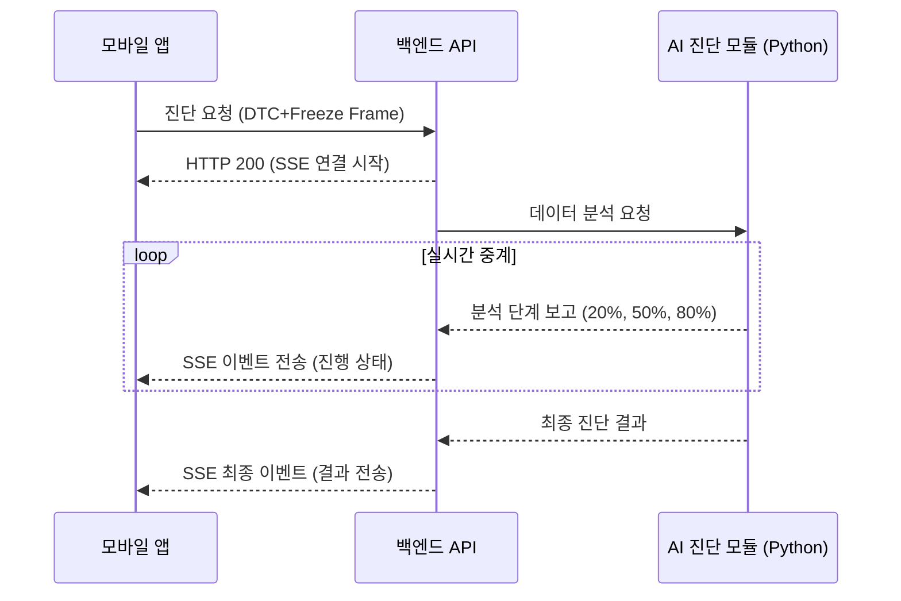
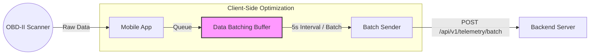

# 기술 기여 및 개발 성과 보고서 (leejunhyuk)

본 보고서는 프로젝트 내에서 담당한 핵심 모듈의 설계, 구현 및 고도화 과정을 기술적 관점에서 정리한 것입니다.

---

## 1. 차세대 진단 시스템 개발 및 통합 (90% 완료)
단순 고장코드 조회를 넘어 대규모 데이터를 처리하는 실시간 진단 아키텍처를 설계했습니다.

* **실시간 비동기 통신 구현 (SSE)**: 진단 데이터 분석의 대기 시간을 사용자에게 실시간으로 중계하기 위해 **Server-Sent Events(SSE)** 프로토콜을 도입, HTTP 연결 유지 및 서버 푸시 기술을 안정화했습니다.
* **진단 로직의 표준화 및 통합**: 파편화되어 있던 수동/자동 진단 프로세스를 단일 파이프라인으로 통합하여 코드 유지보수성을 확보하고 전체 프로세스의 90%를 완성했습니다.

## 2. 블루투스(OBD) 데이터 전송 계층 고도화 (진행 중)
차량과 모바일을 잇는 통신 구간의 데이터 전송 효율과 안정성을 극대화하기 위한 고난도 최적화를 진행 중입니다.

* **배치 텔레메트리(Batch Telemetry) 아키텍처**: 매 초 발생하는 대량의 OBD 데이터를 개별 전송하지 않고, **클라이언트 사이드에서 배치로 묶어 전송**하는 로직을 개발하여 오버헤드를 줄이고 데이터 누락을 최소화했습니다.
* **오프라인 데이터 가용성 확보**: 네트워크 단절 시 수집된 주행 데이터를 **메모리/스토리지 큐(Queue)**에 안전하게 보관한 후, 재접속 시 일괄 전송하는 신뢰성 높은 아키텍처를 설계하고 있습니다.

## 3. 알림(Notification) 허브 시스템 구축
사용자 경험(UX) 강화를 위해 FCM 기반의 실시간 푸시 알림 인프라를 구축했습니다.
* **FCM 기반 통합 알림 서비스**: Firebase Cloud Messaging을 활용하여 서버 측 발송 로직과 클라이언트 측 수신/토큰 관리 시스템을 유기적으로 연결했습니다.
* **스케줄링 기반 인텔리전트 알람**: 소모품 교체 주기 등 백엔드 이벤트와 연동되는 알림 자동화 기능을 구현했습니다.

## 4. 소모품 관리 핵심 로직 개발 및 AI 연동
AI 분석 엔진과 실제 서비스 레이어를 연결하여 실질적인 차량 유지보수 기능을 완성했습니다.
* **AI 마모 엔진 - 서비스 레이어 통합**: `WearFactorService`와 `TripService`를 연동하여, 주행 데이터 발생 시 실시간으로 소모품 마모도를 계산하고 DB에 반영하는 백엔드 파이프라인을 구축했습니다.
* **소모품 상태 관리 UI 구현**: 소모품 수명 데이터를 프론트엔드 대시보드와 동기화하고, 차량 등록/수정 시 소모품 초기 상태 및 주행거리를 입력받는 복잡한 폼 로직을 개발했습니다.
* **데이터 시각화 최적화**: 백엔드의 잔존 수명 계산 수치를 프론트엔드에서 직관적인 게이지 및 수치로 변환하여 출력하는 로직을 완성했습니다.

## 5. 풀스택 데이터 연동 아키텍처 및 환경 최적화
단순한 API 호출을 넘어, 앱 전체의 데이터 정합성을 유지하는 견고한 연동 체계를 구축했습니다.
* **Zustand 기반 전역 상태 머신 구축**: `useVehicleStore`, `useUserStore`, `useBleStore` 등 전역 스토어를 설계하여, 백엔드로부터 온 파편화된 데이터가 앱 전체 컴포넌트에서 일관되게 공유되도록 관리했습니다.
* **Axios 인터셉터 및 보안 레이어**: 전용 Axios 인스턴스를 생성하고 `.env` 환경 변수를 통한 API Key 관리 체계를 마련하여, 보안성과 통신 효율성을 동시에 확보했습니다.
* **인프라 환경 안정화**: Docker 컨테이너 기반의 DB 연결 이슈 및 환경 설정 문제를 직접 해결하여, 팀 전체가 원활하게 개발에 집중할 수 있는 멀티플랫폼 환경을 구축했습니다.

---

### [핵심 역량 키워드]
`SSE`, `Batch Telemetry`, `FCM`, `Zustand`, `Full-stack Integration`, `Infrastructure Optimization`
