# 시스템 아키텍처 및 데이터 흐름 상세 설계서

> **문서 버전**: v1.0
> **기반 문서**: 기술 구현 가이드라인
> **작성일**: 2026-01-10

---

## 1. 시스템 아키텍처 오버뷰 (System Overview)

본 시스템은 고해상도(1Hz) OBD-II 차량 데이터 처리와 고연산(High-Compute)이 필요한 AI/LLM 진단을 동시에 수행하는 하이브리드 아키텍처를 채택합니다.

### 1.1 High-Level Architecture Diagram

```mermaid
graph TD
    %% Client Layer (Top)
    subgraph Client_Layer["Client Layer"]
        direction TB
        OBD_Adapter[("OBD-II Adapter")]
        MobileApp[("Mobile App")]
        OBD_Adapter <== "블루투스" ==> MobileApp
    end

    %% Backend Layer (Center Hub)
    subgraph Backend_Layer["Backend Layer"]
        direction TB
        Gateway["Main Backend<br/>(Java Spring Boot)"]
        MQ["Message Queue<br/>(RabbitMQ)"]
        Gateway -- "작업 할당" --> MQ
    end

    %% Layer Connections (서브그래프 밖으로 이동)
    MobileApp -- "REST (Batch Upload)" --> Gateway

    %% Data Layer
    subgraph Data_Layer["Data Persistence Layer"]
        direction TB
        subgraph Postgres_Integrated["PostgreSQL Integrated"]
            direction TB
            RDB[("Relational DB")]
            TSDB[("Time-series DB")]
            VDB[("Vector DB")]
        end
        S3_Bucket[("AWS S3 Bucket")]
    end
    Gateway -- "비즈니스 데이터" --> RDB
    Gateway -- "텔레메트리 기록" --> TSDB
    Gateway -- "유사도 검색" --> VDB
    Gateway -- "파일 입출력" --> S3_Bucket

    %% External & AI (Narrow Layout)
    subgraph External_Services["External Interfaces"]
        direction TB
        CloudAPI["Manufacturer API"]
        SearchAPI["Web Search API"]
        PushSvc["FCM (Push Notification)"]
    end
    
    MQ -- "데이터 동기화" --> CloudAPI
    MQ -- "알림 발송 작업" --> PushSvc

    subgraph AI_Systems["AI Systems"]
        direction TB
        Orchestrator["AI Service<br/>(FastAPI)"]
        LLM_Agent["LLM Synthesis"]
    end

    MQ -- "작업 구독 및 분석" --> Orchestrator
    Orchestrator -- "미디어 획득 / 학습" --> S3_Bucket
    Orchestrator -- "분석 결과 업데이트" --> Gateway
    Gateway -- "프롬프트 및 문맥 전달" --> LLM_Agent
    LLM_Agent -- "실시간 지식 검색" --> SearchAPI
```

---

## 2. 상세 컴포넌트 명세 (Detailed Component Specification)

### 2.1 Client Layer (Mobile/Web)
- **Role**: 데이터 수집의 최전선이자 사용자 인터페이스.
- **Key Modules**:
    - **OBD Connector**: ELM327과의 블루투스 소켓 통신 관리. `AT Command` 전송 및 응답 파싱. (Connection Keep-alive 필수)
    - **Buffer Manager**: 1Hz 주기의 고빈도 데이터를 로컬 버퍼에 3분간 임시 저장 후, HTTP POST로 일괄 전송합니다. (실시간 스트리밍 제거)
    - **Local Lite-AI**: 네트워크 단절 시(Tunnel 등) 기본적인 안전 경고(급발진, 과열)를 수행하는 경량화된 Rule-based 로직 내장.

### 2.2 Backend Layer (Java Spring Boot)
- **Role**: 비즈니스 로직 처리, 사용자 인증, 데이터 영속화, AI/외부 서비스 연동의 중추.
- **Function**: 모든 요청의 진입점(API Gateway)이며, 배치로 수신된 텔레메트리 데이터를 검증 및 DB에 적재합니다.
- **Message Broker (RabbitMQ) 활용 범위**:
    - **AI Task**: 시간이 소요되는 AI 진단 및 추론 작업 분산 처리.
    - **Push Notification**: FCM을 통한 대량 알림 발송 시 응답 지연 방지 및 재시도 관리.
    - **Cloud Sync**: 외부 제조사 API(Smartcar 등)와의 데이터 동기화 작업 비동기화.
    - **Heavy Reports**: 대용량 시계열 데이터를 가공하는 리포트 생성 작업 백그라운드 처리.
- **Note**: 데이터 전송 및 처리의 효율성을 위해 3분 단위 배치 업로드 방식을 사용하며, 필요한 상태는 DB를 이용합니다.

### 2.3 AI Systems (Integrated AI Services)
- **Role**: 멀티모달 데이터(이미지, 음성, 시계열) 분석 및 지능형 가이드 생성.
- **Components**:
    - **AI Hub (Cloud GPU Service)**:
        - **Tech**: Python, FastAPI.
        - **Models**: YOLOv8-L (외관), AST (엔진음), LSTM-AE (OBD 패턴) 실시간 추론 수행.
    - **openAI (Large Language Model)**:
        - **Model**: **GPT-4o**.
        - **Role**: AI Hub의 분석 결과와 OBD 데이터를 합성하여 사용자 친화적인 진단 리포트(`LLM Synthesis`) 생성.

### 2.4 PostgreSQL Integrated Instance (Data Persistence)
본 시스템은 **단일 PostgreSQL 인스턴스**에서 Extension 기능을 활용하여 세 가지 데이터 모델을 통합 관리합니다.
- **관계형 테이블 (Standard PostgreSQL)**:
    - 사용자 정보, 차량 프로파일, 진단 세션 및 최종 리포트 등 정형 데이터 저장.
- **시계열 테이블 (TimescaleDB Extension)**:
    - 1초 단위로 수집되는 대량의 OBD 텔레메트리 데이터를 하이퍼테이블(Hypertables)로 관리. 3일 보관 후 자동 삭제(Drop Chunk) 정책 적용.
- **벡터 테이블 (pgvector Extension)**:
    - 차량 정비 지식 및 매뉴얼의 임베딩 값을 저장하여 LLM의 RAG(검색 증강 생성) 소스로 활용.

### 2.5 Storage (Media Assets)
- **AWS S3 Bucket**:
    - **목적**: 사용자가 업로드한 사고/고장 사진, 녹화된 엔진 소리 파일, AI 재학습용 원본 로그 저장.

### 2.6 External Interfaces
- **Manufacturer API**: 제조사 클라우드(BlueLink/KiaConnect 등)를 통한 차량 상태 데이터 동기화.
- **Search API (Tavily)**: 수리 방법 및 부품 가격 정보를 위한 실시간 웹 검색 엔진 연동.
- **Public Data Portal**: 엔진 오일 권장 주기, 리콜 정보 등 공공 정보 연동.

---

## 3. 핵심 데이터 흐름 상세 (Detailed Data Flow)

### 3.1 OBD-II 데이터 수집 및 처리 파이프라인 (Batch)
차량 시동 ON 시점부터 앱이 데이터를 로컬에 1초 단위로 수집(Buffering)하고, 3분마다 서버로 일괄 전송하는 흐름입니다.

```mermaid
sequenceDiagram
    autonumber
    participant Car as 🚗 Vehicle (ECU)
    participant OBD as 🔌 OBD Dongle
    participant App as 📱 App (Client)
    participant API as 🚀 API Gateway
    participant TSDB as ⏱️ TimescaleDB

    Note over Car, App: [Phase 1] 연결 및 핸드쉐이크 (Start Drive)
    App->>OBD: 블루투스 연결 요청
    OBD-->>App: 연결됨
    App->>App: 주행 세션 시작 (Trip ID 생성)

    Note over Car, App: [Phase 2] 로컬 수집 및 모니터링 (1Hz)
    loop 1초마다 반복 (App Internal)
        App->>OBD: PID 요청
        OBD-->>App: 응답 데이터
        App->>App: UI 갱신 & 이상 징후 즉시 체크 (Local Alert)
        App->>App: 로컬 메모리에 데이터 Append
    end

    Note over App, TSDB: [Phase 3] 배치 업로드 (3분 주기)
    loop 3분마다 반복
        App->>API: POST /telemetry/batch (180개 로그)
        activate API
        API->>TSDB: Bulk Insert (하이퍼테이블)
        API-->>App: 200 OK
        deactivate API
    end

    Note over App, API: [Phase 4] 주행 종료
    App->>API: 주행 종료 알림 (마지막 배치 포함)
    API->>TSDB: 잔여 데이터 저장
    API->>API: Trip Summary 생성 task 발행
```

### 3.2 AI 멀티모달 복합 진단 프로세스 (Link-based Diagnosis)
사용자가 진단을 요청했을 때, 대용량 파일은 S3를 거쳐 주소 기반으로 처리됩니다.

```mermaid
sequenceDiagram
    autonumber
    actor User
    participant App
    participant API as 🚀 Main Backend (Java)
    participant S3 as ☁️ AWS S3
    participant AI as 🧠 AI Service (FastAPI)
    participant DB as 🐘 PostgreSQL

    User->>App: "진단 요청" (사진/음성 + OBD 데이터)
    App->>API: POST /diagnosis (Multipart File + JSON)
    
    Note over API, S3: [Step 1] 데이터 영속화 (증거 저장)
    API->>S3: 원본 파일 저장 (Upload)
    S3-->>API: S3_URL 반환
    
    Note over API, AI: [Step 2] 메타데이터 분석
    API->>AI: 분석 요청 (S3_URL + OBD Context)
    
    Note over AI: AI 분석 중
    AI->>S3: 파일 다운로드 및 인퍼런스
    AI-->>API: 분석 결과 JSON 반환 (이슈 탐지 결과 등)
    
    Note over API, DB: [Step 3] 최종 결과 합성
    API->>API: LLM 보고서 합성 (AI 결과 + OBD + RAG)
    API->>DB: 진단 세션 및 결과 저장
    
    API-->>App: 진단 결과 (JSON) 반환
    App->>App: 사용자 결과 화면 표시
```

### 3.3 제조사 클라우드 연동 (OAuth 2.0 Flow)
사용자가 제조사 계정을 연결하고 데이터를 동기화하는 보안 흐름입니다.

```mermaid
sequenceDiagram
    autonumber
    actor User
    participant App
    participant API as 🚀 Main Backend
    participant Auth as 🏛️ Manufacturer Auth
    participant DB as 🐘 PostgreSQL (cloud_accounts)

    User->>App: "제조사 계정 연결" 선택
    App->>API: POST /cloud/connect (Provider 선택)
    API-->>App: 인증 URL 반환 (Client ID, Scope 포함)
    
    App->>Auth: 웹뷰에서 제조사 로그인/동의
    Auth-->>App: 인증 코드(Authorization Code) 전달
    
    App->>API: POST /cloud/callback (Code 전달)
    
    API->>Auth: 토큰 교환 (Code <-> Tokens)
    Auth-->>API: 액세스 및 리프레시 토큰 반환
    
    Note over API, DB: [보안] AES-256 암호화
    API->>API: 토큰 암호화 처리
    API->>DB: 암호화된 토큰(encrypted_tokens) 저장
    
    API-->>App: 연동 완료 알림
```

### 3.4 소모품 예지 정비 및 배치 분석 (Predictive Maintenance Batch)
매일 밤 수행되는 대규모 데이터 분석 및 예측 파이프라인입니다.

```mermaid
flowchart TD
    trigger((개인별 비운행 시간<br/>배치 트리거)) --> BatchJob["일일 예측 배치 작업"]
    
    subgraph Data_Preparation ["데이터 준비"]
        BatchJob --> FetchData["PostgreSQL: 최근 30일 데이터 추출"]
        BatchJob --> FetchRaw["TimescaleDB: 최근 3일 로우 파형 추출"]
        FetchData & FetchRaw --> Preprocess["데이터 전처리 및 특징 추출<br/>(추세, 변동성 등)"]
    end
    
    subgraph AI_Inference ["AI 모델 추론"]
        Preprocess --> XGBoost["XGBoost 회귀 모델<br/>(소모품 잔여 수명 예측)"]
        Preprocess --> LSTM["LSTM 이상 감지 모델<br/>(배터리/시동 전압 분석)"]
    end
    
    subgraph Evaluation_Action ["판단 및 후속 조치"]
        XGBoost --> CheckLife{잔여 수명 < 10%?}
        LSTM --> CheckDanger{고장 확률 > 80%? }
        
        CheckLife -- 예 --> CreateNoti1["알림 생성<br/>'엔진오일 교체 주기 도래'"]
        CheckLife -- 아니오 --> UpdateStatus1["현재 상태 DB 업데이트"]
        
        CheckDanger -- 예 --> CreateNoti2["치명적 알림 생성<br/>'배터리 방전 임박'"]
        CheckDanger -- 아니오 --> UpdateStatus2["인퍼런스 결과 로그 저장"]
    end
    
    CreateNoti1 & CreateNoti2 --> PushServer["FCM 푸시 서버"]
    UpdateStatus1 & UpdateStatus2 --> DB[(PostgreSQL)]

```

---

## 4. 데이터베이스 스키마 설계 (Extended ERD)

기본적인 사용자/차량 정보 외에, **시계열 데이터 최적화**와 **AI 진단 이력** 관리에 초점을 맞춘 확장 설계입니다.

### 4.1 간략 ERD (Simplified ERD)

> [!NOTE]
> 본 다이어그램은 시스템의 전체적인 관계를 파악하기 위한 **간략 버전**입니다. 각 컬럼의 데이터 타입, 제약 조건, Enum 값 등 상세한 데이터베이스 설계 정보는 [데이터베이스 상세 설계서 (DB_설계서.md)](file:///c:/dev/AI/AI-5-main/Docs/DB_설계서.md)를 참조하십시오.

---

## 5. 보안 및 네트워크 설계 (Security & Network)

### 5.1 네트워크 아키텍처
- **Private Subnet 원칙**: DB(PostgreSQL, TimescaleDB)와 AI Inference Server는 외부에서 직접 접근할 수 없는 Private Subnet에 배치.
- **Bastion Host / VPN**: 관리자 전용 접근 통로.
- **TLS 1.3**: 모든 구간(App-Server, Server-DB)에 암호화 통신 적용.

### 5.2 데이터 보안
- **VIN & PII 암호화**: `AES-256-GCM` 알고리즘을 사용하여 DB 저장 시 암호화. (Key Management System 활용 권장).
- **데이터 비식별화**: AI 학습용으로 S3로 이관되는 데이터는 `user_id`, `vin` 등을 제거하거나 Hashing 처리하여 저장.

---
**[문서 끝]**
