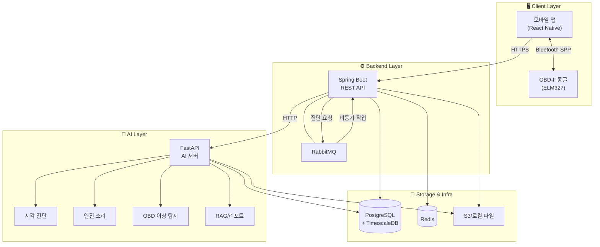
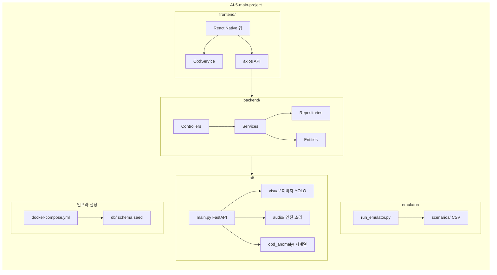
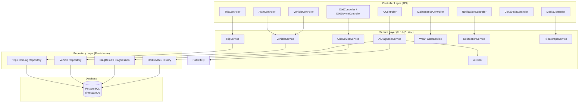
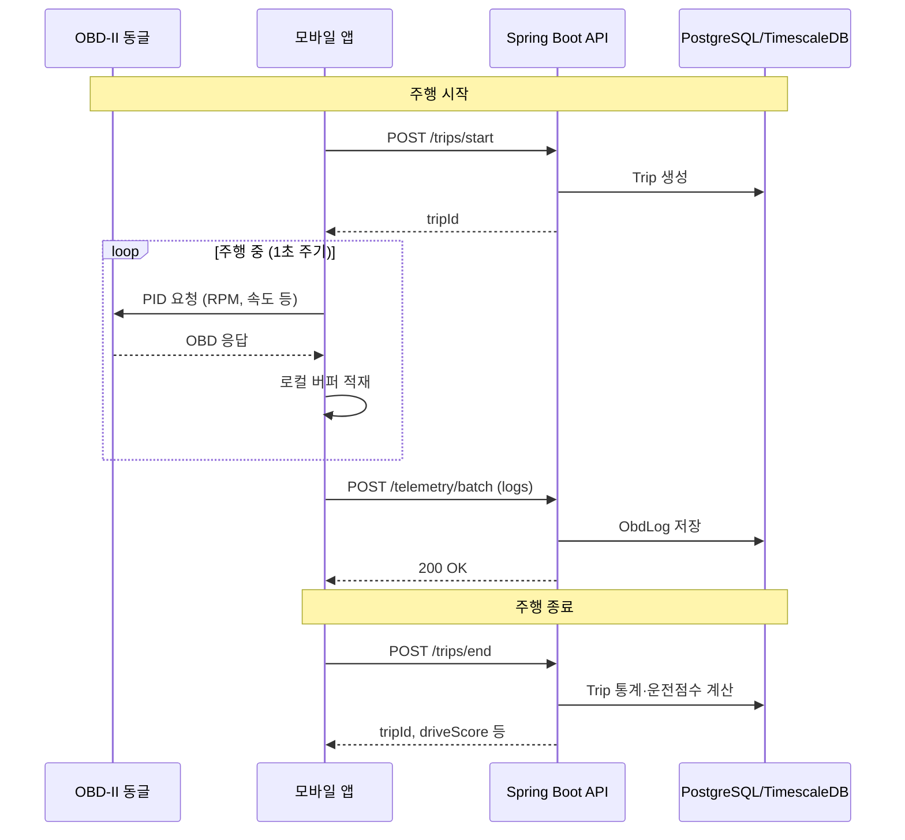
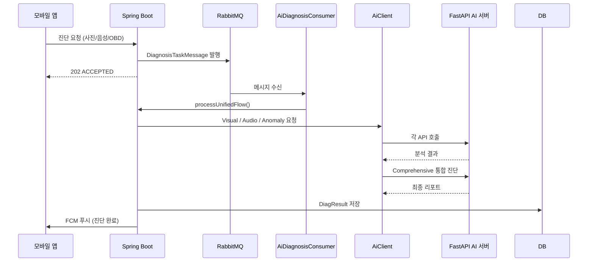
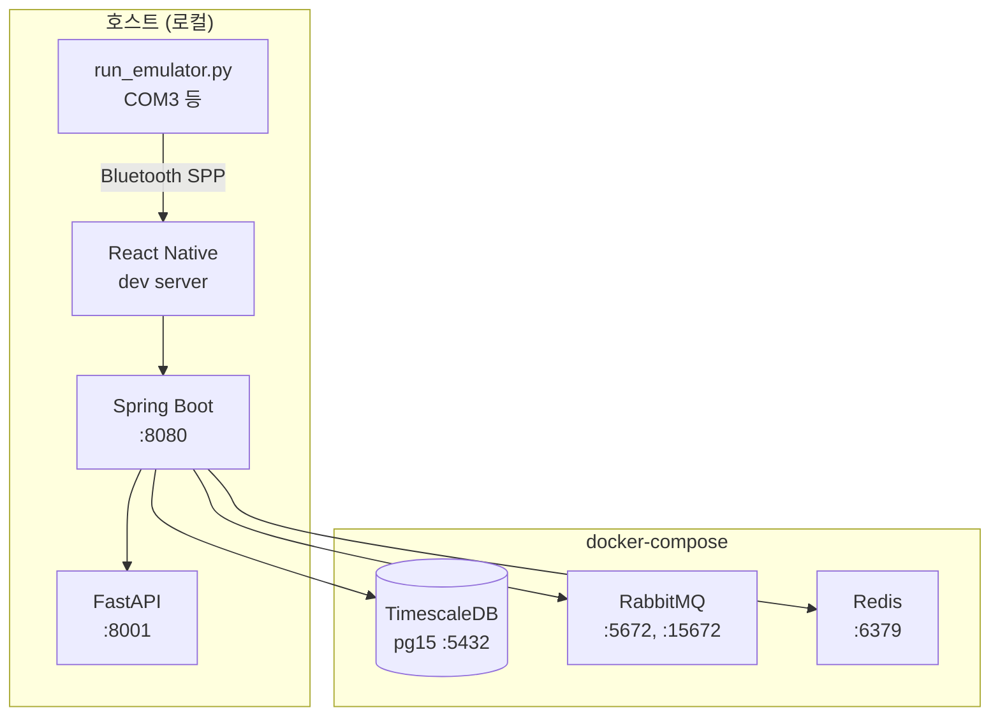
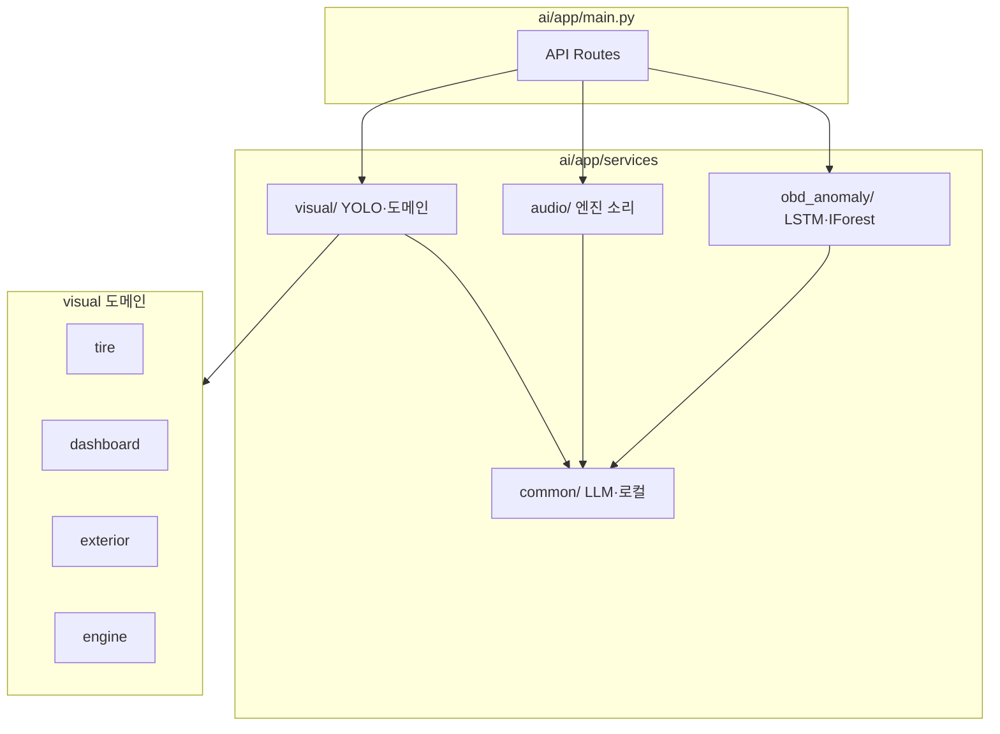
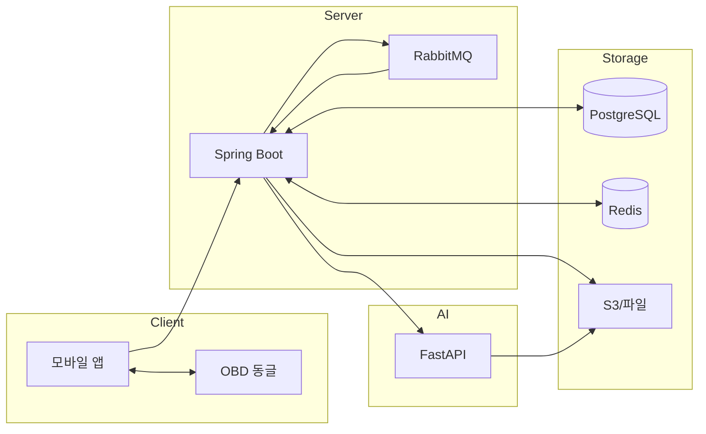

# AI 자동차 건강 관리 시스템 — 프로젝트 아키텍처 (Mermaid)

전체 시스템 구조, 계층, 데이터 흐름을 Mermaid 다이어그램으로 정리합니다.

---

## 1. 시스템 개요 (High-Level)

---

## 2. 프로젝트 폴더/컴포넌트 구조

---

## 3. 백엔드 계층 구조 (Spring Boot)

---

## 4. 데이터 흐름 — 주행·텔레메트리

---

## 5. 데이터 흐름 — AI 정밀 진단 (비동기)

---

## 6. 인프라 구성 (Docker)

---

## 7. AI 서버 내부 구조 (FastAPI)

---

## 8. 요약 — 3계층 + 스토리지

---

- **Client**: React Native 앱 + OBD-II(ELM327). Bluetooth로 실시간 차량 데이터 수집.
- **Server**: Spring Boot — 인증·차량·주행·텔레메트리·진단 요청 조율. RabbitMQ로 AI 작업 비동기 처리.
- **AI**: FastAPI — 시각(YOLO)·엔진 소리·OBD 이상 탐지·RAG/리포트.
- **Storage**: PostgreSQL(TimescaleDB) 메인 저장소, Redis 캐시/세션, S3(또는 로컬) 파일.
- **Emulator**: `emulator/run_emulator.py` + CSV 시나리오로 OBD 동글 없이 주행 시뮬레이션.

이 문서의 다이어그램은 GitHub/GitLab, Notion, VS Code Mermaid 확장 등에서 렌더링할 수 있습니다.
